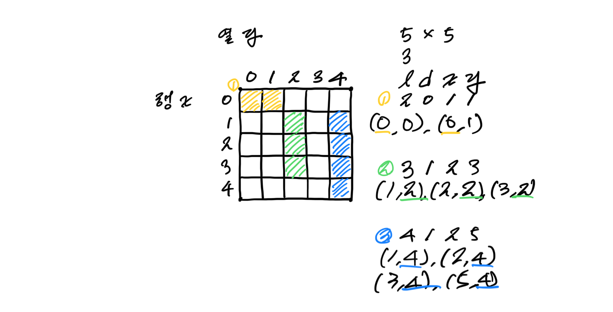
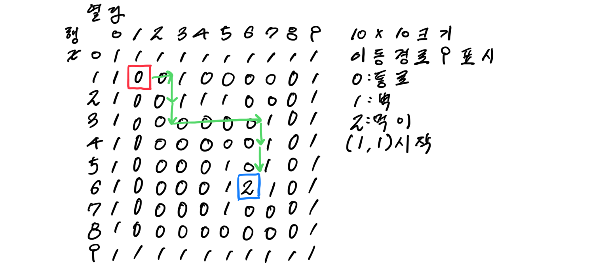

# Codeup: 기초 100제 (91~100) (2020.12.24) 

**사용 언어는 Python입니다.**


## 1. 1093

첫 번째 줄에 출석 번호를 부른 횟수인 정수 n이 입력

두 번째 줄에 무작위로 부른 n개의 번호가 공백을 두고 입력

1 번부터 번호가 불린 횟수를 순서대로 공백으로 구분하여 한 줄로 출력

```python
n = int(input());
a = input().split();
d = {} 								# 빈 딕셔너리 생성
for i in range(1,24): # 1부터 23까지 key 생성
  d[str(i)] = 0; 			#str 변환
for i in range(n):		# 부른 횟수 n만큼 번호 리스트 a를 부르면 각각의 숫자가 나온다
  if str(a[i]) in d:
    d[str(a[i])] = d[str(a[i])] + 1; # d와 비교 후 있으면 1 더하기
for i in range(1,24):
  print(d[str(i)], end = ' '); #value 나란히 출력
```


## 2. 1094

첫 번째 줄에 출석 번호를 부른 횟수인 정수 n이 입력

두 번째 줄에 무작위로 부른 번호가 공백을 두고 입력

불린 출석 번호를 반대로 출력

```python
n = int(input());
a = input().split();
for i in reversed(range(n)):
  print(a[i], end=" ");
```


## 3. 1095

첫 번째 줄에 출석 번호를 부른 횟수인 정수 n이 입력

두 번째 줄에 무작위로 부른 번호가 공백을 두고 입력

출석 번호 중 가장 빠른 것을 1개만 출력

```python
n = int(input());
a = map(int,input().split());
print(min(a));
```

`map` : 리스트의 요소를 지정된 함수로 처리


## 4. 1096

첫 번째 줄에 바둑판에 올려 놓을 흰 돌의 개수(n)가 입력

둘 번째 줄부터 n+1번째 줄까지 흰 돌을 놓을 좌표(x,y)가 n줄 입력

흰돌이 올려진 바둑판의 상황을 있는 위치는 1, 없는 위치는 0으로 출력(바둑판은 19 * 19)

```python
n = int(input());
location = [[0]*19 for i in range(19)]; # 주어진 바둑판의 크기칸큼 배열 생성
for j in range(n):
  x,y = map(int,input().split()); # 돌의 위치를 리스트 형식으로 받음
  location[x-1][y-1] =1; # (0,0)부터 시작하므로
for a in range(19):
  for b in range(19):
    print(location[a][b], end=' '); # 대괄호 제외하고 숫자간 공백을 두고 한 줄씩 출력
  print();  
```


## 5. 1097

바둑알이 깔려 있는 상황이 19*19 크기의 정수값으로 입력

십자 뒤집기 횟수(n)가 입력

십자 뒤집기 좌표가 횟수(n)만큼 입력

십자 뒤집기 결과를 출력

```python
baduk = []
for _ in range(19):
  matrix = list(map(int, input().split()))
  baduk.append(matrix)
n = int(input())
for _ in range(n): 
  x, y = map(int, input().split()) 
  for i in range(19): 
    baduk[i][y-1] = 1 if baduk[i][y-1] == 0 else 0 
    baduk[x-1][i] = 1 if baduk[x-1][i] == 0 else 0 
for i in range(19):
  print(*baduk[i])
```


## 6.  1098

첫 줄에 격자판의 세로(h), 가로(w) 가 공백을 두고 입력

두 번째 줄에 놓을 수 있는 막대의 개수(n) 입력

세 번째 줄부터 막대의 길이(l), 방향(d), 좌표(x,y)가 입력

모든 막대를 놓은 격자판의 상태를 출력

```python
h, w = map(int, input().split())
shape = [[0 for _ in range(w)] for _ in range(h)] # 입력받은 수 만큼 2차원 배열 생성
n = int(input())
for _ in range(n) :                               # 막대의 개수만큼 반복
  l, d, x, y = map(int, input().split())          # 길이, 방향, 좌표 입력
  x, y = x-1, y-1 # 배열은 (0,0)부터 시작하므로
  if d == 0 : # 가로 방향일 때
    for i in range(l) : # 길이 만큼 반복
      shape[x][y+i] = 1 # 가로일때는 y만 이동해서 칠함
  else :
    for i in range(l) : # 세로는 가로의 반대로
      shape[x+i][y] = 1
for s in shape :
  print( *s ) #괄호를 제외한 격자판의 상태 출력
```



## 7.  1099

10*10 크기의 미로 상자의 구조와 먹이 위치가 입력(2,2에서 출발)

성실한 개미가 이동한 경로를 9로 표시해 출력

```python
m=[] # 빈 배열 m 생성
for i in range(12) : # []12개 m 배열에 넣기
    m.append([])
    for j in range(12) : # 각 []에 0 12개 넣기
        m[i].append(0)
for i in range(10) : 
  a=input().split() # 10번 입력값 공백을 두고 받기
  for j in range(10) : # 배열 m의 [i,1~10]에 받은 값 넣기
    m[i+1][j+1]=int(a[j]) # 테두리에 0을 남기고 배열 형성

x=2
y=2 #개미의 초기 좌표
while True : 
  if m[x][y]==0 : # 밟고 있는 곳이 0이면 9로 표시
    m[x][y]=9
  elif m[x][y]==2 : #먹이를 만나면 9를 표시하고 반복문 종료
    m[x][y]=9
    break  
  if (m[x][y+1])==1 and m[x+1][y]==1) or (x==9 and y==9) : # 오른쪽이 벽이고 아래가 벽이거나
    break                                                  # (9,9)에 위치하면 종료

  if m[x][y+1]!=1 : # 오른쪽이 벽이 아니라면
    y+=1            # 오른쪽으로 한칸 이동
  elif m[x+1][y]!=1 : #아래가 벽이 아니라면
    x+=1             #아래로 한칸 이동

for i in range(1,11) : # 1~10까지 i반복
  for j in range(1,11) :  # 1~10 까지 j 반복
    print(m[i][j], end=' ') # m[i][1~10] 나란히 출력
  print()
```



# Reference

https://codeup.kr/problemsetsol.php

https://colab.research.google.com/drive/1j41zX9Z4atBC5jzzerAfkfLizkIoS-2N#scrollTo=hCC2CIZ8imeU