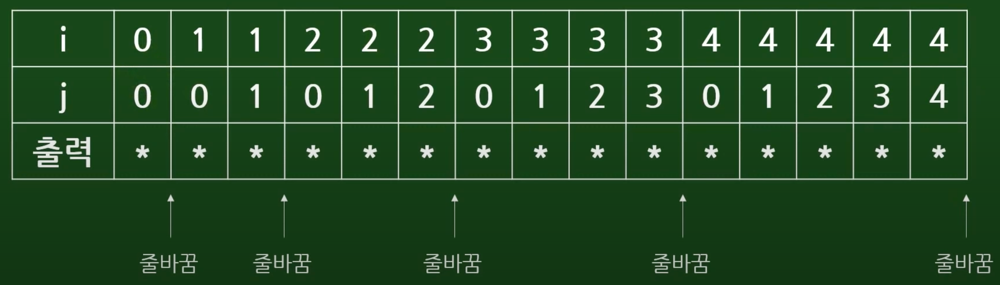
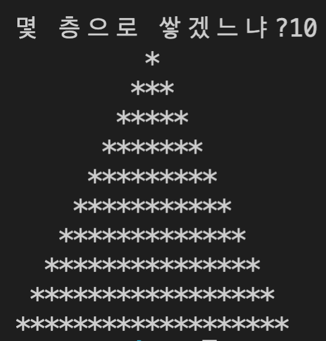

# [나도코딩]C 프로그래밍 - 입문부터 게임 개발까지 (2)(2020.12.26)


**상세 내용 [블로그](https://greedysiru.tistory.com/63) 참고**


## 경찰서 조서 출력

범죄자의 신분을 입력 후 출력

```C
#include <stdio.h>
int main(void)
{
    char name[256];                   //문자열 선언
    printf("이름이 뭐예요?");
    scanf("%s", name, sizeof(name));  //문자열 입력 받기, 256을 넘지 않게 함

    int age;                          //정수 선언
    printf("몇살이에요?");
    scanf("%d", &age);                //정수 앞에는 &붙임

    float weight;                     //실수 선언
    printf("몸무게는 몇 kg 이예요?");
    scanf("%f" , &weight);            //실수 앞에도 &붙임

    double height;                    //더 긴 실수(double)
    printf("키는 몇 cm 이예요?");
    scanf("%lf" , &height);           //double은 "%lf"

    char what[256];
    printf("무슨 범죄를 저질렀어요?");
    scanf("%s", what, sizeof(what));

    // 조서 내용 출력
    printf("\n\n--- 범죄자 정보 ---\n\n");
    printf(" 이름       : %s\n" , name);
    printf(" 나이       : %d\n" , age);
    printf(" 몸무게      :%.2f\n" , weight);    //소수점 두 번째까지 출력
    printf(" 키          :%.2lf\n" , height);
    printf(" 범죄       : %s\n" , what);
  
  	return 0;
}
```


## 새로운 파일 생성

```C
#include <stdio.h>
int main(void)
{
    return 0;
}
```

한 프로젝트 내에서 함수명이 겹치지 않도록 주의


## ++ 연산

`++` : 변수를 1 더해준다.

```C
#include <stdio.h>
int main(void)
{
int a = 10;
printf("a는 %d\n" , a);     //10 출력
a++;                       //a = 10에서 1을 더해주므로 a = 11
printf("a는 %d\n" , a);     //11 출력
a++;
printf("a는 %d\n" , a);     //12 출력
return 0;  
}
```


```C
#include <stdio.h>
int main(void)
{
int b = 20;
printf("b는 %d\n" , ++b);	//21 출력
printf("b는 %d\n" , b++);	//21 출력
printf("b는 %d\n" , b);		//22 출력
return 0; 
}
```

 `++`가 뒤에 있으면 `printf` 실행 후 +1


## 반복문

### for

> for(선언; 조건; 증감){ 실행할 명령 }

```C
#include <stdio.h>
int main(void)
{
for (int i = 1; i <= 10; i++) // i는 1이고 10보다 작을 동안 명령을 실행한 뒤 +1을 한다.
{
  printf("Hello World %d\n", i);
}
return 0;
}
```


### while

> 변수 선언
>
> while(조건){ 실행할 명령 }

```C
#include <stdio.h>
int main(void)
{
int i = 1;
while (i <= 10)
{
  printf("Hello World %d\n", i);
  i++;
}
return 0;
}
```

 `i++`은  `printf` 안에도 가능

```C
#include <stdio.h>
int main(void)
{
int i = 1;
while (i <= 10)
{
  printf("Hello World %d\n", i++);
}
return 0;
}
```


### do while

> 변수 선언
>
> do {실행할 명령} while (조건);

```C
#include <stdio.h>
int main(void)
{
int i = 1;
do {
	printf("Hello World %d\n", i++);
} while (i <=10);
return 0;
}
```


## 이중 반복문

### 구구단

반복문을 두 번 사용해서 구구단을 출력

```C
#include <stdio.h>
int main(void)
{
for(int i=2; i <=9; i++)                        //i가 2부터 9까지 1씩 올라가며 전체 반복(단수)
    {
        printf("%d단 계산\n", i);                 //단수 출력
        for(int j = 1 ; j <= 9; j++)            //각 단수에서 1부터 9까지 1씩 올라가며 곱함
        {
            printf(" %d x % d = %d\n", i, j, i*j); // i,j를 넣어서 각 숫자 및 연산 결과 출력
        }
    }
return 0;
}
```


### 별 그리기

다섯 개의 줄에 별을 하나씩 늘려가며 그리기

```C
#include <stdio.h>
int main(void)
{
for (int i = 0; i < 5; i++)
    {
        for (int j = 0; j <= i; j++)	//별을 출력할 반복문
        {
            printf("*");
        }
        printf("\n");                //한 개의 줄에 별 출력 완료 후 줄바꿈
    }
return 0;
}
```

```
*
**
***
****
*****
```




### 거꾸로 별

위를 반대로 출력

```
    *
   **
  ***
 ****
*****
```

```C
#include <stdio.h>
int main(void)
{
for (int i = 0; i < 5; i++)
    {
        for(int j = i; j < 5 -1; j++) //공백을 출력할 반복문 추가
        {
            printf(" ");
        }
        for (int k =0; k <=i; k++)	//별을 출력할 반복문
        {
            printf("*");
        }
        printf("\n");
    }
return 0;
}
```

`j` 는 공백을 출력할 반복문의 변수이다. `i` 와 같은 값이 입력되어, 4보다 작을 때까지 반복문을 실행한다.


## 피라미드를 쌓아라

꼭대기에서 아래까지 2씩 커지는 피라미드를 만들기

```C
#include <stdio.h>
int main(void)
{
int floor;
    printf("몇 층으로 쌓겠느냐?");
    scanf("%d" , &floor);            //층수를 floor 변수에 받음
    for (int i=0; i < floor; i++)    //floor의 수만큼 쌓음
    {
        for (int j=i; j < floor-1; j++) //공백을 만드는 반복문
        {
            printf(" ");
        }
        for (int k=0; k < i * 2 + 1; k++) //벽(*)을 쌓는 반복문
        {
            printf("*");
        }
        printf("\n");
    }
return 0;
}
```

 층이 내려갈 때, 벽의 개수는 1,3,5,7,9 ... 인 수열이다.  `k< i *2+1`일 때, `k`의 마지막 값은 1,3,5,7,8... 이다.




# Reference

https://www.youtube.com/watch?v=q6fPjQAzll8&t=714s