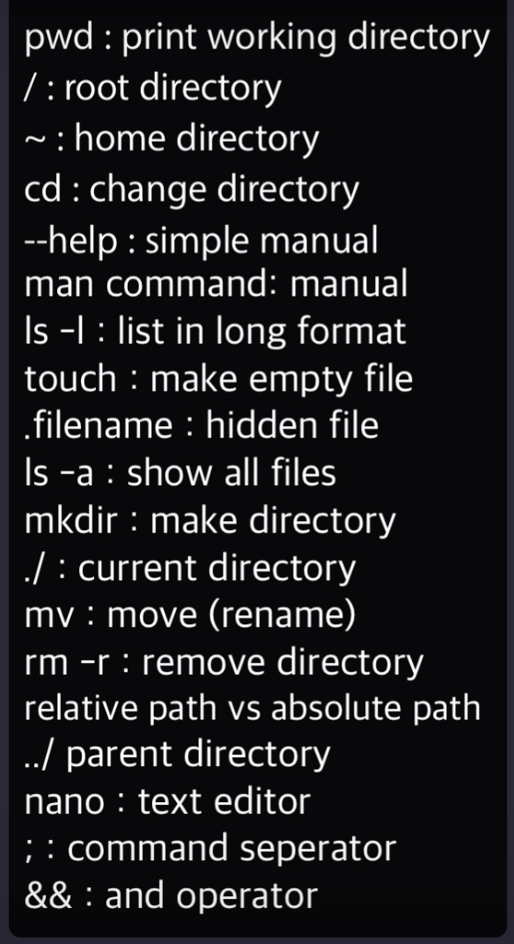

# [생활코딩]POSIX CLI 1(2020.12.2)  

**상세 내용 [블로그](https://greedysiru.tistory.com/7) 참고**

## GUI와 CLI  
| Graphic User Interface(GUI) | Command Line Interface(CLI) |
|:---------------------------:|:---------------------------:|
|화면 조작|문자조작|
|쉽다|어렵다|

## CLI의 장점  
  1. 한번에 순차적인 많은 명령을 내릴 수 있다.  
  1. 컴퓨터 자원을 거의 사용하지 않는다.  
  1. 서버 환경에서 사용한다.  

## POSIX  
POSIX(Portable Operating System Interface)는 유닉스 계열의 컴퓨터를 동일한 방법으로 제어하는 표준이다. 유닉스 계열 OS는 Linux, MacOS가 대표적이다. 해당 계열이 아닌 OS들은 에뮬레이터를 사용해야 한다. 맥은 터미널을 사용하면 된다.  

## CRUD  
POSIX는 아래와 같다.
|    | File | Directory |
|:---|:----:|:----------:|
|Create|editor|mkdir|
|Read|editor, cat, ls|ls|
|Update|ediotr, mv|mv|
|Delete|rm|rm|

## 숨겨진 파일  
숨긴 파일은 이름 맨 앞에 .으로 시작한다. 

## 상대경로와 절대경로
|절대경로|상대경로|
|:----:|:----:|
|cd users/username/documents| cd ..|
|나의 위치에 상관없이 이동|나의 위치에 따라 이동|

## 순차 작업 시키기  
```posix
mkdir dummy;cd dummy;touch dummy.txt;cod ..;ls -R
```
;(세미콜론)을 사용하여 여려 명령어를 입력할 수 있다. 오기로 인한 시스템 오류를 방지하기 위해서는 세미콜론 대신 `&&`를 사용한다.  

* ## 명령어 정리
  
  
# Reference
https://opentutorials.org/module/3747
