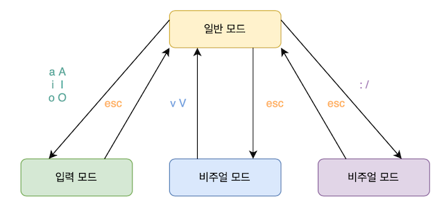

# [코드잇] 유닉스 커맨드 라인 (4) (2021.2.28)

**본 내용은 해당 [강의](https://www.codeit.kr/courses/unix-command-line) 토대로 작성**

# Vim

## 01. 텍스트 에디터, vim

* CLI 환경에서 사용할 수 있는 텍스트 에디터
* 마우스 없이 키보드로만 사용할 수 있다.
* UNIX 계열 운영체제에 설치되어 있는 보편적인 에디터이다.
* vi(1976, 미국, 빌 조이) -> vim(브람 믈레나르)

## 02. vim의 4가지 사용 모드

* 모드에 따라 같은 키를 눌러도 다르게 해석된다.

| 일반 모드(Normal Mode) | 입력 모드(Insert Mode) | 비주얼 모드(Visual Mode) | 명령 모드(Command Mode)  |
| :--------------------: | :--------------------: | :----------------------: | :----------------------: |
|       커서 이동        |      텍스트 입력       |     텍스트 블록 지정     |        내용 저장         |
|    텍스트 붙여넣기     |                        |       텍스트 복사        |         vim 종료         |
|      텍스트 삭제       |                        |                          | 특정 텍스트 검색 및 치환 |
|       작업 취소        |                        |                          |                          |

### 모드 전환

* **항상 일반 모드를 거쳐서 전환해야 한다.**

## 03. vim 입력 모드

###  vim 실행

`vim`

* 일반 모드로  vim을 실행한다.
* 인자로 파일명 입력하여 파일을 vim으로 열 수 있다.

### 입력 모드 전환

`i`: insert(삽입)

`esc `: 일반모드로 전환

### 입력 모드 커맨드

`I` : 커서를 첫 번째 칸으로 옮기고 입력 모드로 전환

`a`: append(추가), 커서를 한 칸 뒤로 옮기고 입력 모드로 전환

`A`: 한 번에 마지막 칸으로 가서 입력모드로 전환

`o`: open(개행), 커서를 다음 줄로 옮기고 입력 모드로 전환

`O`: 커서 위에 빈 줄이 생기고 입력모드로 전환

## 05. vim 명령 모드

### 명령 모드 전환

`:`: 명령 모드로 전환

### 명령 모드 커맨드

`w 파일명`: write, 저장하기

`q`: vim 나가기

`wq`: 저장 후 종료

`q!`: 저장하지 않고 종료

### 텍스트 검색

`/ 찾을텍스트`: 슬래시, 텍스트 검색 명령모드로 전환

`n`: next, 다음 검색 내용으로 이동

`N`: 이전 검색 내용으로 이동

### 텍스트 치환

* 특정 텍스트를 다른 텍스트로 바꿀 수 있다.
* **:**로 명령 모드에서 진행
* g 옵션: global
* c 옵션: confirm

`s/텍스트/대체텍스트`: substitute, 커서의 텍스트 대체

`%s/텍스트/대체텍스트`: 범위를 파일 전체로 각 줄의 첫 번째 단어만 바꾼다.

`%s/텍스트/대체텍스트/g`: 모든 텍스트를 바꾸기

`%s/텍스트/대체텍스트/gc`: 모든 텍스트를 확인하며 바꾸기, 원하는 부분만 교체 가능

## 06. vim 일반 모드

### 커서 이동 하기

* 방향키
* h, j, k, l
  * 좌,하,상,우
  * 이동하고 싶은 칸 수 + h, j, k, l

`ctrl + g`: 현재 커서의 위치

`0`: 줄의 첫 번째 칸으로 이동

`$`: 줄의 마지막 칸으로 이동

`gg`: 파일의  처음으로

`G`: 파일의 마지막 줄으로

### 텍스트 삭제하기

`x`: 텍스트 한 칸씩 삭제

`숫자 + x`: 숫자만큼 텍스트 삭제

`dd`: 문장 삭제하기

`숫자 + dd`: 숫자만큼 문장 삭제

`u`: undo, 이전 작업 취소

## 07. vim 비주얼 모드

* 텍스트 블록 지정 가능
  * 텍스트 삭제
  * 복사-붙여넣기
  * 잘라내기

### 텍스트 블록 지정

`v`:  비주얼 모드로 전환, 한 글자씩 블록 지정

`V`: 비주얼 모드로 전환, 줄 단위로 블록 지정

### 텍스트 삭제

`x`: 블록 지정 텍스트 삭제 후 일반 모드

`u`: 작업 취소

### 복사-붙여넣기

`y`: yank, 복사 후 일반 모드

`p`: paste, 커서 다음 칸 또는 다음 줄에 붙여넣기 (일반 모드)

`P`: 커서 이전 칸 또는 이전 줄에 붙여넣기 (일반 모드)

### 잘라내기

`d`: delete, 삭제한 내용을 일시적으로 기억

## 08. Vim 참고 자료

### Vim 공식 사용 설명서

https://vimhelp.org/#help.txt

###  Vim 게임으로 배우기

https://vim-adventures.com/

