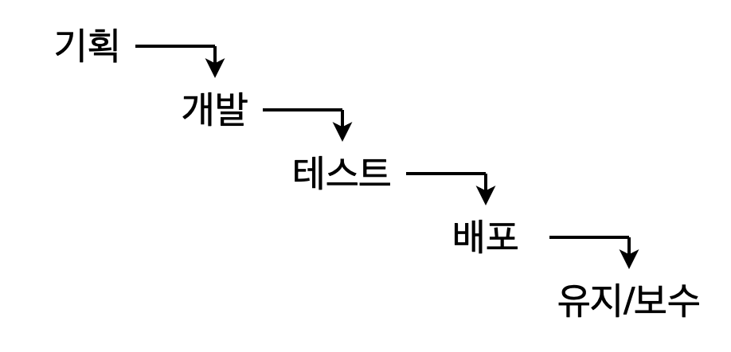

# [코드잇] 프로그래머의 세계 이해하기 (2021.2.10)

**상세 내용 [블로그](https://greedysiru.tistory.com/183) 참고**

# 프로그래밍의 다양한 분야

## 01. 컴퓨터 사이언스의 기본기

* 프로그래밍의 여러 영역은 밀접하게 연결되어 있다.
* 비슷한 접근 방식, 문제 해결 방식이 공유되어 있다.
* 프로그래밍 기본기가 탄탄하면, 새로운 기술과 새로운 언어에 빠르게 적응

### 컴퓨터 사이언스의 기본

* **객체 지향 프로그래밍**
* **알고리즘**
* **자료 구조**
* 그 외
  * 컴퓨터 구조, 운영체제, 컴파일러, 웹 개발, 데이터베이스, 네트워크

## 02. 소프트웨어 공학

* 개발자는 여러 분야의 사람들과 협업한다. (ex. 기획, 디자인, 마케팅 등)
* **소프트웨어 공학 : 소프트웨어로 제품/서비스를 만드는 방법에 대한 학문**
  * 기획, 제작, 테스트, 출시, 사후관리와 같은 모든 프로세스를 포함

|     기획      | 어떤 것을 만들지 정하는 단계                    |
| :-----------: | :---------------------------------------------- |
|   **개발**    | **기획한 것을 만드는 단계**                     |
|  **테스트**   | **개발이 기획대로 잘 되었는지 확인하는 단계**   |
|   **배포**    | **개발된 제품/서비스를 사용자가 사용하는 단계** |
| **유지/보수** | **출시된 서비스를 변화시키는 단계**             |

## 03. 프로세스 관리

### 폭포수(Waterfall) 방식

* 고전적으로 사용되는 방식
* **각 단계를 완료하고 다음 단계로 넘어가는 방식**

* **기획** : 기획자가 필요한 것을 문서로 완성
* **개발** : 문서를 받아 프로그램을 제작
* **테스트** : 프로그램이 잘 작동되는지 확인
* **배포** : 프로그램을 사용자가 사용할 수 있도록 공개
* **유지/보수** : 오류 개선 및 추가적인 기능 개발

#### 폭포수 방식의 단점

* 각 단계를 한번에 완벽하게 끝내기 힘들 수 있다.
* 프로그램이 복잡하면, 의도한대로 완벽히 전달되기 어렵다.
* 의도하지 않은 방향으로 진행되어도 완성이 되기 전에 문제를 발견할 수 없다.
* 수정 사항이 많이 생길 가능성이 높다
* 개발자들이 수정 사항을 반영하기 힘들다.

### 애자일(Agile) 방식

* 재빠른, 민첩한
* 결과물을 만들어 미리 확인하고 수정하며 진행
* 프로그램을 적당한 크기의 기능으로 나눈다.
*  각 기능에 대해 실제 동작하는 소프트웨어를 만들어 확인한다.
* 중간중간 사용하면서 발전시키기 때문에 기능 변경이 유연하다.
* **scrum, kanban** : 구체적인 실행 방법

### 애자일 방식 VS. 폭포수 방식

* **각 단계가 복잡하지 않다면, 폭포수 방식**
* **애자일 방식**은 각 기능을 적당한 크기를 나누고 만드는 것을 반복하므로 **프로젝트가 복잡해질 수도 있다.**
* **두 방식을 혼용**하여 사용할 수도 있다.

## 04. 테스트 프로세스

* 버그 : 의도하지 않은 에러
* 자동화 테스트 도구, 테스트 도구를 사용하여 버그 방지
* 특정상황에 발생하는 문제가 있는 경우가 있으므로 별도의 테스트 단계, 테스트 부서가 있을 수 있다.
* 신뢰성이 중요한 경우 추가 테스트를 여처라례 하기도 한다.

### 버그 관리 툴

* 얼마나 시급한지, 담당자는 누구인지, 빼먹은 버그가 있는지 버그가 잘 고쳐졌는 확인해야할 수 있다.
* **Jira, asana, Trello**
* **이슈** :버그에 대한 정보를 기입한 것

#### 이슈의 상태

|    Open     |       In-progress       |               Resolved                |            Closed            |                  Reopen                   |
| :---------: | :---------------------: | :-----------------------------------: | :--------------------------: | :---------------------------------------: |
| 이슈가 생김 | 개발자가 개선 작업 진행 | 문제가 해결됨 (개발자가 작업 완료) | 테스트 결과 버그가 잘 해결됨 | 추가적인 문제 발생시 다시 Open으로 돌아감 |

* **Assign** : 각 단계마다의 담당자 지정

## 06. 버전 관리

* git : 버전 관리를 하는 소프트웨어
  * 내용이 수정되었다면, **수정 사항 정보만 저장**
  * 누가 수정했는지, 변경 사항, 이유 등을 기록
  * 코드 저장 용량 절감, 각 사항의 이력 파악 용이
  * 하나의 공통 코드에서 여러 버전을 관리할 수 있다.(**Branch**)
* GitHub :  git을 이용해 코드를 저장하는 온라인 저장 공간

## 07. 개발자들의 필수 프로그램 IDE

* 통합 개발 환경(IDE, Integrated Development Environment)
* 개발자들이 코딩할 때 도움이 되는 기능을 모아둔 프로그램
* 코드를 효율적으로 작성할 수 있다.
* VSC, PyCharm 등

# 트렌드를 읽는 능력

## 01. 프로그래밍은 선택의 연속

* 프로그래밍 분야는 변화가 빠르다.
* 프로그래밍 언어, 라이브러리, 프레임워크, 디자인 패턴, 스타일 가이드를 선택함에 있어 신중해야한다.
* **트렌드를 읽어 내는 것이 매우 중요**

## 02. 트렌드를 읽는 방법 I (활발한 기술)

* **커뮤니티 살펴보기**
* **프로그래밍 언어와 관련된 자료 찾아보기**
* 좋은 언어/프레임워크/기술은 많은 사람들이 사용
* **stackoverflow, Quora**와 같은 커뮤니티에서 많이 언급, 질문되는 것
* **RedMonk**에서 관련 통계를 볼 수 있다.
* 구글에 튜토리얼을 얼마나 검색했는지에 대한 순위도 참고

## 03 .트렌드를 읽는 방법 II (인정받는 기술)

* 좋은 회사에서 선택한 기술
  * **stackshare** : 여러 회사에서 사용한 언어, 프레임워크, 라이브러리 기술을 알아볼 수 있다.
* 기업에서 만들거나 지원하는 기술 : 안정적으로 성장할 확률이 높다.
  * React: facebook
  * Angularjs : Google
  * Java : Oracle
  * Swift : Apple
  * Go : Google
* 다양한 자료 살펴보기 
  * medium, Reddit, Naver, kakao, woowahan

## 04. 트렌드를 읽는 방법 III (유망한 기술)

* **산업적인 이유로 기술의 추세가 바뀔 수 있다.**
* 프로그래밍 관점 뿐만아니라 산업 전반에 대한 이해가 필요하다.
* 꾸준한 조사, 공부가 필요
* **Gartner** : 년도별 기술 트렌드 분석  참고하기

# Reference

[코드잇 - 컴퓨터 개론](https://www.codeit.kr/courses/intro-to-computer)

