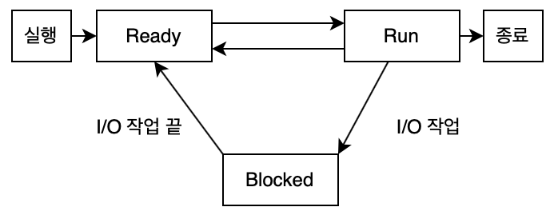

# Process vs Thread

**본 내용은 10분 테코톡 쪼밀리님, 오구님의 강의를 토대로 작성하였습니다.**

## 1. 용어정리

### 프로그램(Program)

* 어떤 작업을 위해 운영체제 위에서 **실행할 수 있는 파일**
* 웹 브라우저, 워드 프로세서, 카카오톡

### 프로세스(Process)

* 운영 체제 위에서 **실행중인** 프로그램
* 프로그램 명령어와 데이터들이 메모리에 올라오고 실행 중 또는 실행 대기중인 상태
* 프로세스가 동작하는 것은 프로세스의 특정 스레드가 실행 중
* 그 특정 스레드는 프로세스가 가진 데이터를 참조
* **스레드 단위 작업을 지원하기 위한 작업 할당의 단위**

### 프로세서(Processor)

* 프로세스가 **동작**될 수 있도록 하는 하드웨어(=cpu)
  * 동작: 프로세스가 **동작**될 수 있도록 하는 하드웨어(=cpu)

### 멀티태스킹

* CPU(프로세서)는 **한순간에 하나의 프로세스**만 실핼할 수 있음
* 운영체제가 짧은 시간에 수십번에서 수천번 실행할 프로세스를 교체
* 사람이 느끼기에는 동시에 작업되는 것처럼 보임

## 2. 프로세스

### 프로세스 상태

* 프로세스가 실행이되면 Ready 상태가 된다.
* 스케쥴링에 의해서 작업이 할당
* Run상태가 되어 작업이 진행
* 할당받은 시간이 끝나게 되면 다시 Ready 상태로 돌아오게 된다.
* Run 상태에서 작업을 하다가 I/O 작업을 만나면, I/O 작업을 요청하고 Blocked 상태로 빠짐
* 작업이 끝나면 종료상태가 된다.

### PCB(Process Control Block)

**프로세스를 제어하기 위한 정보 모음**

* 프로세스 식별자(Process ID)
* 프로세스 상태
* 다음에 실행할 명령어의 주소
* 이전에 작업하던 작업 내용(레지스터)
* CPU 스케줄링 정보(우선 순위, 최종 실행시각, CPU 점유시간 등)
* 프로세스의 주소 공간 등

### Context Switching

* 여러 작업이 진행될 때 교체되는 시점마다 각 작업이 레디 상태로 빠지는 정보, 진행 정도, 진행 지점에 대해 로딩하는 순간

### 프로세스 구조

* 각각, Stack, Heap, Data, Code 영역을 가진다.
* Stack: 호출된 함수 또는 지역변수 등의 임시 데이터
* Heap: 동적으로 생긴 데이터
  * new Object(), malloc()
* Data: 전역 변수
  * static, global 변수
* Cdoe: 프로그램의 코드

### 작업 흐름에 갈래가 생기는 경우

* 작업에 흐름이 여러 갈래 생기는 경우, 여러 개의 프로세스로 하나의 작업을 구성할 수 있음
* 각 프로세스가 메모리 영역을 가지므로 비효율이 발생

#### 비효율 1

* 첫 프로세스를 진행하는 동안 스택, 힙, 데이터, 코드 영역이 실제로 일을 하는 코어로 로딩
* 다음 프로세스로 넘어갈 때 기존에 사용하던 것을 내리고 다른 코드들을 로딩하는 작업이 필요

### 비효율 2

* 같은 작업을 하기 위해서 다른 프로세스의 정보를 사용하기 위해 통신이 필요

## 3. 스레드

* **프로세스 내에서 실행되는 작업 흐름의 단위**
* 스레드는 프로세스의 하위에서 Code, Data, Heap을 공유
* 각 쓰레드는 스택을 가진다.
* PCB의 레지스트 블록만 교체
* 컨텍스트 스위칭 비용이 적다.

### 멀티 스레드 주의점

* 디버깅이 까다로움
* 한 프로세스 안의 스레드에 문제가 생기면 같은 프로세스 안의 스레드도 문제가 생김
* 같은 데이터를 공유하기에, 데이터 동기화에 신경 써야함

## 정리

> 자원은 프로세스 단위로 받고, 작업/스케줄링은 스레드 단위로 진행

# Reference

[[10분 테코톡] 쪼밀리와 오구의 Process vs Thread](https://www.youtube.com/watch?v=DmZnOg5Ced8&list=PLgXGHBqgT2TvpJ_p9L_yZKPifgdBOzdVH&index=78)