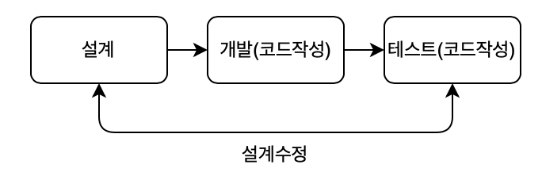
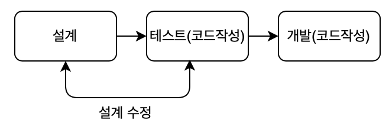
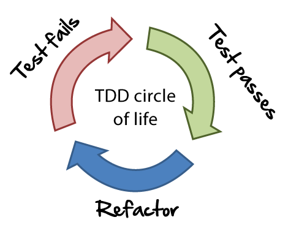

# TDD와 단위테스트

**본 내용은 10분 테코톡 피카님의 강의를 토대로 작성하였습니다.**

## 1. TDD란?

* Test-Driven Development
* **테스트 코드를 먼저 만들고**, 실제 프로덕션 코드를 나중에 만드는 개발

### 기존의 개발 프로세스 vs. TDD 개발 프로세스

## 2. TDD 사이클

1. 실패하는 테스트를 구현한다.
2. 테스트가 성공하도록 프로덕션 코드를 구현한다.
3. 프로덕션 코드와 테스트 코드를 리팩토링한다.

## 3. TDD를 사용하는 이유?

* 변화에 대한 두려움을 줄여준다. (리팩토링이 편하다)
* 디버깅 시간을 줄여준다.
* 동작하는 문서 역할을 한다.

## 4. TDD의 장점

* 테스트커버리지가 높아진다.
  * 테스트 대상의 전체 범위에서 테스트를 수행한 범위
* 오버 엔지니어링 방지
  * 오버 엔지니어링: 미래의 구현을 지레짐작하여 불필요한 코드를 작성하는 것
  * 필요한 만큼만 코딩할 수 있다.
* 설계 피드백이 빠르다.

## 5. TDD의 오해

> TDD는 설계방법론이다?

* 높은 응집을 유도하지 않는다.
* 단일 책임 원칙과 인터페이스 분리 원칙 위배에 어떤 신호도 주지 않는다.
* 인터페이스 일관성을 도출하지 않는다.
* 리팩토링 단계는 좋은 구조를 안내하거나 좋은 구조를 갖도록 강제하지 않는다.
* **즉, 설계 방법론이 아니다.**

## 6. TDD를 실패하는 이유?

* 코드가 이루고자하는 가치나 기능을 테스트하기보다 그 기능을 어떻게 구현하고 있는지를 테스트한다.
* 결국 테스트 케이스들이 구현체와 결합도가 높아진다.
* 구현체들을 리팩토링하면, 결합되어있는 테스트 케이스들이 모두 깨져버린다.

## 7. 테스트의 범위

* 통합 테스트: 여러 작업 단위가 연계된 워크플로우를 테스트하기 위한 수단(객체, 서비스, 시스템 간)
* 기능 테스트: 공개된 API의 가장 바깥쪽에 해당하는 코드 검사
* 부하 테스트: 주어진 단위 시간 동안 어플리케이션이 얼마나 많은 요청을 처리할 수 있는지 검사
* 인수 테스트: 고객 또는 대리인이 정의되어진 모든 목적에 부합되는지 확인해보고자 하는 검사

### 단위 테스트

* 가장 작은 단위의 테스트
* 일반적으로 메서드 레벨
* 검증이 필요한 코드에 대해 테스트 케이스를 작성하는 **절차 또는 프로세스**
* Unit Testing은 테스트 코드가 목적 코드의 완정성을 입증 해주기 때문에, 테스트 코드 그 자체만으로 주요한 가치가 있음

## 8. 단위 테스트의 목적

* 문제점 발견
  * 각 단위가 정확하게 동작하는지 검사
  * 문제가 발생 시 어느 부분이 잘못되었는지 확인
  * 프로그램 안정성이 높아진다.
* 쉬운 변경
  * 문제점을 금방 파악
  * 수정 코드가 잘 동작하는지 쉽게 확인
  * 변경을 자주 할 수 있음
* 품질 향상
* 코드의 문서화
  * 샘플코드
  * 예외 상황, 용도, 의존 관계를 한눈에 파악
* 배포되는 코드와 일치하여 항상 최신상태로 유지

## 9. F.I.R.S.T 법칙

### F - Fast(빠르게)

* 테스트는 빨라야 한다.

### I - Independent(독립적으로)

* 테스트는 서로 의존하면 안된다.
* 하나가 실패하면 나머지도 잇다라 실패
* 원인 진단 어려움
* 후반 테스트가 찾아낼 결함이 숨겨짐

### R - Repeatable(반복 가능하게)

* 어떤 환경에서도 반복 가능해야 한다.

  *  실제환경, QA환경, 오프라인 환경

  

### S - Self-Validating(자가 검증하는)

* 테스트는 boolean으로 값을 반환

### T - Timely(적시에)

* 항상 적시에 작성
* 실제 코드 구현 직전에 구현

# Reference

[[10분 테코톡] 피카의 TDD와 단위테스트](https://www.youtube.com/watch?v=3LMmPXoGI9Q&list=PLgXGHBqgT2TvpJ_p9L_yZKPifgdBOzdVH&index=31)

​	