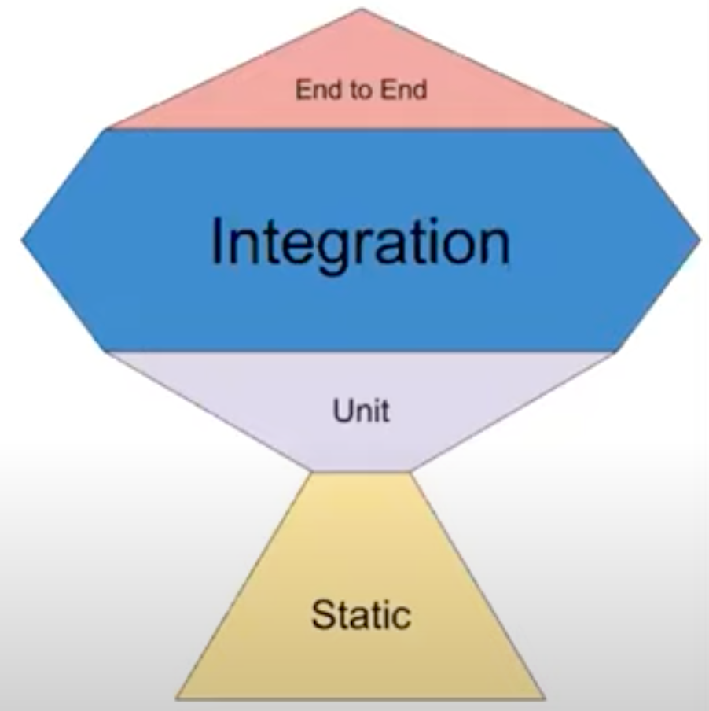

# 프론트엔드에서의 테스트 종류

**본 내용은 10분 테코톡 도비님의 강의를 토대로 작성하였습니다.**

## 1. 테스트란?

* 프로그램을 실행하여 **오류화 결함을 검증**하고 **애플리케이션이 요구사항에 맞게 동작하는지 검증**하는 절차
* 개발 과정에서 생기는 요구사항/ 리팩터링 등과 같은 변경사항들로 인해서 새로운 결함이 유입되지 않았는지 확인
* 기존 버그 수정 / 새로운 기능 추가 / 리팩토링의 부담감 해소
  * 기술부채를 줄일 수 있음
  * 기술부채: 기술적으로 해결되어야 할 문제들을 뒤로 미루고 비지니스 문제를 해결하는 시점을 앞당기는 것
  * 기술부채가 밀리다보면 오히려 코드를 새로 작성하는 것이 나은 상황이 올 수도 있다.

## 2. 테스팅 프로피

### Static 테스트

* 정적 테스트
* 구문오류, 나쁜 코드, 스타일 등을 검증
* ESLint, TypeScript

### Unit 테스트

* 단위 테스트
* 작은 단위를 떼어 내어 분리된 환경에서 테스트
* 복잡한 알고리즘이 제대로 동작하는지 확인
* 의존성이 있는 경우, Mocking 필요
* 작성 비용 낮음, 실행 속도 빠름
* Jest

### Intergration 테스트

* 통합 테스트
* 어플리케이션이 여러 부분들이 통합되어 제대로 상호작용 하는지 테스트
* 주로 큰 범위(페이지) 테스트를 의미
* 앱의 모든 기능이 제대로 동작한다는 확신을 줄 수 있음
* Jest, RTL, Enzyme

### E2E 테스트

* 실제 사용자가 사용하는 것과 같은 조건에서 전체 시스템을 테스트
* API 서버, DB 등의 외부 서비들을 모두 사용하여 통합된 시스템을 테스트
* 고비용, 속도 느림
* Cypress, Selenium

### 요약

| UI     | **Service** | **Unit** |
| ------ | ----------- | -------- |
| 느림   | 중간        | 빠름     |
| 고비용 | 중간        | 저비용   |

* **제한된 리소스로 테스팅 효율을 높이고 싶으면, 통합 테스트 위주로 작성**

## 3. 프론트엔드 테스팅 대상

### 사용자 이벤트 처리

* 입력 이벤트를 적절한 이벤트 핸들러로 처리
* 이를 테스트하기 위해서는 JS API, Test 유틸리티를 통해서 시뮬레이션, E2E를 통해서 실제로 브라우저 상에서 이벤트 발생 시켜봄

### API 서버 통신

* 실제 API서버 이용: 통합 테스트, E2E 테스트
* mockAPI: 단위 테스트, 통합 테스트
  * 내가 원하는 응답을 받을 수 있어서 다양한 상황을 테스트할 수 있다.
  * Jest

### 시각적 요소

* 입력과 출력값 검증
  * 입력: 사용자의 액션
  * 출력: 사용자의 액션에 따른 화면
* 스냅샷 테스트: HTML구조가 의도대로 나타나는지를 테스트
  * Jest, StoryBook
* 시각적 회귀 테스트: HTML에 CSS를 더해서 컴포너늩가 실제로 브라우저에서 렌더링되는 모습이 의도한 대로 나타나는지를 테스트
  * StoryBook

## 4. 테스팅 환경

* 테스트 코드가 어디서 실행되느냐에 따라서 브라우저, Node.js로 나누어짐

### 브라우저

* 네트워크 10. 렌더링 엔진 활용가능
* 테스트 코드를 다양한 운영체제, 브라우저 사용가능 => 호환성 체크가능
* Node.js에 비해 무거워서 초기 구동속도가 늦다.
* 브라우저를 사용하기 위해 별도로 설치가 필요하다. => Headless 브라우저로 사용하는 것을 권장
* karma, Selenium, Cypress

### Node.js

* 설치 및 실행이 간단하고 속도가 빠르다.
* 모듈 단위로 테스트가 가능하다.
* DOM, BOM, API가 없다 => jsdom을 사용하나, 브라우저 동작을 100% 구현하지는 못한다.
* Jest, Mocha

# Reference

[[10분 테코톡] 프론트엔드에서의 테스트 종류](https://www.youtube.com/watch?v=pkYUcKWOqPs&list=PLgXGHBqgT2TvpJ_p9L_yZKPifgdBOzdVH&index=3)