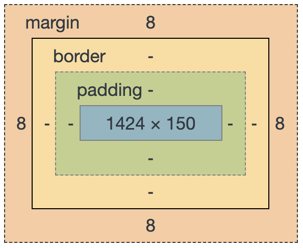

# [노마드코더]코코아톡 클론코딩 (2)(2021.1.4)


**상세 내용 [블로그](https://greedysiru.tistory.com/92) 참고**


# Learning CSS

## 1. CSS 추가하기

### HTML파일에 인라인 코드로 작성

```html
<head>
  <style>
    CSS 코드 작성
  </style>
</head>
```

### CSS파일 분리

Externel CSS라고 한다.

```html
<head>
  <link href="style.css" rel="stylesheet" />
</head>
```


## 2.CSS의 문법

>selector{
>
>property : value ;
>
>}

* **selector** : 선택자. 스타일을 적용할 HTML 태그를 가르킨다.

* **Property** : 속성. 글자 크기, 색상 등의 스타일을 설정할 수 있도록 한다.

* **vlaue** : 속성에 적용할 값

  

## 3. Cascading의 의미

* 위에서 있는 코드부터 차례대로 읽는다는 의미

* 위에서부터 아래까지 차례대로 적용된다.

* 같은 것을 설정한 경우, 마지막의 설정이 적용

* 겹치지  않는 것은 같이 적용

  

## 4. Block, Inline

### Block

* 옆에 다른 요소가 올 수 없다.
  * **div, p, address**
* 높이와 너비가 있다.


### Inline

* 옆에 다른 요소가 올 수 있다.
  * **span, a, img, link**
* 높이와 너비가 없다.


### Block과 Inline 바꾸기

```CSS
<style>
    div {
        display: inline;
        height: 150px;
        width: 150px;
        background-color: tomato;
    }
    span {
        display: block;
        background-color: turquoise;
    }
</style>
```

`display` 에 `inline`이나 `block`을 설정


### inline-block

* inline과 block의 속성을 동시에 줄 수 있다.

```CSS
<style>
div {
        display: inline-block;
        width: 50px;
        height: 50px;
        background-color: teal;
    }
</style>
```


## 5. Box model

* Block은 **margin, padding, border** 속성을 가진다.

  


### Margin

* 경계의 바깥에 있는 공간
* inline에는 좌,우에만 적용
* **border**보다 바깥에 있다.

```CSS
<style>
 div {
  			margin: 50px;  /*상하좌우 적용*/
        height: 150px;
        width: 150px;
    }
    body{
        margin-top: 20px;
        margin-left: 10px;
        margin-right: 5px;
        margin-bottom: 10px; 
    }
    h1{
      	margin: 20px 15px; /*첫번째 : 위아래 , 두번째 : 좌우*/
    }
    h2{
				margin: 10px 20px 15px 5px; /*위, 우, 하, 좌*/
    }
</style>
```


#### Collapsing margins

* box들의 경계가 같을 때, 상하 **margin**이 같아진다.


### Padding

* box의 경계로부터 안쪽에 있는 공간
* inline에도 적용된다.


### Border

* box의 경계이다.


### Asterisk

* Asterisk(*)를 사용하여 전체 요소에 속성을 줄 수 있다.
* 예시

```CSS
<style>
   * {
          border:2px solid black;
      }
</style>
```


## 6. id와 class

### id

* **한 요소를 하나의 id를 지정**할 수 있다.
* 특정 id의 값을 지칭하려면 **#id를 이용해 접근**한다.
* 예시

```css
<head>
<style>
		#first {
        background-color: whitesmoke;           /* 각각의 아이디에 속성을 설정할 수 있다.*/
        width: 150px;
        height: 150px;
    }
    #second {
        background-color: teal;
        width: 100px;
        height: 100px;
    }
    #third {
        background-color: wheat;
        width: 50px;
        height: 50px;
    }
    #fourth {
        background-color: blanchedalmond;
        width: 25px;
        height: 25px;
    }
</style>
</head>
<body>
    <div id="first">
        <div id="second">
            <div id="third">
                <div id="fourth">                    
                </div>
            </div>
        </div>
    </div>
</body>
```


### Class

* **여러개의 요소들에게 부여**해서 사용할 수 있다.
* .**class를 이용해서 접근**한다.
* 예시

```CSS
<style>
    body{
        margin: 20px;
    }
    .btn {
        padding: 5px 10px;
        border-radius: 10px;
    }
    .teal{
        background-color: teal;
    }
    .tomato{
        background-color: tomato;
        color: white;        
    }
</style>
</head>
<body>
    <span class="btn teal">hello</span>
    <span class="btn tomato">hello</span>
    <span class="btn teal">hello</span>
    <span class="btn tomato">hello</span>
    <span class="btn teal">hello</span>
    <span class="btn tomato">hello</span>
    <span class="btn teal">hello</span>
    <span class="btn tomato">hello</span>
</body>
```


# Reference

https://nomadcoders.co/kokoa-clone/lobby