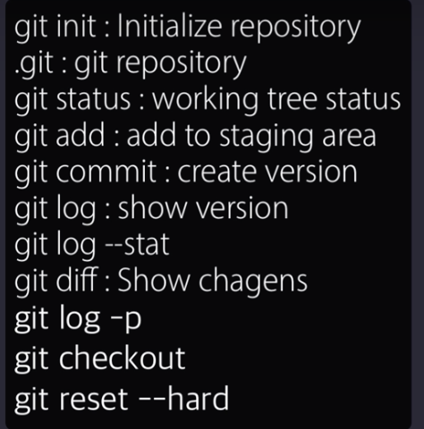

# [생활코딩]Git2 CLI - 버전관리 (2020.12.2)  

**상세 내용 [블로그](https://greedysiru.tistory.com/8) 참고**  

## Git 설치  
https://git-scm.com  

## Git CLI  
POSIX CLI로 Git을 사용할 수 있다.

## Git Repository 생성  

디렉토리에서 Repository를 생성해야한다. 터미널에서  

```posix
git init
```
입력하면, 숨겨진 폴더 .git이 생성된다. 이 폴더는 디렉토리의 변경사항들을 저장한다.  

## Git add

```posix
git add 파일명.txt
```
입력하면, git이 해당 파일을 추적하고 버전 기록이 시작된다.  

## Git commit  

파일의 버전을 저장하려면 commit을 한다.
```posix
git commit 파일명.txt
```
에디터에서 버전명을 입력한다. 에디터 설정은 아래와 같다.
```posix
git config --global core.editor"nano"
```
에디터를 들어가지 않고 바로 commit하는 방법은 아래와 같다.
```posix
git commit -m "버전명"
```

## 요약
커밋까지는 총 세 단계다.  
  1. Working tree : 추적전의 상태  
  1. Staging Area : 추적이 된 상태, 버전을 만들 파일들이 있는 곳.  
  1. Repositroy : commit하여 버전이 저장된 곳.  

## 변경 사항 보기  
Staging Area에 있는 파일이 수정되면 
```posix
git diff 파일명.txt
```
를 입력하면 변경 사항들을 볼 수 있다.
```posix
git log -p
```
위 명령어는 기록된 각 버전에서의 변경 사항들을 볼 수 있다.  


## 해당 버전으로 돌아가기
```posix
git checkout 버전 번호
```
다시 최신버전으로 돌아가고 싶다면,
```posix
git checkout master
```

## Git 삭제하기 (리셋하기)  
버전을 복구하고 싶다면,
```posix
git reset --hared 복구 버전 번호
```
입력하면, 해당 버전으로 돌아간다. 수정한 것은 삭제하고 복구 버전 시점으로 간다.  

## Git 되돌리기  
버전을 남기고 되돌리고 싶으면,
```posix
git revert 버전번호
```
입력하면, 되돌리기가 된다. 유의할 점은 원하는 시점까지 역순으로 진행해야 한다.

## 명령어 정리  
  

# Reference
https://opentutorials.org/module/3762