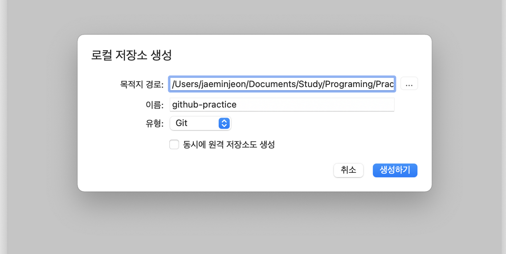
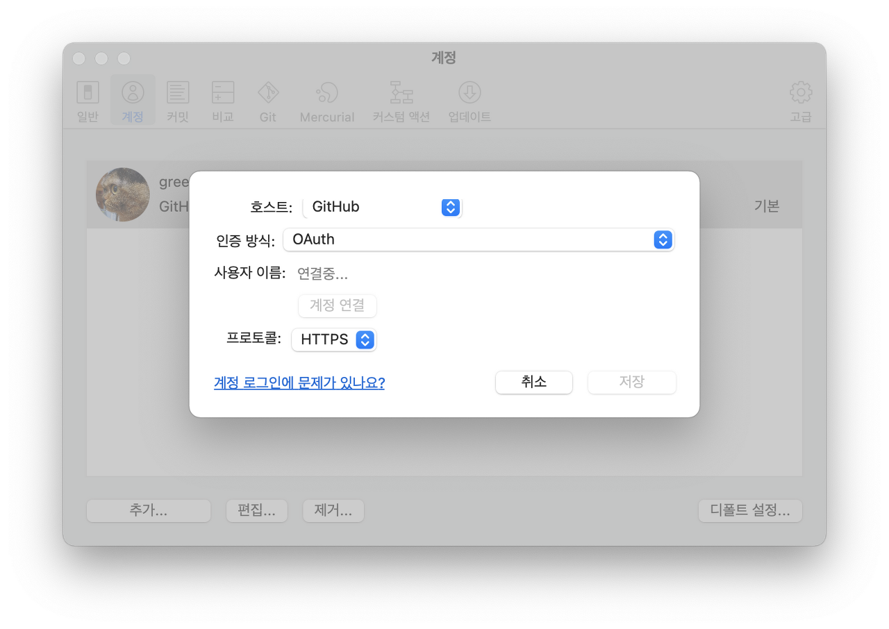
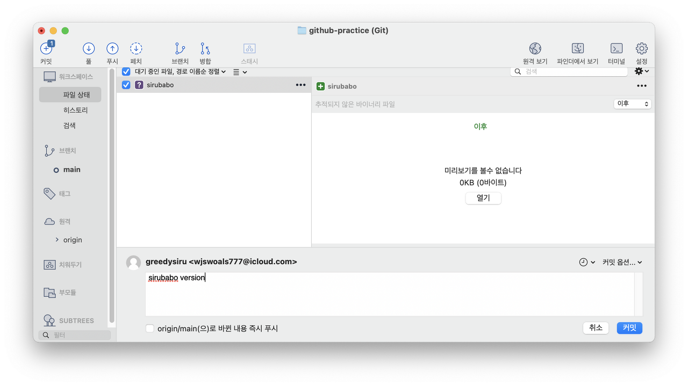
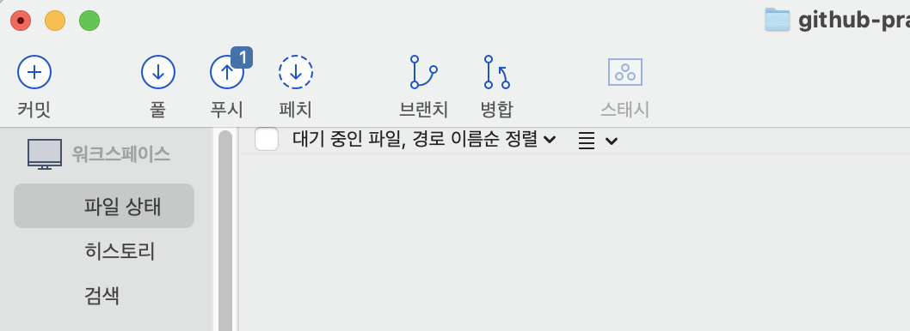

# [생활코딩]Git2-Source tree 버전관리 (2020.12.3)  

**상세 내용 [블로그](https://opentutorials.org/module/4636) 참고**  

## Sourcetree 설치  
https://opentutorials.org/module/3746  
설치 후, Atlassian의 회원가입을 하면 사용할 수 있다.  

## 저장소 생성  
새로 만들기 - 로컬 저장소 생성 클릭 후 아래 처럼 입력한다.
  

## Github와 연결  
Sourcetree의 설정창을 켜고 계정 탭에서 아래와 같이 입력한다.

인증방식을 OAuth, 프로토콜은 HTTPS로 한다. 계정에 로그인이 되어있으면 연결이 완료 된다.  

## Sourcetree로 Push하기  
파일이 변경되거나 추가되면 아래처럼 Commit을 할 수 있다.  
  
이제 화면 상단에 Push가 뜬다.
  
암호를 입력하면 Push가 완료 된다.  

# Reference  
https://opentutorials.org/module/3746