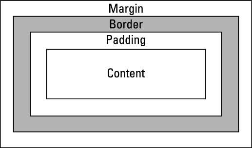

# [코드잇] HTML/CSS 핵심개념 (1)(2021.2.17)

**상세 내용 [블로그](https://greedysiru.tistory.com/209) 참고**

# Box Model

## 01. Box Model 소개

* **모든 HTML 요소는 Box Model로 이루어져 있다.**

  

  

  

  * **content** : 실제 내용
  * **padding**: 내용과 테두리 사이의 여유 공간
  * **border**: 테두리
  * **margin**: 해당 요소와 다른 요소 사이의 여백
    * 별도의 설정이 없이도 웹 브라우저의 기본 설정 값이 있다.

## 02. margin, padding

### padding 설정

* padding이 상하좌우 다 같은 경우 하나의 값을 입력하면 된다.
* 위아래, 좌우로 묶어 지정하려면 순서대로 두 개를 입력하면 된다.

> **element {**
>
> **padding: top right bottom left;**
>
> **}**

### margin 설정

> **element {**
>
> **margin: top right bottom left;**
>
> **}**

### 가운데 정렬

* 요소들은 기본적으로 왼쪽에 치우쳐있다.
* **margin-right: auto, margin-left: auto를 적용하면 가운데 정렬이 된다.**
* 브라우저에서 좌우 남은 공간을 동등하게  margin으로 설정한다.

## 03. width, height

* **가로길이와 세로길이를 설정**
* img에도 적용할 수 있다.

### min-width, min-height

* 요소의 최소 너비, 높이 설정
* 화면이 작아져도 설정한 최소 너비, 높이를 유지한다.

### max-width, max-height

* 요소의 최대 너비, 높이 설정
* 화면이 커져도 설정한 최대 너비 높이를 유지한다.

## 04. overflow

* **컨텐츠의 내용보다 width나 height가 작게 설정되어 있는 경우**
* 컨텐츠가 box 밖으로 넘쳐 나온다.

### overflow: hidden

* 넘치는 부분을 숨긴다.

### overflow: visible

* 밖으로 넘쳐 나온다.
* 기본값

### overflow: scroll

* 넘치는 부분을 숨기고 스크롤을 생성한다.
* 컨텐츠가 넘치지 않아도 **항상 스크롤을 보여준다.**

### overflow: auto

* **컨텐츠가 넘친 경우에만 스크롤바를 보여준다.**

## 05. border

* 테두리를 설정한다.
  * 선의 굵기, 종류, 색상
  * 선의 종류: solid, dashed, dotted 등

> **element {**
>
> **border: 1px solid red;**
>
> **}**

### 테두리 없애기

> **element {**
>
> **border: none;**
>
> **}**

## 06. 박스 꾸미기

### 둥근 모서리

* 더 큰 값을 쓸 수록 더 둥글게 된다.
* 각 모서리를 개별 설정 가능

> **element {** 
>
> **border-radius: 5px;**
>
> **}**

### 배경색

* 배경색을 설정할 수 있다.
  * **페이지 배경색은 body태그에 설정**하면 된다.
  * **배경색을 투명하게 두고 싶으면 transparent** 값으로 설정 (기본값)
* 색 이름, RGB, HEX 중 하나 사용

> **element {**
>
> **background-color: red;**
>
> **}**

### 그림자

* 요소에 그림자를 줄 수 있다.
  * 기본값은 none
  * **가로, 세로, 흐림 정도(blur), 그림자 크기(spread), 그림자 색**

> **element {**
>
> **box-shadow: 40px 10px 10px 20px black ;**
>
> **}**

## 07. box-sizing

### content-box

* **기본값**
* **width, height를 설정하면 content의 크기만 설정된다.**
* border, padding을 고려해야 원하는 크기를 설정할 수 있다.

> **element {**
>
> **box-sizing: content-box;**
>
> **}**

### border-box

* **width, height를 설정하면 border, padding, content를 모두 포함한 길이가 된다.**
* 매우 편하기 때문에 모든 요소에 설정하는 추세

> **element {**
>
> **box-sizing: border-box;**
>
> **}**

## 08. 배경 이미지

* 배경에 이미지를 삽입할 수 있다.

> **element {**
>
> **background-image: url( image url );**
>
> **}**

### background-reapet

* 이미지를 반복한다.
* **no-repeat** : 반복하지 않음
* **repeat-x** : 가로 방향 반복
* **repeat-y** : 세로 방향 반복
* **repeat** : 가로와 세로 모두 반복

### background-size

* 배경 이미지의 사이즈를 정한다.
* **auto** : 원래 이미지 사이즈대로 출력
* **cover** : 화면을 꽉 채우고 사진 비율 유지
* **contain** : 가로, 세로 중 먼저 채워지는 쪽에 맞추어서 출력
* 픽셀값과 퍼센트값으로 지정할 수 있다.

### background-position

* 배경 이미지의 위치를 정해주는 속성
* 픽셀값과 퍼센트값으로 지정할 수 있다.
* 가로, 세로를 각각 조합해서 지정
  * 가로 : **left, center, right**
  * 세로 : **top, center, bottom**

> **element {**
>
> **background-position: right top;**
>
> **}**

# Reference

[코드잇 - HTML/CSS 시작하기](https://www.codeit.kr/courses/web-publishing)

