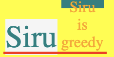
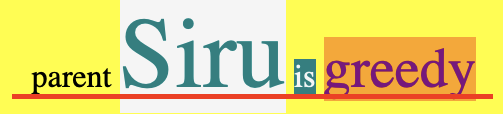
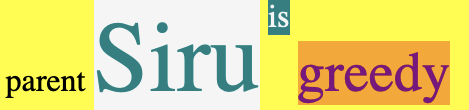
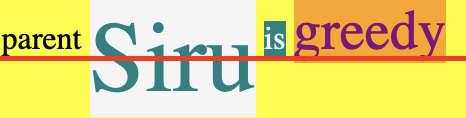

# [코드잇] HTML/CSS 핵심개념 (3)(2021.2.18)


**상세 내용 [블로그](https://greedysiru.tistory.com/211) 참고**


# Display

## 01. display

* **HTML 요소의 레이아웃을 결정하는 가장 중요한 속성 중 하나**


### display의 종류

모든 요소는 딱 하나의 display 값을 가진다.

1. **inline**
2. **block**
3. **inline-block**
4. **flex**
5. **list-item**
6. **none**

대부분의 요소들은 **inline**과 **block** 중 한 가지이다.


### inline display

다른 요소들과 같은 줄에 머무르려고 하는 성향을 가지고 필요한 만큼의 가로길이만 차지한다. 아래는 기본 diplay값이 inline이다.

**width, height를 가질 수 없다.**

1. **span 태그**
2. **a 태그**
3. **b 태그**
4. **i 태그**
5. **img 태그**
6. **button 태그**


### block display

다른 요소들과 다른줄에 가려고 하는 성향을 가지고 최대한 많은 가로길이를 차지한다. 아래는 기본 display값이 block이다.

**width, height를 설정할 수 있다.**

1. **div 태그**
2. **h1~h6 태그**
3. **p 태그**
4. **nav 태그**
5. **ul 태그**
6. **li 태그**


### display 바꾸기

* **CSS에서 display 속성값으로 변경할 수 있다.**

```CSS
h1 {
  display: inline;
}
i {
  display: block;
}
```


## 02. inline-block

* **inline 요소처럼 다른 요소들과 같은 줄에 머무르면서 block요소처럼 width, height를 설정할 수 있다.**

```CSS
i{
  display: inline-block;
  width: 100px;
  height: 100px;
}
```


## 03. img 태그

* **img 태그는 inline이지만 width, height를 가진다.**
  * **대체 요소(replaced element)**
* 텍스트처럼 다룰 수 있다.
  * **vertical-align, text-align을 적용할 수 있다.**


### img 태그 가운데 정렬

* text-align으로도 가능하지만, 의미가 자연스러운 코드는 아래이다.

```CSS
img {
  diplay: block;
  margin-left: auto;
  margin-right: auto;
}
```


## 04. 다양한 링크

* **텍스트 외의 요소에 링크를 부여할 수 있다.**
  * a 태그안에 inline요소를 넣는다.


### block 요소에 링크를 넣을 때

div 태그를 a태그로 대체하여 링크를 넣을 수 있다. 하지만, div 태그는 block이고 a태그는 inline이기 때문에 레이아웃이 망가진다. 이럴 때는 아래처럼 설정하면 된다.

```CSS
/* 클래스 title에 링크 넣기 */
.title {
  display: block;
  color: black;
  text-decoration: none;
}
```


## 05. Baseline

* inline요소가 가지는 아래의 선
  * text 아래 선
  * image의 아래 선


빨간줄로 표시한 것이 Baseline이다.

### inline-block의 경우

* 요소의 마지막 줄이Baseline을 가진다.
* 줄이 없는 경우 box 밑이 Baseline이 된다.
* **overflow의 경우**
  * visible: 요소의 마지막 줄이 Baseline
  * hidden: box의 밑이 Baseline

|                visible                 |                 hidden                 |
| :------------------------------------: | :------------------------------------: |
|  |  |


## 06. vertical-align pt. 1

* **Baseline이 기본으로 설정**
  * 해당 요소의 Baseline을 부모 요소의 Baseline에 맞춘다.


```HTML
 <div class="cover">
   parent
 <span class="siru">Siru</span>
 <span class="is">is</span>
 <span class="greedy">greedy</span>
 </div>
```





### vertical-align: top

* 해당 요소의 위가 속해있는 줄의 가장 높은 요소에 맞춰진다.

```CSS
    .is{
      vertical-align: top;
    }
```




#### 다른 예시

* 가장 높은 요소에 vertical-align: top을 주었을 때

```CSS
   .siru {
      vertical-align: top;
    }
```



siru를 제외한 가장 높은 요소는 greedy이다. 그래서 greedy가 위로 올라오게 된다. 이에 더해서 greedy의 Baseline을 맞추기 위해 parent와 is가 올라오게 된다. 그 이유는 Baseline은 상황에 따라 옮겨지게 되는데 **Baseline은 vertical-align의 조건들을 충족시키면서, 줄의 높이를 최소화 시키는 곳에 위치한다.** siru가 greedy와 맞추기 위해서 내려오는 것은 줄이 높이가 길어지기 때문에 그렇게 동작하지 않는 것이다.


## 07. vertical-align pt. 2

### vertical-align: middle

* **부모요소의 소문자  x의 가운데와 해당 요소의 가운데가 맞춰진다.**
  * 소문자 x의 높이는 인쇄술에서 중요하기 때문이다.


## 08. 가운데 정렬

### 가로 가운데 정렬

* inline 요소

> **selector {**
>
> **text-align: center;**
>
> **}**

* block 요소

> **selector {**
>
> **margin-left: auto;**
>
> **margin-right: auto;**
>
> **}**


### 세로 가운데 정렬

* line-height 속성 주기
  * **부모요소에는 line-height와 속성값, 자식요소에는 line-height: normal**

* 비어있는 요소 더하기
  * **display: inline-block, height: 100% , vertical-align: middle**

```HTML
<div class="container">
  <div class="helper"></div>
  <div class="info">
    <h1>Hello!</h1>
    <p>My name is young.</p>
  </div>
</div>
```

```CSS
.container {
  width: 300px;
  height: 400px;
  text-align: center;
}

/* 가운데 정렬을 위한 요소 */
.helper {
  display: inline-block;
  height: 100%;
  vertical-align: middle;
}

.info {
  display: inline-block;
  vertical-align: middle;
}
```


#### width가 100%인 경우

* 띄어쓰기를 없앤다.
* margin 값을 띄어쓰기 만큼 마이너스 값을 준다.


#### 주의 사항

* 부모의 height가 설정되어 있어야 한다.


# Reference

[코드잇 - HTML/CSS 시작하기](https://www.codeit.kr/courses/web-publishing)

