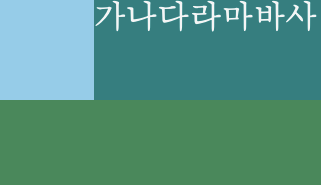
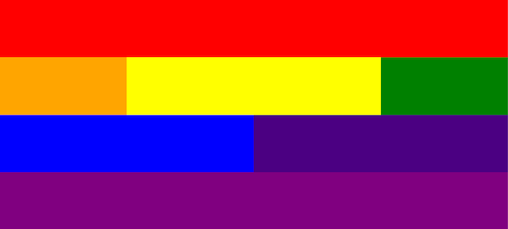

# [코드잇] HTML/CSS 핵심개념 (4)(2021.2.18)


**상세 내용 [블로그](https://greedysiru.tistory.com/213) 참고**

# 포지셔닝

## 01. relative 포지션

### position 속성

* **모든 요소는 기본적으로 static이다.**
  * 원래 있어야할 위치에 배치


###  position: relative

* **상대적인 위치**
  * 원래 있어야할 위치를 기준으로 이동한다.
  * top, right, bottom, left
* **margin과 다른점**
  * 다른 요소에 영향을 주지 않는다.
  * 이동 후 요소들과 겹칠 수 있다.
* 예시

```CSS
b {
  position: relative;
  top: 30px
}
```


## 02. fixed 포지션

* **브라우저를 기준으로 포지셔닝**
  * top, right, bottom, left
* 해당 요소를 포지셔닝한 위치에 **고정한다.**
* 네비게이션바에 주로 사용


## 03. absolute 포지션

* **가장 가까운 포지셔닝이 된 조상(Ancestor) 요소가 기준**
  * top, right, bottom, left
* 포지셔닝이 된 요소 : static(기본)이 아닌 position 설정이 된 요소


# Float

## 01. float

* **설정한 요소를 띄운다.**
  * right, left
* 띄워지면서, 그 공간은 공백이 된다.
* **하지만, inline, inline-block 요소는 그 공간에 갈 수 없다.**
* 뉴스 레이아웃을 만들 때 사용


### 예시

```HTML
<style>
  .skyBlue{
    background-color:SkyBlue;
    height: 50px;
    width: 50px;
    float: left;
  }
  .teal{
    background-color:teal;
    height: 50px;
    color: whitesmoke;
  }
  .seaGreen{
    background-color:SeaGreen;
    height: 50px;
  }
</style>
</head>
<body>
<div class="skyBlue"></div>
<div class="teal">가나다라마바사</div>
<div class="seaGreen"></div>
</body>
```




## 02. multiple floats

* **여러 요소를 띄울 수 있다.**
* 같은 위치에 float를 하면, 먼저 온 요소 옆에 나란히 위치한다.
  * 줄이 찼을경우, 다음 줄에 위치한다.
  * 브라우저의 크기에 반응하여 적절한 위치를 차지한다.
* **이를 이용해서 그리드(Grid) 레이아웃을 만들 수 있다.**


### 그리드 연습

```HTML
<!DOCTYPE html>
<html>
  <head>
    <title>그리드 연습</title>
    <meta charset="utf-8" />
    <link href="css/styles.css" rel="stylesheet" />
  </head>
  <body>
    <div id="red"></div>
    <div id="orange"></div>
    <div id="yellow"></div>
    <div id="green"></div>
    <div id="blue"></div>
    <div id="indigo"></div>
    <div id="purple"></div>
  </body>
</html>
```

```CSS
body {
  margin: 0;
}

/* 전체 */

div {
  height: 200px;
  float: left;
}

/* 개별 */

#red {
  background-color: red;
  width: 100%;
}

#orange {
  background-color: orange;
  width: 25%;
}

#yellow {
  background-color: yellow;
  width: 50%;
}

#green {
  background-color: green;
  width: 25%;
}

#blue {
  background-color: blue;
  width: 50%;
}

#indigo {
  background-color: indigo;
  width: 50%;
}

#purple {
  background-color: purple;
  width: 100%;
}
```




## 03. clear

* **gird에서 지정한 곳에 float인 요소가 없도록 정리할 수 있다.**
  * left, right

> **selector {**
>
> **clear : left;**
>
> **}**

### clear로 그리드 문제 해결하기

* inline 요소가 gird의 빈 공간을 채워지는 것을 막는다.
* gird인 div는 세로 길이가 0px 이다.
  * 이러한 점 때문에, 테두리를 설정하여도 제대로 적용이 되지 않는 문제를 해결한다.
* **gird를 지정한 div의 맨 아래에 빈 div를 만들어 clear: left를 설정한다.**


### 원리

* 빈 div에 clear: left를 적용하면 왼쪽에 float인 요소가 없도록 맨 밑으로 내려온다.
* 그 결과, gird인 div는 세로길이가 늘어나게 된다.


# 리스트

## 01. 리스트

### ol 태그

* **Ordered List**
* 하위 태그로 li 태그를 사용해서 순서있는 리스트를 나타낸다.
  * List item
* type
  * a, A, i, I
  * 순서를 지정한 type에 따라 나타낸다.

```HTML
<ol tpye="A">
  <li>물 마시기</li>
  <li>공부하기</li>
  <li>잘 자기</li>
</ol>
```


### ul 태그

* Unordered List
* 순서없는 리스트


## 02. 리스트 스타일링

* ul태그와 li태그는 display: list-item이다.
* **list-style-tpye: square** 
  * 정사각형 점으로 나타낼 수 있다.
* **list-style: none**
  * 점 없애기
* 기본적으로 padding이 설정되어있어 ul을 선택자로 지정하여 padding을 없앨 수 있다.
* 사이트의 네비게이션을 만들 때 주로 사용한다.


### 예시

```CSS
ul {
  padding-left: 0;
  width: 200px;
}

li{
  list-style: none;
  margin-bottom: 10px;
  background-color: #77abff;
  color: white;
  padding: 10px 20px;
}
```


# Reference

[코드잇 - HTML/CSS 시작하기](https://www.codeit.kr/courses/web-publishing)

