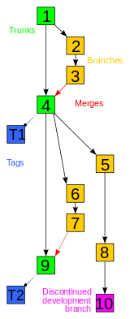

# [노마드코더]코코아톡 클론코딩 (11)(2021.1.11)

**상세 내용 [블로그](https://greedysiru.tistory.com/109) 참고**

# Publishing our website

## 1. Branches on Git

* Branch는 코드의 평행세계와 같다.
* 검증된 코드는 Master에 저장
* 기능 추가, 시험은 Branch에서 시행
* 원하는 Branch를 Master와 합칠 수 있다.
* GitHub Desktop에서 원하는 Branch를 이동하며 코드를 작업할 수 있다.
* 여러 사람과 Project를 할 때 유용하다.

## 2. Publisihing on Gihub pages

* gh-pages 라는 이름의 Branch를 가지고 있으면 Github에서 무료 hosting을 지원한다.
* **URL(유저이름.github.io/저장소이름)**이 생성된다.
* Static 웹 사이트인 경우에만 지원
  * HTML, CSS, JavaScript로만 이루어진 웹 사이트
  * Back-end 또한 지원하지 않는다.

## 3. Updating Github Pages

* hosting한 웹 사이트를 바꾸고 싶을때 아래의 순서를 따른다. 반드시 순서 따를것!
* mater branch (기본)에서 수정사항을 적용하고 저장한다.
* GitHub Desktop에서 commit한다.
* gh-pages branch로 들어가서 상단의 branch 탭을 클릭한다.
* update from master를 클릭한다.
* push한다.

# Reference

Git 이미지 - https://ko.wikipedia.org/wiki/깃_(소프트웨어)

강의 - https://nomadcoders.co/kokoa-clone/lobby

