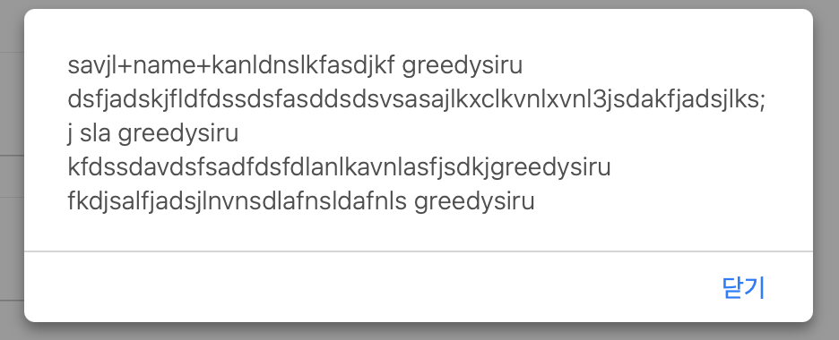
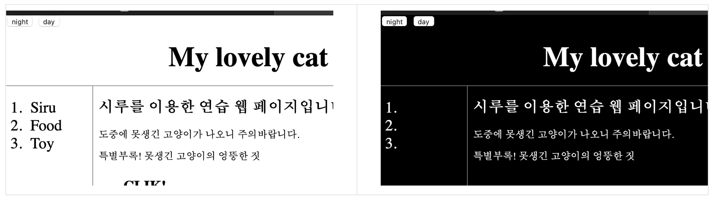

# [생활코딩]WEB2-JavaScript (1)(2020.12.7)  

**상세 내용 [블로그](https://greedysiru.tistory.com/12)참고**  

## JavaScript의 등장  
HTML의 정적인 한계로 사용자와 상호작용이 불가능. 그로인해 동적인 JavaScript등장. 웹 페이지는 HTML을 기반으로 JavaScript를 사용해서 사용자와 상호작용할 수 있도록 함.  

## <script>  
JavaScript 사용시, 앞뒤에 `<script></script>`태그를 사용한다.  

## 이벤트  
웹 브라우저에서 일어나는 일. 이런 이벤트가 일어났을 때, JavaScript를 실행되게 한다. onclick, onkeydown 등이 있다.  

## on속성  
on으로 시작하는 속성은 두 가지 특징이 있다.
 >속성 값에는 JavaScript가 온다.  
 >웹 브라우저가 속성값을 기억하고 이벤트가 일어나면 실행.  

## Datatype  
JavaScript의 Datatype(자료형)은 6가지이다. 대표적으로 Number(숫자), String(문자열)이 있다. 숫자는 연산자와 만나 동작이 된다. 문자열은 취급시 따옴표,큰따옴표로 감싼다. 숫자 1이라도 따옴표를 감싸주면 문자취급이 된다.  

## 변수와 대입 연산자
 >x=1  
x는 Variable(변수)이고 =은 대입 연산자, 1은 값이다.  
 >1=2  
1은 언제나 1이므로 대입이 안 된다. 1은 Constant(상수)이다.  

## 변수 사용 예시
복잡한 문자열의 원하는 자리에 원하는 단어를 넣는다고 할 때, 아래의 명령어를 입력한다.
```javascript
var name = 'greedysiru' ; 
alert("savjl+name+kanldnslkfasdjkf "+name+" dsfjadskjfldfdssdsfasddsdsvsasajlkxclkvnlxvnl3jsdakfjadsjlks;j sla "+name+" kfdssdavdsfsadfdsfdlanlkavnlasfjsdkj"+name+" fkdjsalfjadsjlnvnsdlafnsldafnls "+name+" ")

```
그 결과 아래와 같이 원하는 결과가 출력된다.
  
변수를 사용했으므로 원하는 단어가 달라졌을 때 변수 값만 변경하면 된다. 생산성이 높아진다.  

## 웹 브라우저 제어  
웹 페이지의 화면을 Day, Night 버튼을 누르면 각각 화면이 바뀌도록 기능을 준다. 아래와 같은 명령어를 입력한다.
```html
<input type="button" value="night" onclick="
    document.querySelector('body').style.backgroundColor = 'black';
    document.querySelector('body').style.color = 'white';
      ">

<input type="button" value="day" onclick="
      document.querySelector('body').style.backgroundColor = 'white';
      document.querySelector('body').style.color = 'black';
      ">
```
### 부연 설명
  1. input type="button"은 버튼을 출력한다는 뜻  
  1. value는 버튼의 이름  
  1. onclik은 이벤트(속성)  
  1. document.querySelector()는 선택자  
  1. style.backgroundColor는 스타일  


**JavaScript문법과 CSS문법의 혼동과 대문자를 주의한다**  

명령어를 입력한 결과, 아래 처럼 웹 페이지에 기능을 부여할 수 있다.    
  

## 명령어  
`document.wirte('문자')` : 문자출력  
`<input type="button" value="hi">` : hi 버튼 출력  
`<input type="button" value="hi" onclick="alret('hi')">` : 누르면 hi경고창이 뜨는 hi버튼 출력  
`<input type="text" onchange="alret('changed')">` : 변화가 생기면 changed 경고창이 뜨는 텍스트 상자 출력  
`'문자열'.length` :  문자열의 길이 출력  
`str.toUpperCase()` : 대문자 만들기  
`str.indexOf('o')` : 해당 문자열에 o가 몇번 째에 있는지 출력  

# Reference
https://opentutorials.org/course/3085


