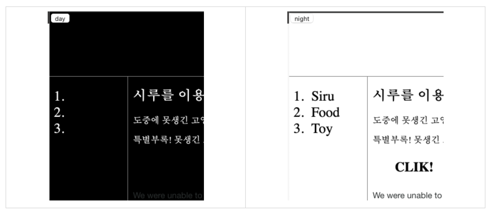

# [생활코딩]WEB2-JavaScript (2) (2020.12.8)  

  

**상세 내용 [블로그](https://greedysiru.tistory.com/13?category=860707) 참고**  

  

## 프로그래밍 언어란  

  시간의 순서에 따라서 실행되어야 할 기능을 프로그래밍 언어의 문법에 맞게 글로 적어 컴퓨터에게 실행시킬 수 있다. JavaScript가 대표적인 프로그래밍 언어이다.  


## 조건문

  조건에 따라서 다른 기능이 실행되도록 할 수 있다.


## Comparison(비교 연산자)와 Boolean(불리언)  

  1. === : 좌항과 우항을 비교해서 true(참)과 false(거짓)을 출력하는 비교 연산자
  2. ture, false는 Boolean이다.
  3. Boolean은 데이터의 형태 중 하나. 단 두가지의 값을 가짐.


## Conditional statements(조건문)

조건문 if의 문법은 아래와 같다.

```javascript
if(조건){
  참일 때
}
else{
  거짓일 때
}
```


## 조건문의 활용

  한 버튼에 토글 기능을 줄 수 있다.

  ```javascript
  <input id="night_day" type="button" value="night" onclick="
      if(document.querySelector('#night_day').value === 'night'){
        document.querySelector('body').style.backgroundColor = 'black';
        document.querySelector('body').style.color = 'white';
        document.querySelector('#night_day').value = 'day';
      } 
      else {
        document.querySelector('body').style.backgroundColor = 'white';
        document.querySelector('body').style.color = 'black';
        document.querySelector('#night_day').value = 'night';
      }
  
  ```

  onclick속성에 if조건문을 버튼의 id의 value에따라 바뀌도록 한다. night버튼일 때 누르면 화면이 어두워지고 day버튼을 누르면 화면이 밝아질 것이다.




## 리팩토링

  코드의 중복을 줄이고 더 효율적으로 하는 것. 위 명령어의 `document.querySelector('#night_day')`를 this로 대체하고 변수를 사용해서 `document.querySelecotr('body')`를 대체한다.

```javascript
<input type="button" value="night" onclick="
  var target = document.querySelector('body')
    if(this.value === 'night'){
      target.style.backgroundColor = 'black';
      document.querySelector('body').style.color = 'white';this.value='day';
    }else{
      target.style.backgroundColor = 'white';
      target.style.color = 'black';
      this.value='night'
    }">
```


## 명령어 정리

`var 변수명=` : 변수 만들기  

# Reference  
https://opentutorials.org/course/3085