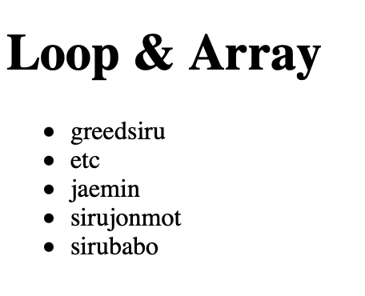
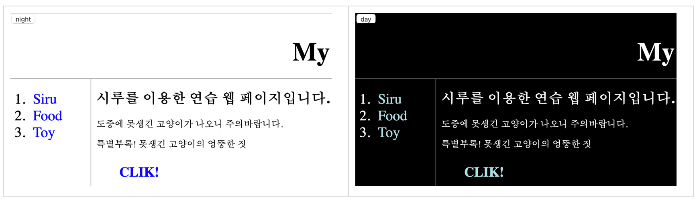

# [생활코딩]WEB2-JavaScript (3) (2020.12.8)

**상세 내용 [블로그](https://greedysiru.tistory.com/18) 참고**


## Array(배열)

많은 데이터를 배열에 정리할 수 있다. 배열에 오는 각 데이터는 원소라고 한다.


## Array(배열)의 문법과 성격

```javascript
var coworkers=["greedysiru","jaemin"]
```

대괄호를 사용하고 값과 값 사이는 컴마로 구별한다.

```javascript
document.write(coworkers[0]);
```

greedysiru가 출력. 배열은 첫 번째가 0이다.

```javascript
document.write(coworkers.length);
```

배열의 길이가 나온다.

```javascript
coworkers.push("a")
```

배열에 문자열을 추가할 수 있다.


## 반복문

```javascript
while( ){
      
      }
```

()에 boolean이 들어가 ture일 때 {}를 반복한다.


## 배열과 반복문

배열의  수 만큼 리스트를 생성할 수 있다.

```javascript
<script>
      var coworkers = ['greedsiru','etc', 'jaemin','sirujonmot','sirubabo'];
</script>
    <ul>
      <script>

        var i = 0;
        while(i < coworkers.length){
        document.write('<li>'+coworkers[i]+'</li>');
        i = i + 1
      }

 	  </script>
    </ul>


```

변수 i를 넣고 배열의 길이만큼 명령어가 실행되게 한다.




## 배열과 반복문의 활용

웹 페이지의 `<a>` 를 while 과 배열을 사용해서 폰트 색상을 변경할 수 있다.

```javascript
var alist = document.querySelectorAll('a');
    var i = 0 ;
    while(i < alist.length){
    console.log(alist[i]);
    alist[i].style.color = 'powderblue'
    i = i + 1;
      }
```

`document.querySelectorAll('a')` 는 해당페이지의 `<a>` 를 배열의 형식으로 찾는다. 반복문은 배열의 길이만큼 반복하므로 페이지 전체 `<a>` 는 폰트 색상이 적용된다.




## 명령어 정리

`var coworkers = ["a", "b"];` : 변수에 배열 넣기

`coworkers.length;` : 배열의 길이(수)

`coworkers.push("")` : 배열에 데이터 추가

`while( ){}` : ( ) 안의 조건을 true일 때 { } 반복

`'+variable+'` : 명령문 내 변수 추가

`document.querySelector('a')` : a태그를 첫 번째만 가져오는 매서드

`document.querySeletorAll('a')` : 모든 a태그를 배열로 가져오는 매서드

`console.log( )` : 콘솔에서 해당( )을 출력

`array.length` : 배열수


# Reference

https://opentutorials.org/course/3085

