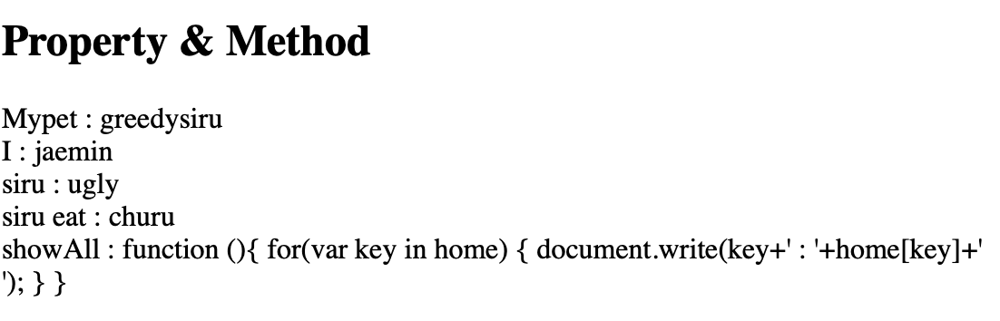

# [생활코딩]WEB2-JavaScript (5)(2020.12.9)


**상세 내용 [블로그](https://greedysiru.tistory.com/20) 참고**


## Object (객체)

함수와 변수를 그룹핑해서 정리정돈 할 수 있다.


## 객체의 쓰기와 읽기


```javascript
<script>
	var home = {
    "mypet" : "greedysiru",
    "I" : "jaemin"
      };  
</script>
```

추가로 쓰기는 아래와 같다. 공백이 포함되어 있으면 대괄호를 쓴다.

```javascript
<script>
  home.siru = "ugly";
	home["siru eat"]="churu";  
 </script>
```

출력은 아래처럼 하면 된다.

```javascript
<script>
  document.write("mypet : "+home.Mypet+"<br>");
	document.wrtie("I : "+home.I+"<br>");
	document.write("siru : "+home.siru+"<br>");
	document.write("siru eat : "+home["siru eat"]);
</script>
```


## 객체와 반복문

객체의 반복문에서는 for문을 쓴다. while과 달리 변수를 따로 지정하지 않아도 해당 변수의 key값을 전부 불러온다.

```javascript
<script>
	for(va key in home){
 		document.write(home[key]+'<br>');   
  }
</script>
```


## Property 와 Method

키의 값을 Property라고 한다. 키와 property 를 동시에 출력하려면 아래와 같은 명령어를 입력한다.

```javascript
<script>
	home.showAll=function(){
  for(var key in home){
    document.write(key+":"+home[key]+'<br>')
  }
}
</script>
```

`home.showAll=function(){}` 은 객체에서의 함수정의이다.



마지막에 showAll까지 출력되는 이유는 객체에 함수도 포함되기 때문이다.


## 객체의 활용

이전에 만든  웹 페이지의 많은 함수를 객체로 정리할 수 있다.

```javascript
var Links={
	SetColor:function(color){
    	var alist=document.querySelectorAll('a');
        var i=0;
        while(i<alist.length){
        	console.log(alist[i]);
            alist[i].style.color=color;
        }
    }
}

var Body={
	SetColor:function(color){
    	document.querySelector('body').style.color=color;
    },
    SetBackgroundColor:function(color){
    document.querySelector('body').style.backgroundColor=color;
    }
}
```


## 파일 쪼개서 정돈하기

관리하는 웹 페이지들에 기능을 정의한 JavaScript를 적용할 수 있다. .js확장자로 만든 파일에 JavaScript명령어를 넣고

```html
<script src="color.js"></script>
```

를 각 페이지 head에 넣어준다.


## 명령어 정리

`var home={}` : 객체 입력

`for(){}` : for반복문

`home.ShowAll=function(){}` : 객체에서의 함수 정의


# Reference

https://opentutorials.org/course/3085

