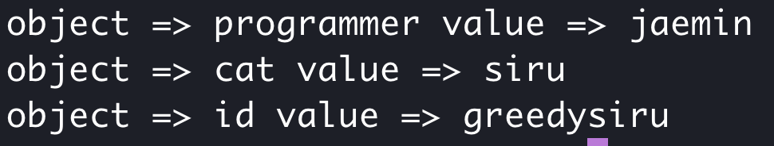

# [생활코딩]WEB2-JavaScript (6)(2020.12.22)


**상세 내용 [블로그](https://greedysiru.tistory.com/54?category=860707) 참고**


## 객체의 형식

객체(Object) vs. 배열(Array)

|       Object       |        Array        |
| :----------------: | :-----------------: |
|     순서 없음      |  순서에 따라 저장   |
| 식별자: 문자(이름) | 식별자: 숫자(0부터) |
|      중괄호{}      |      대괄호[]       |


## 객체의 반복

for문을 사용해서 객체의 key와 value를 불러올 수 있다.

```javascript
for(var name in roles){
  console.log('object =>', name, 'value =>', roles[name]);
}
```





## 객체 - 값으로서 함수

 JavaScript에서 함수는 구문이면서 값이다. 이는 다른 구문과 큰 차이점이다.

함수는 변수, 배열의 원소, 객체의 value가 될 수 있다.

```javascript
var f = function (){
  console.log(1+1);
  console.log(1+2);
}
console.log(f);
var a = [f];
a[0]();

var o = {
  func:f
}
o.func();
```

이렇게, 함수 `f`가 변수로서 선언되고 정상적으로 출력된다.


## 객체 - 데이터와 값을 담는 그릇

함수가 참조하는 데이터가 있을 때, 한 객체를 생성해서 그 객체에 연관된 함수와 데이터를 정리한다.

```javascript
var q = {
v1:'v1',
v2:'v2',
f1:function (){
  console.log(this.v1);
},
f2:function (){
  console.log(this.v2);
}
}

q.f1();
q.f2();
```

한 객체의 함수는 그 객체에 묶여있는 데이터를 `this` 를 사용해서 바로 불러올 수 있다. 객체의 명이 달라지거나 객체가 어느 변수로 속해지는 것에 상관없이 소속 객체 안을 참조할 수 있다.


# Reference

https://opentutorials.org/course/3332