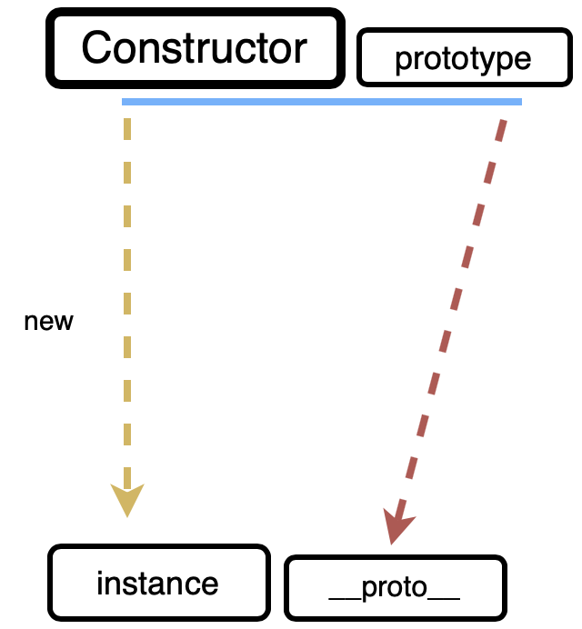
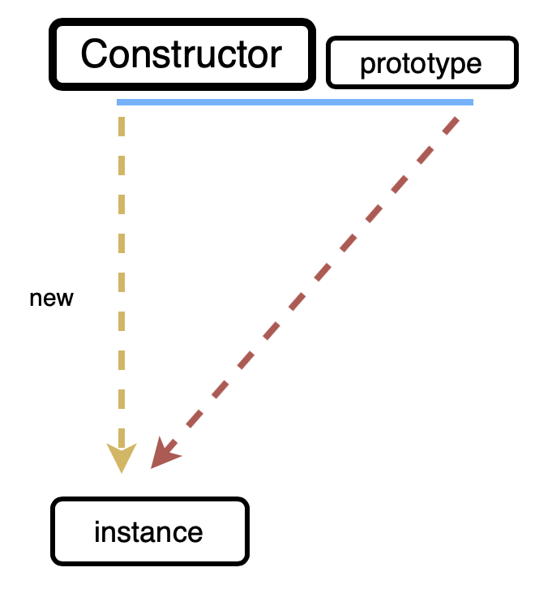
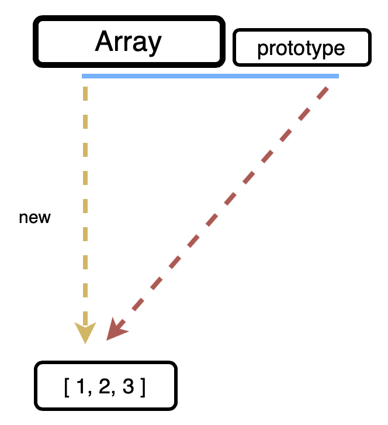
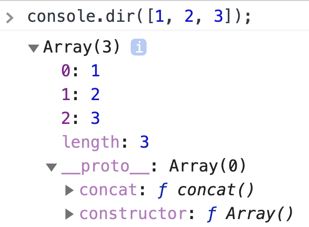
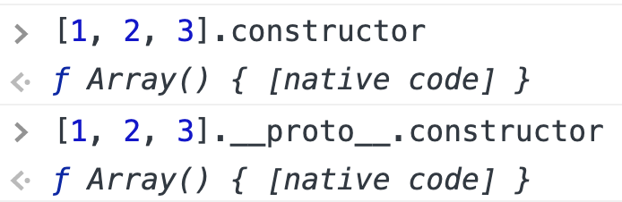
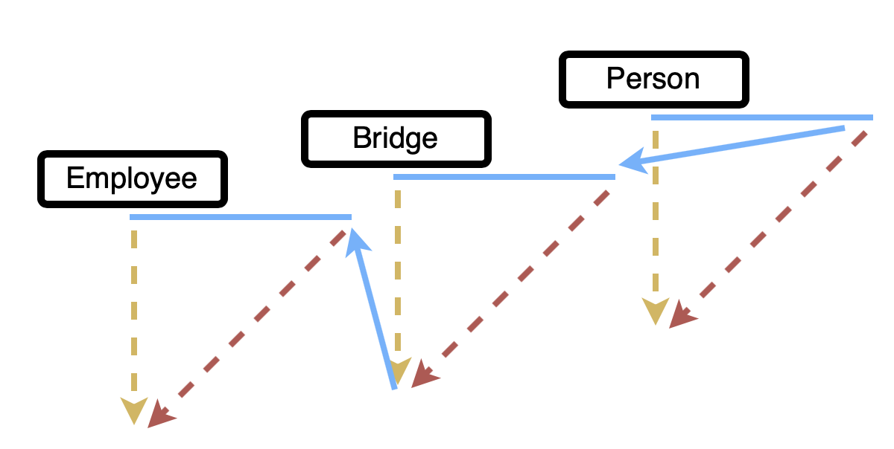

# [인프런 - 정재남] Javascript 핵심 개념 알아보기 - JS Flow (3)(2021.1.26)


**상세 내용 [블로그](https://greedysiru.tistory.com/140) 참고**


# 1. 클로저

* 닫힘 / 폐쇄 / 완결성
* **함수와 그 함수가 선언될 당시의 lexical environment의 조합, 현상**
* **실행 컨텍스트 A**의 내부에서 **함수 B**를 선언한 상황에서 **실행 컨텍스트 A**와 **함수 B**가 콤비가 되어 무엇인가를 한다.
* 함수 B의 입장에서는 **outerEnvironmentReference**가 실행 컨텍스트 A의 **environmentRecord**를 참조한다.
*  **컨텍스트 A에서 선언한 변수를 내부함수 B에서 접근할 경우에만 발생하는 특수한 현상**


## 예시 1

```JavaScript
var outer = function () {
  var a = 1;
  var inner = function () {
    console.log(++a);
  };
  inner();
}
outer();
```

|               | LexicalEnvrionment        |                          |
| ------------- | ------------------------- | ------------------------ |
| inner         | environmentRecord         | :{ }                     |
|               | outerEnvrionmentReference | :{ a: 1 -> 2, inner: f } |
|               | **LexicalEnvrionment**    |                          |
| outer         | envrionmentRecord         | :{ a: 1 -> 2, inner: f } |
|               | outerEnvrionmentReference | : { outer: f}            |
| 전역 컨텍스트 |                           |                          |

* **inner함수**
  * 실행시 **envrionmentRecord**에는 아무것도 없다.
  * **outerEnvironmentReference**는 **outer**의 **LexicalEnvironment**를 참조한다.


## 예시 2

```JavaScript
var outer = function () {
  var a = 1;
  var inner = function () {
    retrun ++a;
  };
  retrun inner;
}
var outer2 = outer();
console.log(outer2());
console.log(outer2());
```

|               | LexicalEnvrionment        |                                            |
| ------------- | ------------------------- | ------------------------------------------ |
| inner         | environmentRecord         | :{ }                                       |
|               | outerEnvrionmentReference | :{ a: 1 -> 2 -> 3}                         |
|               | **LexicalEnvrionment**    |                                            |
| outer         | envrionmentRecord         | :{ **a: 1 -> 2 -> 3** , inner: f }         |
|               | outerEnvrionmentReference | : { outer: f}                              |
| 전역 컨텍스트 | environmentRecord         | : { outer: f , outer2: undefined -> inner} |

1. **outer함수** 
   1. **inner**가 **retrun**되면서 전역 컨텍스트의 **outer2 : inner** 입력 (참조카운트는 아직 있는 상태)
2. **전역 컨텍스트**
   1. **console.log(outer2());** 실행되며 **함수 inner** 호출
3. **inner함수**
   - a에 접근하여 a가 2가 된다.

4. **outer함수**
   - outer의 a도 2가 된다.

5. **전역 컨텍스트**
   * console.log는 2가 출력
   * **console.log(outer2());** 실행되어 위처럼 inner함수 -> outer함수를 거친다.
   * 3이 출력


## 정리

* outer에서 변수 a가 사라지지 않고 유지된다.

* **컨텍스트 A에서 선언한 변수 a를 참조하는 내부함수 B를 A의 외부로 전달할 경우, A가 종료된 이후에도 a가 사라지지 않는 현상이다.**

* 지역변수가 함수 종료 후에도 사라지지 않게 할 수 있다.


## 응용

```javascript
function a () {
  var localA = 1;
  var localB = 2;
  var localC = 3;
  retrun {                     // 객체 전체를 return
    get a () { retrun localA; },
    set a (v) { localA = v; },
    get b () { return localB + localC; },
    set b(v) { throw Error('read only'); }
  }
}
var obj = a();
```

* **obj는 객체**이고 **클로저**에 의해서
  * **a**라는 프로퍼티에 **접근해서 값을 바꾸거나 읽어올 수 있다.**
  * 지역변수 **localA**에 직접 접근할 수 있는 것은 아니다.
  * **b**라는 프로퍼티는 접근시 **내부의 값과 다른 값에 접근된다.**
  * **b**는 **값을 바꾸려 하면, error가 출력**된다.
* **지역변수를 보호**하면서 접근할 수 있는 수단을 만들 수 있다.
* **클로저**에 의해서 외부에서 **값을 읽거나 변경할 수 있게 하거나 못하게 할 수 있다. 또, 전혀 다른 값을 보여줄 수 있다.**
* **외부에게 선별적으로 권한**을 줄 수 있다.


# 2. 프로토타입

## prototype, constructor, _ _ proto _ _



* **Constructor** : 생성자
  * **prototype**
* **instance** : 생성자를 new 연산자를 이용해서 만듦
  * **_ _ proto _ _** : Constructor의 prototype 내용이 참조를 전달. 즉 서로 같은 객체를 바라본다.

* **_ _ proto _ _**는 생략이 가능해서 아래와 같이 동작하는 것 처럼 보인다.




### 배열



* [ 1, 2, 3 ]은 **Array**라는 생성자 함수에 의해서 **new연산자**를 통해 Array의 **instance**와 동일하다.
* **Array**에는 **prototype**을 포함한 여러 **프로퍼티**가 있다.
  * from()
  * isArray()
  * of()
  * arguments
  * length
  * name
  * prototype
* **prototype**이 **instance**의 **_ _ proto _ _** 에 의해서 동일하게 연결이 된다.
* **prototype**: 배열의 메소드들이 있다.
  * concat()
  * filter()
  * forEach()
  * map()
  * push()
  * pop()

* console.dir로 배열을 출력해보면 아래와 같이 나온다.



*  **_ _ proto _ _**아래에 **prototype의 메소드**와 **constructor**가 있는 것을 볼 수 있다.
* **constructor**에는 **Array 함수**가 담겨져 있다.



*  **_ _ proto _ _**는 생략이 가능하므로 위와 같이 똑같이 출력된다.


### 예시

```JavaScript
function Person(n, a) {
  this.name = n;
  this.age = a;
}
var gomu = new Person('고무곰', 30);

var gomuClone1 = new gomu.__proto__.constructor('고무곰_클론1', 10); // Person 접근

var gomuClone2 = new gomu.constructor('고무곰_클론2', 25); // Person 접근

var gomuProto = Object.getPrototypeOf(gomu); // 프로토타입 반환
var gomuClone3 = new gomuProto.constructor('고무곰_클론3', 20);

var gomuClone4 = new Person.prototype.constructor('고무곰_클론4', 15);
```

* **고무곰_클론** 들은 전부  **Person**의 **instance**이다.


### prototype에 접근 가능한 경우

```JavaScript
[CONSTRUCTOR].prototype
[instance].__proto__
[instance]
Object.getPrototypeOf([instance])
```


### 생성자 함수에 접근 가능한 경우

```JavaScript
[CONSTRUCTOR]
[CONSTRUCTOR].prototype.constructor
[instance].__proto__constructor
[instance].constructor
(Object.getPrototypeOf([instance])).constructor
```


## 메소드 상속 및 동작 원리

```JavaScript
function Person(n, a) {
  this.name = n;
  this.age = a;
}

var gomu = new Person('고무곰', 30); // 2개 인스턴스
var iu = new Person('아이유', 25);

gomu.setOlder = function() {
  this.age += 1;
}
gomu.getAge = function() {
  retrun this.age;
}
iu.setOlder = function() {
  this.age += 1;
}
iu.getAge = function() {
  return this.age;
}
```

* 위의 **.setOlder**와 **.getAge** 메소드를 prototype을 통해서 간략하게 할 수 있다.

```JavaScript
function Person(n, a) {
  this.name = n;
  this.age = a;
}
Person.prototype.setOlder = function() { // Person의 prototype
  this.age += 1;                         
}
Person.prototype.getAge = function() {
  return this.age;
}

var gomu = new Person('고무곰', 30); // 2개 인스턴스
var iu = new Person('아이유', 25);
```

* **gomu.setOlder();** 에서, **this**는 **gomu**이다.
  * 정상적으로 출력
* **gomu._ _ proto _ _.setOlder();**에서, **this**는 **gomu._ _ proto _ _**이다.
  * 즉, **undefined**에 숫자를 더하는 것이므로 **NaN**이 출력
* **Person.prototype.age = 100;** 을 입력한 경우
  * **gomu._ _ proto _ _.getAge();**는 101이 나온다.
  * **gumu.getAge();**는 31이 나온다.


## prototype chaining

* **prototype**은 **객체**이다.
* **prototype** 또한 **Object**라는 생성자 함수에 **new 연산자**로 인해서 만들어진 **객체**이다.
* 그러므로 **Object.prototype을 상속받는다.**
* 배열을 생성한 경우 아래와 같은 관계를 가진다.

> [1, 2, 3] < ---------- Array.prototype < ---------- Object.prototype

* 만약, 어떤 메소드를 찾는데**, Array.prototype**에 없으면, 타고 올라가서 **Object.prototype**에서 메소드를 찾는다.

* **Object.prototype**: 모든 데이터 타입에서 공통적으로 사용할 메소드들이 있다.

  * hasOwnProperty()
  * toString()
  * valueOf()
  * isPrototypeOf()

* string, array, number 등 어떤 데이터 타입을 생성했을 때, **궁극적으로 Object.prototype에 접근할 수 있다. 이것이 prototype chaining이다.**

* 그러나, { a: 1, b: 2}와 같은 **literal object**에서는 **자신의 메소드를 사용할 수 없다.** **Object.prototype**은 통용되기 때문이다. 즉, **this**를 사용할 수 없다.

  > { a:1, b: 2} < ---------- Object.prototype

* 그래서 생성자 함수 Object에 static한 메소드를 넣어놓는다.

* **Object**

  * assign()
  * freeze()
  * create()
  * values()
  * keys()


## 예제

<br>

```JavaScript
var arr = [1, 2, 3];

console.log(arr.toString()); // 1,2,3 출력
```

* arr에는 toString이라는 메소드가 없어도 **prototype에서 메소드를 찾아낸다.**

<br>

```JavaScript
var arr = [1, 2, 3];
arr.toString = function() {
  return this.join('_');
}

console.log(arr.toString()); // 1_2_3
```

* arr에 toString메소드가 생성되어 있으면, **자신의 것을 사용한다.**

<br>

```JavaScript
var arr = [1, 2, 3];
arr.toString = function() {
  return this.join('_');
}

console.log(arr.toString()); // 1_2_3

console.log(arr.__proto__.toString.call(arr)); // 1,2,3

console.log(arr.__proto__.__proto__.toString.call(arr)); // Object.prototype에 접근 [object Array]
```

* **_ _ proto _ _**: 을 사용해서 상위의 prototype에 지정해서 접근할 수 있다.

<br>

```JavaScript
var arr = [1, 2, 3];
Array.prototype.toString = function() {
  return '[' + this.join(', ') + ']';
}

console.log(arr.toString()); // [1, 2, 3]

console.log(arr.__proto__.toStirng.call(arr)); // [1, 2, 3]

console.log(arr.__proto__.__proto__.toString.call(arr)); // [object Array]
```


# 3. 클래스

* 계급 / 집단 / 집합
* **공통적인 속성을 지닌 것들을 한데 묶어놓은 덩어리**
* **instance**: 어떤 클래스의 속성을 지니고 있는 구체적인 객체, 대상 
* **superclass**: **subclass**의 상위 클래스
* **class**는 **instance**를 생성하는 데에 **보조적인 역할**을 한다.


## 배열

* 본래, JavaScript는 prototype 체계이지만, Class에 빗대어서 설명한다.
* **Array**라는 클래스는 아래와 같은 것들을 포함한다.
* **Array**
  * static methods : class를 하나의 객체로서 다룰 때 사용. **instance가 접근 불가**
    * from()
    * isArray()
    * of()
  * static properties : class를 하나의 객체로서 다룰 때 사용. **instance가 접근 불가**
    * arguments
    * length
    * name
  * prototype : (prototype)methods. **instance가 접근 가능, 자신의 것처럼 사용할 수 있다.**
    * concat()
    * filter()
    * foEach()
    * map()
    * push()
    * pop()


## 예시

```JavaScript
function Person(name, age) {
  this._name = name;
  this._age = age;
}
Person.getInformations = function(instance) { // static method
  return {
    name: instance._name,
    age: instance._age
  };
}
Person.prototype.getName = function() { // (prototype) method
  return this._name;
}
Person.prototype.getAge = function() { // (prototype) method
  return this._age;
}

var gomu = new Person('고무', 30);

console.log(gomu.getName()); // 고무
console.log(gomu.getAge());  // 30
conosle.log(gomu.getInformations(gomu)); // 실행이 되지 않는다.
console.log(Person.getInformations(gomu)); // 실행이 된다.
```

* **getInfromations**는 **static method** 이다. 그러므로 **gomu에서 바로 메소드로서 접근할 수 없다.**


## 상속

> 상위 클래스 Person
>
> * getName()
> * getAge()
>
> 하위 클래스 Employee
>
> * getPosition()

* 상위 하위 클래스를 구현하기 위해 아래와 같이 진행한다.
  * **Employee.prototype =new Person()**
  * 단, 위와 같이 지정하면 기존의 **constructor**가 없어지므로 아래를 추가한다.
  * **Emplyee.prototype.constructor = Employee**


### 예시

```JavaScript
function Person(name, age) {
  this.name = name || '이름없음';
  this.age = age || '나이모름';
}
Person.prototype.getName = function() {
  return this.name;
}
Person.prototype.getAge = function() {
  return this.age;
}

function Employee(name, age, postion) {
  this.name = name || '이름없음';
  this.age = age || '나이모름';
  this.position = position || '직책모름';
}

Employee.prototype = new Person(); // 상위-하위 클래스 구현
Employee.prototype.constructor = Employee; // constructor 지정
Employee.prototype.getPostion = function() {
  return this.position;
}

var gomu = ne Employee('고무', 30, 'CEO');
console.dir(gomu);
```

* **단, 이 경우 instance의 name 프로퍼티를 지웠을 때, prototype chaining으로 인해, "이름없음"이 출력된다.**


## Bridge

* **비어있는 함수를 생성하여 매개체**로 한다.
*  **prototype chaining으로 인한 불필요한 프로퍼티를 방지할 수 있다.**



1. **Bridge.prototype =Person.prototype**
2. **Employee.prototype = new Bridge()**
3. **Employee.prototype.constructor = Employee**


### 예시

* 이제, instance의 프로퍼티를 지웠을 때의 **prototype chaining을 방지**할 수 있다.

```JavaScript
function Person(name, age) {
  this.name = name || '이름없음';
  this.age = age || '나이모름';
}
Person.prototype.getName = function() {
  return this.name;
}
Person.prototype.getAge = function() {
  return this.age;
}

function Employee(name, age, postion) {
  this.name = name || '이름없음';
  this.age = age || '나이모름';
  this.position = position || '직책모름';
}

function Bridge(){} // 빈함수 생성
Bridge.prototype = Person.prototype;
Employee.prototype = new Bridge(); // Bridge와 연결
Employee.prototype.constructor = Employee; // constructor 지정
Employee.prototype.getPostion = function() {
  return this.position;
}

var gomu = ne Employee('고무', 30, 'CEO');
console.dir(gomu);
```


### 함수화

* Bridge를 만드는 과정을 함수화 하여 편하게 사용할 수 있다.

```JavaScript
var extendClass = (function() {
  function Bridge(){}
  return function(Parent, Child) {
    Bride.prototype = Parent.prototype;
    Child.prototype = new Bridge();
    Child.prototype.constructor = Child;
  }
})();
```

* 즉시 실행 함수이며 클로저이다.
* 전역 컨텍스트가 종료될 때까지 유지된다.
* 빈 함수이므로 메모리를 많이 차지하지 않는다.


# Reference

https://www.inflearn.com/course/핵심개념-javascript-flow/dashboard