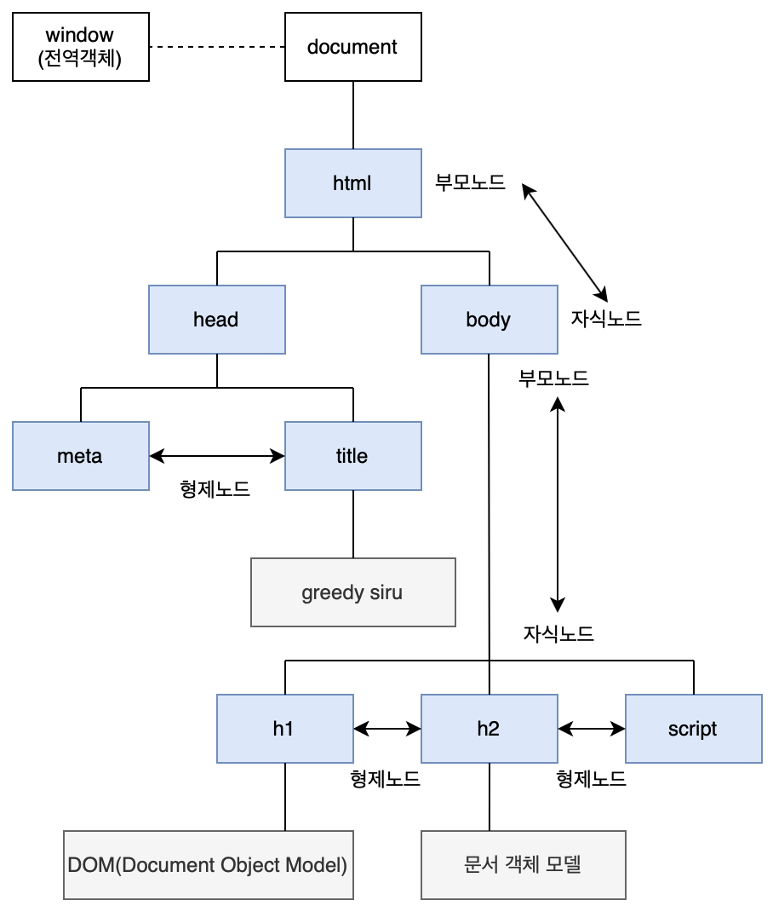

# [코드잇] 인터랙티브 자바스크립트 (2) (2021.2.22)


**상세 내용 [블로그](https://greedysiru.tistory.com/222?category=860707) 참고**


# 브라우저와 자바스크립트

## 01. 브라우저

* **브라우저 또한 객체이다.**
  * **window** : 브라우저의 창


### window

* **브라우저의 창을 나타내는 객체**
* **JavaScript에서의 최상단에 존재하는 객체**
  * window 객체가 JavaScript의 모든 객체를 포함
  * 내장 객체, 내장 함수
* JavaScript의 어느곳에서나 항상 접근할 수 있다.
  * 내장 객체, 내장 함수에 접근시 본래 window.를 써야하지만 생략 가능하다.
* **전역 객체 (global object)**
* 프로퍼티에 접근하여 브라우저를 자유롭게 제어할 수 있다.
  * **window.innerWidth, window.innerHeight** : 창의 너비와 높이
  * **document 객체**
  * **console 객체**
* 메소드 또한 존재한다.
  * **window.open()**: 제목 없는 새 창이 뜬다.
  * **window.close()**: 호출된 곳의 탭이 닫힌다.


## 02. DOM

* **Document Object Model (문서 객체 모델)**
  * Object 자료형
* **웹 페이지에 나타나는 HTML 문서 전체를 객체로 표현한 것**
  * 문서 내 태그들은 각각의 객체
* 웹 문서의 최상단 객체
* 웹 페이지를 수정, 컨텐츠 생성을 할 수 있다.
* 직접 접근하면 DOM에 해당하는 HTML이 출력된다.
* console.dir로 접근시 객체 형태로  다양한 프로퍼티들이 출력된다.


## 03. console.dir vs. console.log

* 두 메소드 모두 파라미터로 전달받은 값을 콘솔에 출력한다.
* 값 자체를 확인 -> log 메소드
* 객체의 속성을 확인 -> dir 메소드

|                 | 문자열, 숫자, 불린   | 배열, 객체, 함수       | 복수 입력         | DOM 객체         |
| --------------- | -------------------- | ---------------------- | ----------------- | ---------------- |
| **console.log** | 입력받은 그대로 표시 | 파라미터로 전달받은 값 | 모든 값           | HTML 형태로 출력 |
| **console.dir** | 문자열 표시          | 객체의 속성            | 첫 번째 값만 출력 | 객체 형태로 출력 |


## 04. DOM 트리

### HTML태그의 구조

```HTML
<!DOCTYPE html>
<html lang="ko">
  <head>
    <meta charset="UTF-8">
    <title>greedysiru</title>
  </head>
  <body>
    <h1 id="title">DOM(Document Object Model)</h1>
    <h2 id="sub-title">문서 객체 모델</h2>
    <script src="index.js"></script>
  </body>
</html>
```

* html 태그 > head 태그 > meta 태그 > title 태그 > body 태그 > h1, h2, script 태그
* 부모 태그 - 자식 태그의 관계로 표현


### DOM 트리

* document 객체를 최상위로 계층구조를 이룬 것
* **Node: 각 객체**
  * 부모노드 (Parent Node) - 자식노드 (Child Node)
  * 형제노드 (Sibling Node)
  * **요소 노드(Element Node)**: 태그를 표현하는 노드
  * **텍스트 노드(Text Node)**: 문자를 표현하는 노드. **요소 노드의 자식 노드이며  스스로 자식노드를 가질 수 없다.** 잎 노드(leaf node)라고도 부름.
  * 코멘트 노드(Comment Node)
  * 문서 노드(Document Node)
* 대부분 DOM 트리는 요소 노드와 텍스트 노드로 구성된다.




## 05. DOM 트리 살펴보기

* 웹 문서에 컨텐츠를 수정, 생성하기 위해 다루고자하는 노드를 잘 선택할 수 있어야 한다.
* document 객체의 메소드를 활용한다.
* DOM 트리의 부모, 자식, 형제 관계를 활용하여 태그를 선택할 수 있다.
* 아래의 예시 코드를 토대로 각 요소에접근하는 방법을 살펴본다.

```html
<!DOCTYPE html>
<html lang="ko">
<head>
  <meta charset="UTF-8">
  <title>JS with Codeit</title>
</head>
<body>
  <div id="content">             <!-- 부모요소 -->
    <h2 id="title-1">Cat-1</h1>  <!-- 자식요소 -->
    <ul id="list-1">             <!-- 자식요소 -->
      <li>Ragdoll</li>
      <li>British Shorthair</li>
      <li>Scottish Fold</li>
      <li>Bengal</li>
      <li>Siamese</li>
      <li>Maine Coon</li>
      <li>American Shorthair</li>
      <li>Russian Blue</li>
    </ul>
    <h2 id="title-2">Cat-2</h1>  <!-- 자식요소 -->
    <ul id="list-2">             <!-- 자식요소 -->
      <li>Sphynx</li>
      <li>Munchkin</li>
      <li>Persian</li>
      <li>Norwegian Forset</li>
      <li>Turkish Angora</li>
      <li>Bombay</li>
      <li>Selkirk Rex</li>
      <li>Munchkin</li>
    </ul>
  </div>
  <script src="index.js"></script>
</body>
</html>
```


### 자식 요소 노드

```javascript
const myTag = document.querySelector('#content');

console.log(myTag.children); // HTMLCollection
console.log(myTag.firstElementChild); // title-1
console.log(myTag.lastElementChild); // list-2
```

* **element.children** : 자식 요소 노드를 HTMLCollection으로 접근할 수 있는 프로퍼티
  * 대괄호 표기법으로 각 요소 노드 접근 가능
* **element.firstElementChild** : 첫 번째 자식 요소 노드 접근
* **element.lastElementChild** : 마지막 자식 요소 노드 접근


### 부모 요소 노드

```javascript
const myTag = document.querySelector('#content');

console.myTag = console.log(myTag.parentElement); // body 태그
```

* **element.parentelement** : 부모 요소 노드를 접근할 수 있는 프로퍼티


### 형제 요소 노드

```javascript
const myTag = document.querySelector('#content');

console.log(myTag.previousElementSibling); // 해당 노드의 이전 형제 요소 노드는 없으므로 null
console.log(myTag.nextElementSibling); // script 태그
```

* **element.previousElementSibling** : 이전 형제 요소 노드에 접근
* **element.nextElementSibling** : 다음 형제 요소 노드에 접근


### 응용

```javascript
const myTag = document.querySelector('#title-1');

console.log(myTag.parentElement.nextElementSibling); // 자신의 부모 요소 노드의 다음 형제 요소 노드인 script태그
```

* 위처럼 프로퍼티를 연결하여 사용할 수 있다.


## 06. 모든 노드에 대한 이동 프로퍼티

|       프로퍼티       |   유형    |                          결과                          |
| :------------------: | :-------: | :----------------------------------------------------: |
|   node.childNodes    | 자식 노드 |            node의 자식 노드 모음(NodeList)             |
|   node.firstChild    | 자식 노드 |             node의 첫 번째 자식 노드 하나              |
|    node.lasgChild    | 자식 노드 |                 node의 자식 노드 하나                  |
|   node.parentNode    | 부모 노드 |                 node의 부모 요소 하나                  |
| node.previousSibling | 형제 노드 | node의 이전(previous) 혹은 좌측(left)에 있는 노드 하나 |
|   node.nextSibling   | 형제 노드 |  node의 다음(next) 혹은 우측(right)에 있는 노드 하나   |

* 줄 바꿈과 들여쓰기로 인해 생성된 텍스트 노드 주의


## 07. 요소 노드 프로퍼티


### element.innerHTML

* **요소 노드 안의 HTML 자체를 문자열로 return**
* 태그와 태그 사이의 줄바꿈, 들여쓰기와 같은 부분도 포함
* 태그 내부에 새로운 값을 할당할 수 있다.
* 요소 안의 HTML을 **수정**할 때 자주 사용
* 덧셈 연산자를 활용하여 추가할 수도 있다.

```javascript
const myTag = document.querySelector('#list-1');

myTag.innerHTML += '<li>Exotic</li>' // list-1에 해당 요소 추가
```


### element.outerHTML

* **해당 요소를 포함한 전체 HTML 코드를 문자열로  return**
* 내부의 줄 바꿈, 들여쓰기 모두 포함
* 새로운 값을 할당할 경우, 요소 자체가 교체


### element.textContent

* **요소 안의 내용들 중에서 텍스트만 가져온다.**
* 내부의 줄 바꿈, 들여쓰기 모두 포함
* 태그 내부의 텍스트에 새로운 값을 할당
* 텍스트만 다루므로, HTML의 태그 문법은 적용되지 않는다.


## 08. 요소 노드 추가하기

* 요소 노드 프로퍼티를 활용하면 태그 안의 처음이나 마지막, 태그 자체의 앞이나 뒤에 태그를 추가할 수 있다.
* 그러나, 기존 내용에 덮어씌우는 방식이기 때문에 기존 데이터가 사라질 수 있는 가능성이 있다.
* outerHTML의 경우 프로퍼티를 수정한 경우, 완전히 새로운 요소가 되어버리기 때문에 다시 그 요소를 찾아야 한다.
* **요소 노드를 직접 생성해서 그 요소만 추가하는 것으로 해결할 수 있다.**


### 1. 요소 노드 만들기

> **document.createElement('태그이름');**


### 2. 요소 노드 꾸미기

> **element.textContent = 'content';**
>
> 문자열 넣기
>
> **element.innerHTML = 'HTML content';**
>
> HTML 태그 넣기


### 3. 요소 노드 추가하기

> **element.prepend(element);**
>
> **element.append(element);**
>
> **element.before(element);**
>
> **element.after(element);**

* prepend: 메소드를 호출한 노드의 첫 번째 자식 노드로 전달한 값을 추가
* append: 메소드를 호출한 노드의 마지막 자식 노드로 전달한 값을 추가
* before: 메소드를 호출한 노드의 앞에 형제 노드로 전달한 값을 추가
* after: 메소드를 호출한 노드의 뒤에 형제 노드로 전달한 값을 추가
* 파라미터로 문자열을 전달하여도 텍스트 노드를 생성하여 각 위치에 추가된다.
* 여러개의 값을 전달하면 순서대로 추가한다.


### 예시

```javascript
// 추가할 곳 지정
const contents = document.querySelector('#content');

// 요소 노드 생성
const siru = document.createElement('h1');

// 요소 노드 꾸미기
siru.textContent = '시루';

// 요소 노드 추가하기
contents.append(siru);
```


## 09. 노드 삭제와 이동하기

### 노드 삭제

> **element.remove();**

* 메소드를 호출한 노드를 삭제
* 대괄호 표기법으로 특정 노드만을 삭제할 수 있다.


### 노드 이동

> **element.append(node);**

* 이동할 노드를 지정한 요소에 옮길 수 있다.
* **prepend, before, after 메소드도 사용 가능**
* 대괄호 표기법을 활용하여 상세한 위치로 노드를 이동할 수 있다.


## 10. To Do List 만들기 (예시)

```html
<!DOCTYPE html>
<html lang="ko">
<head>
  <meta charset="UTF-8">
  <title>오늘 할 일</title>
  <link rel="stylesheet" href="style.css">
</head>
<body>
  <div class="main">
    <h2 class="title">오늘 할 일</h2>
    <ul id="to-do-list"></ul>
  </div>
  <script src="index.js"></script>
</body>
</html>
```


```javascript
const toDoList = document.querySelector('#to-do-list');

function addNewTodo(text) {
  // 리스트 만들기
	const toDo = document.createElement('li');
	// 리스트 내용 넣기
	toDo.textContent = text;
	// 리스트 추가하기
	toDoList.append(toDo);
}

// 테스트 코드
addNewTodo('자바스크립트 공부하기');
addNewTodo('고양이 화장실 청소하기');
addNewTodo('고양이 장난감 쇼핑하기');
```


## 11. HTML 속성 다루기

* 브라우저가 HTML 문서를 해석할 때 DOM객체가 만들어진다.
* **태그가 가지고 있는 속성들은 요소 노드의 프로퍼티가 된다.**
  * 모든 속성이 프로퍼티가 되는 것은 아니다. (HTML의 표준이 아닌 경우)
  * **.id, .className, .href**


### 메소드로 속성 접근하기

> **element.getAttribute('property')**

* **해당 태그의 추가된 모든 속성에 접근**
* 비표준 속성도 접근할 수 있다.
* 해당 메소드에서 클래스를 접근할 때는 **class**로 입력


### 속성 추가하기

> **element.setAttribute('property', 'value');**

* 이미 존재하는 속성인 경우 수정한다.


### 속성 삭제하기

> **element.removeAttribute('property');**

* 지정한 속성을 제거한다.


## 12. 스타일 다루기

### stlye 프로퍼티

> **element.style.prorperty = 'value';**

* style 프로퍼티에 접근하여 속성 값을 설정할 수 있다.
* **property 접근 시 camel 표기법을 사용한다.**
  * **.textDecoration, .backgroundColor**
* HTML 태그에 직접 적용되기 때문에 우선순위가 높아진다.
* 여러 태그에 적용시, 비슷한 코드를 불필요하게 작성해야 한다.


### className 프로퍼티

* stylesheet에 적용할 속성을 넣은 클래스를 만든다.
* className으로 미리 작성한 클래스의 이름을 입력
* class 속성값 전체가 바뀔 수 있다.


### classList 프로퍼티

* 권장되는 방식
*  stylesheet에 적용할 속성을 넣은 클래스를 만든다.
* **class의 속성값을 유사배열로 다룰 수 있다.**
* **add, remove, toggle 메소드를 활용한다.**
  * **.add()**: 클래스를 추가한다. 여러개의 파라미터를 쉼표로 구분하여 전달 할 수 있다.
  * **.remove()**: 클래스를 제거. 여러개의 클래스 삭제 가능
  * **.toggle()**: 클래스가 있으면 추가, 없으면 삭제. 두 번째 파라미터는 불린을 전달받아 ture 이면 add의 기능을 하고 false를 전달하면 remove를 강제한다.


## 13. 비표준 속성 다루기

### 비표준 속성 접근

> **[property name]{**
>
> **property : vlaue;**
>
> **}**

* 비표준 속성 이름을 선택하여 접근할 수 있다.


> **[property name = "value"]{**
>
> **property : vlaue;**
>
> **}**

* 더 구체적으로 값을 가진 속성에 접근


### 비표준 속성 활용하기

#### 1. 선택자로 활용

> **document.quertySelectorAll('[property name]');**


#### 2. 값을 표시할 태그를 구분할 때 활용

* **객체 형태의 데이터가 있을 때, 각 프로퍼티 값이 들어갈 태그를 구분할 때 활용**

```html
<!DOCTYPE html>
<html lang="ko">

<head>
  <meta charset="UTF-8">
  <title>JS with Codeit</title>
</head>

<body>
  <p>할 일 : <b field="title"></b></p> <!-- field는 비표준 속성 -->
  <p>담당자 : <b field="manager"></b></p>
  <p>상태 : <b field="status"></b></p>
  <div>
    상태 변경: 
    <button class="btn" status="대기중">대기중</button>  <!-- status는 비표준 속성 -->
    <button class="btn" status="진행중">진행중</button>
    <button class="btn" status="완료">완료</button>
  </div>
  <script src="index.js"></script>
</body>

</html>
```


```javascript
const fields = document.querySelectorAll('[field]'); // 비표준 속성 field를 가진 태그들을 가져온다.
const task = {                                       // 넣을 컨텐츠 (딕셔너리)
  title: '코드 에디터 개발',
  manager: 'CastleRing, Raccoon Lee',
  status: ''
}

for (let tag of fields) {                            // 가져온 태그들을 하나하나 접근
  const field = tag.getAttribute('field');           // 접근한 태그의 프로퍼티 값 가져오기
  tag.textContent = task[field]                      // 해당 프로퍼티 값과 같은 이름의 key의 값을 가져와 해당 태그에 입력
}
```


#### 3. 스타일이나 데이터 변경에 활용

* .getAttribute() 를 활용해서 속성값을 가져오고
* .setAttribute() 를 활용해서 속성값을 설정
* 이벤트를 통해 실시간으로 스타일, 데이터 변경

```javascript
const fields = document.querySelectorAll('[field]'); // 비표준 속성 field를 가진 모든 태그 가져오기
const task = {                                       // 딕셔너리 형태의 넣을 값
  title: '코드 에디터 개발',
  manager: 'CastleRing, Raccoon Lee',
  status: ''
}

for (let tag of fields) {                            // 가져온 모든 태그 하나하나 접근
  const field = tag.getAttribute('field');           // 접근한 태그의 프로퍼티 값 가져오기
  tag.textContent = task[field]                      // 해당 프로퍼티 값과 같은 이름의 key의 값을 가져와 해당 태그에 입력
}

const btns = document.querySelectorAll('.btn')       // 모든 .btn 가져오기
for (let btn of btns) {                              // 가져온 태그들 하나하나 접근
  const status = btn.getAttribute('status');         // 버튼의  status 속성 가져오기
  btn.onclick = function () {                        // 버튼이 클릭되었을 때 함수 실행
    fields[2].textContent = status;                  // fields의 상태에 status의 텍스트 넣기 (유사배열의 2번 index)
    fields[2].setAttribute('status', status);        // 속성 부여하기
  }
}
```


### dataset 프로퍼티

* **비표준 속성을 사용하기 위한 방식**
* 추후, 비표준 속성과 동일한 이름의 표준 속성이 생겨나도 설계한 방식대로 기능한다.
* **dataset 프로퍼티에 저장**

> **data-propertyname 으로 속성 넣기**
>
> **element.dataset.propertyname 으로 접근가능**


# Reference

[코드잇 - 인터랙티브 자바스크립트](https://www.codeit.kr/courses/javascript-intermediate/topics/interactive-javascript)