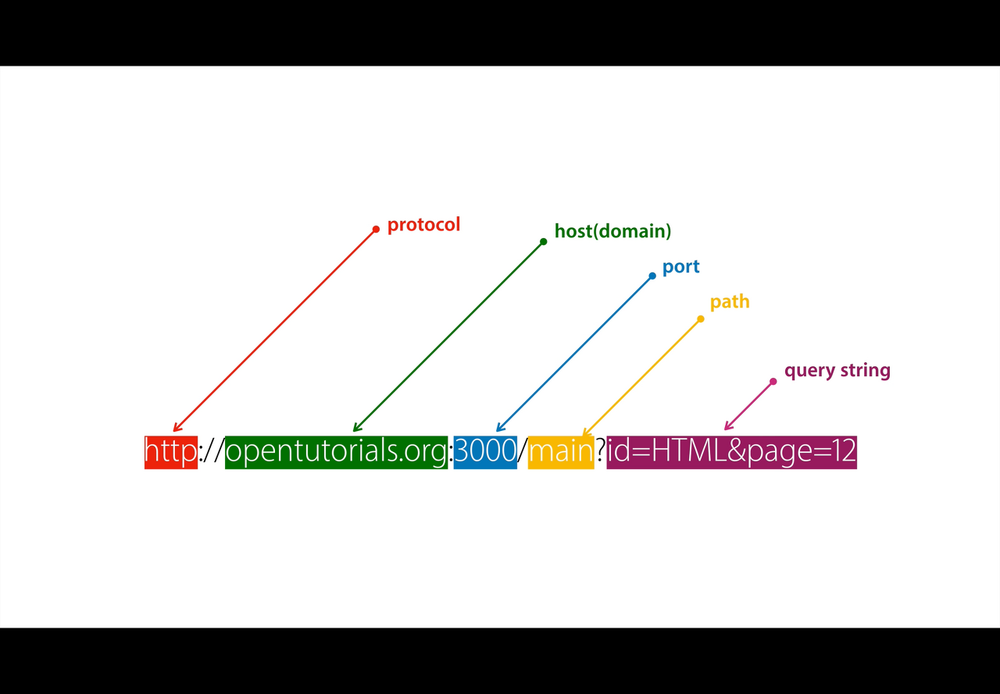
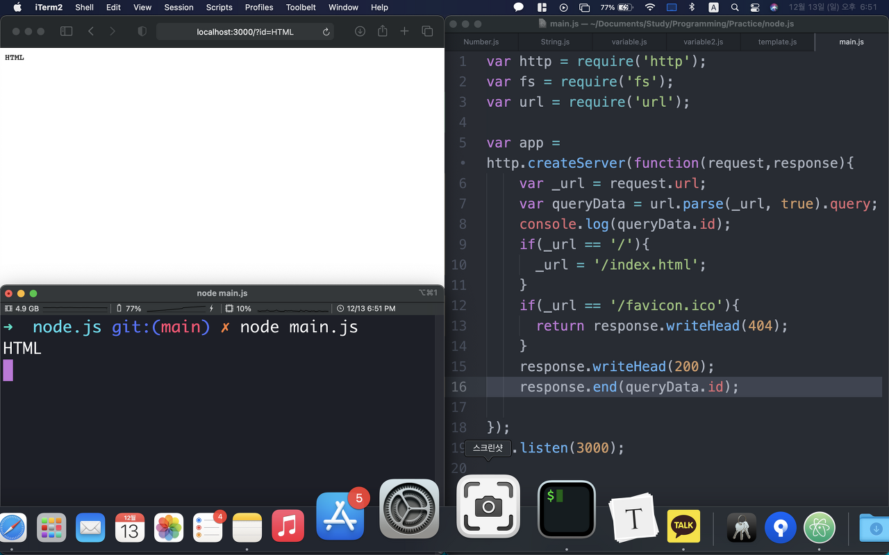

# [생활코딩]WEB2-Node.js (2)(2020.12.13)


**상세 내용 [블로그](var queryData = url.parse(_url, true).query;) 참고**


## Data type

JavaScript에서

1. Number
2. String
3. Boolean
4. Array
5. Object

`+,-,*,/` : 좌항과 우항을 처리 출력하는 이항 연산자, 산술 연산자.


## 문자열

> "가"
>
> '가'

따옴표의 짝을 맞출 것.


## 변수

1. 데이터의 이름을 붙인다.
2. 중복의 제거를 할 수 있다.


## Template literals

```javascript
ar name = 'greedysiru' ;
var letter = `dsfjkla  ${name}

nvl;adjkl;da${name}fl;kdjf lds;klsj;${name}lk vjfi snvkl;akownodanf la lk;dio${name};ewijoadsjf${name}adfk;dsjiofk snvsiavnad${name}s;fj kdsvn;as${name}vdknv;asdnodndsvsjcsoaj dlk;sasv;svn;l';`
console.log(letter);
```

* 사용할 문자열의 앞 뒤에 `(Grave Accent)

* 변수 및 명령어는 `${name}`


## URL



1. Protocol : 서버 접속에 대한 통신 규칙.
2. Domain : host.인터넷 접속된 각 컴퓨터.
3. Port : 서버의 번호
4. Path : 인터넷 접속된 컴퓨터의 경로
5. Query string : 읽고 싶은 정보 입력. 웹 서버에게 전달.


## 입력된 값 사용하기

클라이언트가 입력한 쿼리스트링을 화면과 콘솔창에 출력되도록 한다.

```javascript
var url = require('url');
```

Node.js에게 url 모듈을 사용할 것이라고 명령

```javascript
var queryData = url.parse(_url, true).query;
```

이 url에서 쿼리 스트링을 queryData에 가져온다.

```javascript
console.log(queryData.id);
response.end(queryData.id);
```

콘솔창과 클라이언트의 화면에 출력.




## 명령어 정리

`\` :  코드 줄 바꿈

`\n` : 문자열 출력 시 줄 바꿈

`//` : JavaScript 주석


# Reference

https://opentutorials.org/course/3332