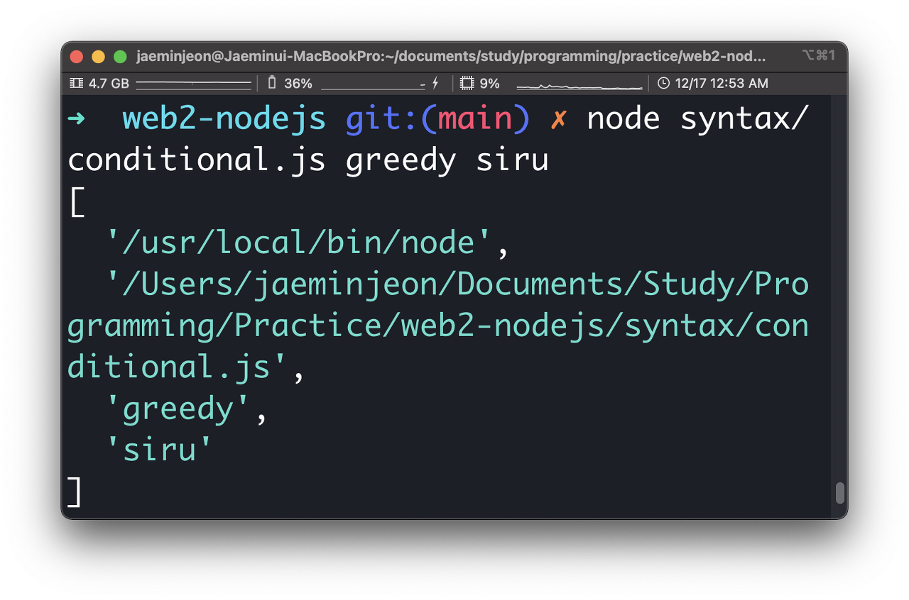
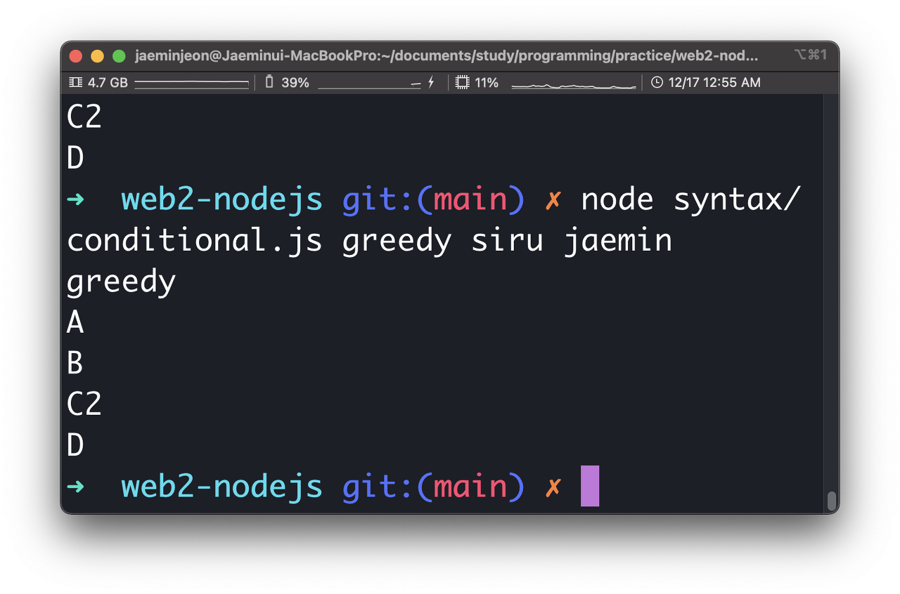
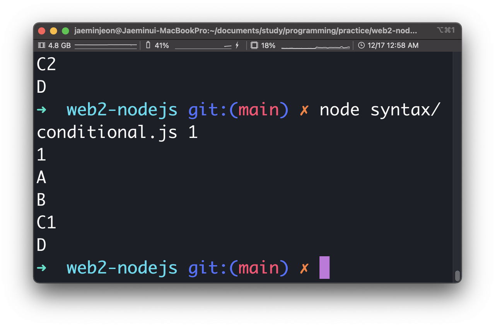

# [생활코딩]WEB2-Node.js (4)(2020.12.17)


**상세 내용 [블로그](https://greedysiru.tistory.com/30) 참고**


## Input & Output

```javascript
var args = process.argv;
console.log(args);
console.log("A");
console.log("B");
if(false){
  console.log("C1");
}
else {
  console.log("C2");
}
console.log("D");
```

conditional.js 파일에 위 명령어가 입력되어 있다. 

```javascript
node syntax/conditional.js greedy siru
```

 콘솔 창에 위 명령어를 입력하면 아래와 같이 출력된다.



콘솔 창에 입력한 "greedy", "siru"는 배열의 형태로 저장된다.

```javascript
console.log(args[2]);
```

이 명령어를 conditional.js에 추가하고 다시 명령어를 실행한다.



배열은 0부터 시작하므로 두 번째 배열인 "greedy"가 출력되는 것이다

```javascript
if(args[2] === '1'){
  console.log("C1");
}
else {
  console.log("C2");
}
console.log("D");
```

파일에 조건문을 추가하고 콘솔창 명령어에 1을 입력한다.



True이므로 C1이 출력.


## Not found 구현

조건문을 도입해서 오류메세지를 전송하도록 한다.

```javascript
var pathname = url.parse(_url, true).pathname;
if (pathname === '/'{
//템플릿 삽입
    }else{
	response.writeHead(404);
      response.end('Not found');
}


```

사용자가 웹 페이지에 존재하지 않는 pathname을 입력시 404오류 Not found를 출력하게 된다.


## App - 홈페이지 구현

홈 페이지의 메인에 인사말을 뜨도록 한다.

```javascript
if(queryData.id === undefined){
        var title = 'welcome';
        var description = 'Hello.Node.js';
        ar template = `
        <!doctype html>
        <html>
        <head>
          <title>WEB1 - ${title}</title>
          <meta charset="utf-8">
        </head>
        <body>
          <h1><a href="/">WEB</a></h1>
          <ul>
            <li><a href="/?id=HTML">HTML</a></li>
            <li><a href="/?id=CSS">CSS</a></li>
            <li><a href="/?id=JavaScript">JavaScript</a></li>
          </ul>
          <h2>${title}</h2>
          <p>${description}</p>
        </body>
        </html>
        `;
        response.writeHead(200);
        response.end(template);
      });
      } else{
}
```

Querystring이 undefined일 때의 title과 descripton을 출력하도록 한다.


## 파일 목록 알아내기

```javascript
var testFolder = './data';
var fs = require('fs');

fs.readdir(testFolder, function(error, filelist){
  console.log(filelist);
})
```

data폴더의 파일명들을 fs모듈과 함수를 통해서 filelist로 가져온다. 이들 데이터는 배열로 저장된다.


## 글 목록 출력하기

```javascript
var list=<ul>
var i = 0;
          while(i < filelist.length){
            list =list + `<li><a href="/?id=${filelist[i]}">${filelist[i]}</a></li>`;
            i = i + 1;
          }

          list = list+'</ul>';
```

웹 페이지의 리스트를 변수 선언하고 반복문과 fs모듈로 저장한 filelst로 동적인 리스트를 생성한다.


## 함수를 이용해서 코드 정리하기

JavaScript의 함수를 이용해서 웹 페이지의 코드를 정리한다. 아래와 같이 줄일 수 있다.

```javascript
var http = require('http');
var fs = require('fs');
var url = require('url');

function templateHTML(title, list, body){
  return `
  <!doctype html>
  <html>
  <head>
    <title>WEB1 - ${title}</title>
    <meta charset="utf-8">
  </head>
  <body>
    <h1><a href="/">WEB</a></h1>
    ${list}
    ${body}
  </body>
  </html>
  `;
}
function templateList(filelist) {
  var list ='<ul>';
  var i = 0;
  while(i < filelist.length){
    list = list + `<li><a href="/?id=${filelist[i]}">${filelist[i]}</a></li>`;
    i = i + 1;
  }
  list = list+'</ul>';
  return list;
}


var app = http.createServer(function(request,response){
    var _url = request.url;
    var queryData = url.parse(_url, true).query;
    var pathname = url.parse(_url, true).pathname;
    console.log(url.parse(_url, true).pathname);

    if (pathname === '/'){
      if(queryData.id === undefined){
        fs.readdir('./data', function(error, filelist){
          var title = 'welcome';
          var description = 'Hello.Node.js'
          var list ='<ul>';
          var list = templateList(filelist);
          var template = templateHTML(title, list, `<h2>${title}</h2>${description}`);
          response.writeHead(200);
          response.end(template);
        })


      } else{
        fs.readdir('./data', function(error, filelist){
          fs.readFile(`data/${queryData.id}` , 'utf8', function(err, description){
            var title = queryData.id;
            var list = templateList(filelist);
            var template = templateHTML(title, list, `<h2>${title}</h2>${description}`);
            response.writeHead(200);
            response.end(template);
          });
        });
      }
    } else {
      response.writeHead(404);
      response.end('Not found');
    }


});
app.listen(3000);
```

# Reference

https://opentutorials.org/course/3332