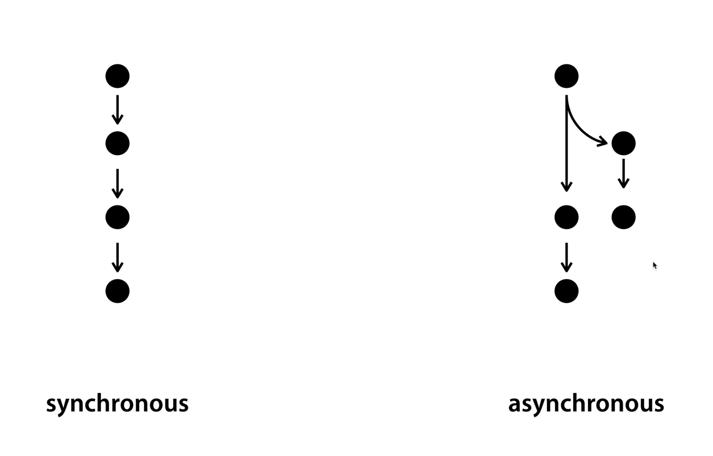

# [생활코딩]WEB2-Node.js (5)(2020.12.18)

**상세 내용 [블로그](https://greedysiru.tistory.com/39) 참고**

## Synchronous & Asynchronous

Node.js에서 명령어를 비동기적으로 실행할 수 있다.

|    동기적     |   비동기적    |
| :-----------: | :-----------: |
| 순차적인 실행 | 병렬적인 실행 |




## 구체적인 예시

```javascript
console.log('A');
var result = fs.readFileSync('syntax/sample.txt','utf8');
console.log(result);
console.log(‘C’);
```

`fs.readFileSync` 는 명령을 동기적으로 처리한다는 의미이다. 콘솔에서 출력은 아래와 같이나온다. 입력한 순서대로 A,B,C가 나온다. 

```javascript
console.log('A');
fs.readFile('syntax/sample.txt','utf8',function(err, result){
  console.log(result);
});
console.log('C');
```

`fs.readFile` 은 명령을 비동기적으로 처리한다는 의미이다.  이것은 출력이 A,C,B이다. 


## Callback

```javascript
fs.readFile('syntax/sample.txt','utf8',function(err, result){
  console.log(result);
});
```

이 명령어는  Node.js에게 readFile기능을 이용해서 해당 파일을 읽어오라고 시킨다. 그리고 그 작업이 끝난 다음에 함수를 실행을 명령한다. 이렇게 나중에 실행시키는 것을 Callback 이라고 한다.

```javascript
var a = function(){
  console.log('A');
}

function slowfunc(callback){
  callback();
}

slowfunc(a)
```

변수 a에 문자'A'를 콘솔 출력하라는 명령어가 입력되어 있다. slowfunc라는 함수는 callback이라는 인자에 `callbakc()` 함수를 실행한다. 마지막에, `slowfuc(a)` 는 callback인자에 함수 a가 들어가므로 문자 'A'가 출력된다.


## Package manager와 PM2

NPM을 통해서 PM2라는 Package를 설치해서 이용해 본다.

```CLI
npm install pm2 -g
```

 `-g` 는 컴퓨터 어디서든지 사용할 수 있다는 의미이다. 


## PM2 명령어

### 1. 실행

```CLI
pm2 start main.js
```

입력시 파일을 실행하고 이름과 상태들을 보여준다.

### 2. 상태 조회

```CLI
pm2 monit
```

실행되고 있는 파일의 상태를 시각적으로 보여준다.

### 3. 프로세스 리스트

```CLI
pm2 list
```

### 4. 프로세스 종료

```CLI
pm2 stop main.js
```

### 5. 파일 감시

```CLI
pm2 start main.js--watch
```

파일이 수정될 때 자동으로 종료,실행하여 실시간 적용한다.

### 6. 로그 조회

```CLI
pm2 log
```


# Reference

https://opentutorials.org/course/3332