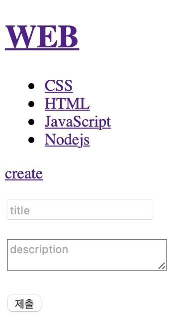

# [생활코딩]WEB2-Node.js (6)(2020.12.19~21)

**상세 내용 [블로그](https://greedysiru.tistory.com/46) 참고** 

## HTML-form

HTML-form으로 사용자가 컨텐츠를 생성할 수 있게 한다.

```html
<form action="http://localhost:3000/process_create" method="post">
<p><input type="text" name="title"></p>
<p><textarea name="description"></textarea></p>
<p><input type="submit"></p>
</form>
```

`<form></form>` : HTML-form을 사용

​		-`action` : 각 각의 컨트롤`input, textarea`에 사용자가 입력한 정보를 `submit`했을 때 속성이 가르키는 곳으로 전송

​		-`method="post"` : 쿼리스트링을 생성하지 않는 방식

`<input></input>` : 사용자가 데이터를 입력할 수 있는 컨트롤 생성

​		-`type="text"` : 텍스트 상자

​		-`type="submit"` : 제출버튼

`<textarea></textarea>` : 여러줄 입력할 수 있는 텍스트 상자


## App - 글생성 UI 만들기

이제 HTML-from으로 사용자가 컨텐츠를 만들 수 있도록 링크를 생성한다.

```html
${list}
     <a href="/create">create</a>
${body}
```

해당하는 경로의 페이지를 생성하고 HTML-form을 넣어준다.

```javascript
    else if(pathname === '/create'){
       fs.readdir('./data', function(error, filelist){
         var title = 'WEB - create';
         var list = templateList(filelist);
         var template = templateHTML(title, list, `
           <form action="http://localhost:3000/process_create" method="post">
             <p><input type="text" name="title" placeholder="title"></p>
             <p>
               <textarea name="description" placeholder="description"></textarea>
             </p>
             <p>
               <input type="submit">
             </p>
           </form>
         `);
         response.writeHead(200);
         response.end(template);
       });
```




## App - POST 방식으로 전송된 데이터 받기

Node.js에서 querystring모듈을 가져오기 위해, 아래를 입력한다.

```javascript
var qs = require('querystring');
```

HTML-form에 으로 서버에 데이터를 보낼때,  `pathname ==='/create'` 인 경우에 대해서 명령어를 입력한다.

```javascript
else if(pathname === '/create_process'){
       var body = '';
       request.on('data', function(data){
           body = body + data;
       });
       request.on('end', function(){
           var post = qs.parse(body);
           var title = post.title;
           var description = post.description
       });
       response.writeHead(200);
       response.end('success');
```

`request.on('data', function(data){body = body + data;})` : 서버가 수신할 때수신한 정보를 전달. 데이터를 `body` 에 추가.

`request.on('end', function(){var post = qs.parse(body);var title =post.title; var description = post.description });` : 수신 완료시 `body` 에서 변수 `title` 과 `description` 에 `post`의 데이터를 입력한다.


## App - 파일생성과 리다이렉션

사용자가 데이터를 서버에 보내면 파일을 생성하고 해당하는 파일을 볼 수 있는 리다이렉션 기능을 추가한다.

```javascript
var description = post.description;
           fs.writeFile(`data/${title}`, description, 'utf8', function(err){
             response.writeHead(302, {Location: `/?id=${title}`});
             response.end();
           })
```

fs 모듈에 의해서, 사용자가 입력한 `title` 을 제목으로, `description` 의 내용을 가진 파일이 utf8의 형식으로 생성된다. 뒤이어서 함수가 콜백으로 실행되어서 사용자가 입력한 `title` querystring으로 이동시킨다.


# Reference

https://opentutorials.org/course/3332