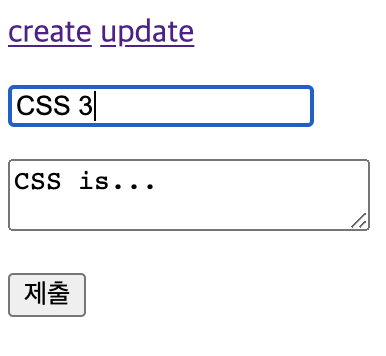
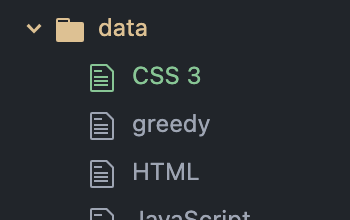
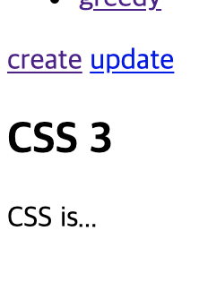

# [생활코딩]WEB2-Node.js (7)(2020.12.22)

**상세 내용 [블로그](https://greedysiru.tistory.com/49) 참고**


## App - 글수정 - 수정 링크 생성

이제, 사용자가 수정을 할 수 있도록 update 기능을 추가한다. 함수 `templateHTML` 에 `control`  인자를 넣는다.

```javascript
function templateHTML(title, list, body, control){
  .
  .
  ${control}
```

사용자가 홈 `/` 에 있을 경우의 템플릿을 수정한다.

```javascript
 var template = templateHTML(title, list,
             `<h2>${title}</h2>${description}`,
             `<a href="/create">create</a>`
           );
```

사용자가 리스트의 페이지에 있을 경우의 템플릿을 수정한다.

```javascript
var template = templateHTML(title, list,
               `<h2>${title}</h2>${description}`,
               `<a href="/create">create</a> <a href="/update?id=${title}">update</a>`
             );
```


## App - 글수정 - 수정할 정보 전송

  HTML-form을 사용하여 서버로 수정할 정보를 전송하게 한다.

```javascript
else if(pathname === '/update'){
       fs.readdir('./data', function(error, filelist){
         fs.readFile(`data/${queryData.id}`, 'utf8', function(err, description){
           var title = queryData.id;
           var list = templateList(filelist);
           var template = templateHTML(title, list,
             `
             <form action="/update_process" method="post">
               <input type="hidden" name="id" value="${title}">
               <p><input type="text" name="title" placeholder="title" value="${title}"></p>
               <p>
                 <textarea name="description" placeholder="description">${description}</textarea>
               </p>
               <p>
                 <input type="submit">
               </p>
             </form>
             `,
             `<a href="/create">create</a> <a href="/update?id=${title}">update</a>`
           );
           response.writeHead(200);
           response.end(template);
         });
       });
```

`<input type="hidden" name="id" value="${title}">` : `type`에 `hidden` 속성을 부여하면, 보이지 않는 박스가 생성

각 컨트롤의 기본값들은 해당 `id` 의 `tilte` 과 `description` 을 넣는다.

2.폼에 데이터를 읽는 기능


## App - 글수정 - 수정된 내용 저장

수정이 완료된 페이지를 사용자에게 출력한다.

```javascript
else if(pathname === '/update_process'){
       var body = '';
       request.on('data', function(data){
           body = body + data;
       });
       request.on('end', function(){
           var post = qs.parse(body);
           var id = post.id;
           var title = post.title;
           var description = post.description;
           fs.rename(`data/${id}`, `data/${title}`, function(error){
             fs.writeFile(`data/${title}`, description, 'utf8', function(err){
               response.writeHead(302, {Location: `/?id=${title}`});
               response.end();
             })
           });
       });
```

 `request.on` 에 의해 `data` 를 가져온다.

`fs.rename()` 에 의해 `id` (옛 이름)가 `title` (새로운 이름)으로 변경

`fs.writeFile` 이 수정 내용을 적용한다. `fucntion(error)` 가 실행되고 사용자는 자신이 변경한 파일의 페이지로 바로 이동된다. 

|           수정 내용 입력           |             파일 적용              | 수정된 페이지                      |
| :--------------------------------: | :--------------------------------: | ---------------------------------- |
|  |  |  |


## App - 글삭제 - 삭제버튼 구현

수정 버튼 옆에 컨텐츠를 삭제하는 버튼을 만든다.

```javascript
 <a href="/create">create</a>
                 <a href="/update?id=${title}">update</a>
                 <form action="delete_process" method="post">
                   <input type="hidden" name="id" value="${title}">
                   <input type="submit" value="delete">
                 </form>`
```

HTML-form을 생성하여 `post` 속성을 부여하고 `hidden` 박스와 `submit` 버튼을 생성한다. 


## App - 글삭제 기능 완성

HTML-form에 의해서, 삭제 버튼을 클릭시 실행할 코드는 아래와 같다.

```javascript
else if(pathname === '/delete_process'){
       var body = '';
       request.on('data', function(data){
           body = body + data;
       });
       request.on('end', function(){
           var post = qs.parse(body);
           var id = post.id;
           fs.unlink(`data/${id}`, function(error){
             response.writeHead(302, {Location: `/`});
             response.end();
           })
       });
```

`fs.unlink` 에 의해서  `data/${id}` 가 삭제된다. 이어서 콜백 함수가 실행되어, 사용자를 홈으로 리다이렉트 한다.


# Reference

https://greedysiru.tistory.com/49?category=862259


