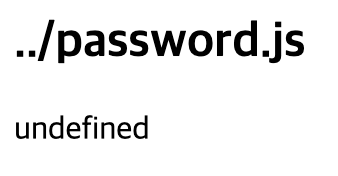
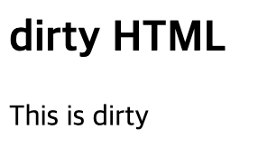

# [생활코딩]WEB2-Node.js (9)(2020.12.23)


**싱세 내용 [블로그](https://greedysiru.tistory.com/57) 참고**


## App - 입력 정보에 대한 보안

쿼리스트링을 악용한 정보유출을 막기위해 보안기능을 추가한다.

Node.js 기능에서 `path`를 조회할 수 있는 모듈이 있다. 

```javascript
var path = require('path');
path.parse('../password.js').base;
```

`path.parse('../password.js').base;` :  `base`의해 상위 디렉토리를 제외하고 읽는다.

아래의 명령어에 이것을 적용한다.

```javascript
fs.readFile(`data/${queryData.id}`, 'utf8', function(err, description)
```

위의 `path.parse` 명령어를 이용하여, 상위 디렉토리로 들어가지 못하게 막는다.

```javascript
var filteredId = path.parse(queryData.id).base;
           var filteredId = path.parse(queryData.id).base;
           fs.readFile(`data/${filteredId}`, 'utf8', function(err, description){
             ...
           }
```

변수 `filteredId` 에 쿼리스트링의 `base`만 추출되어 이 경로로 들어가게 된다.




## App - 출력정보에 대한 보안

출력정보에서 발생하는 보안 이슈를 살펴보자.

XSS(Cross Site Scripting)같은 웹 공격 방식은 `<script>`에 의해 일어난다. 사용자가 웹 페이지를 읽어들일 때 태그를 무시하여 악의적인 코드 생성을 막는다.`sanitize-html` 패키지를 사용한다.

터미널에서 진행하고 있는 프로젝트로 들어가 npm을 시작한다,

```javascript
npm init
```

 `sanitize-html` 을 설치하기 위해 아래 명령어를 입력한다.

```javascript
npm install -S sanitize-html
```

`-S` 는 프로젝트에서만 패키지 적용한다. 

`main.js`에 패키지의 모듈을 적용한다. 변수 `sanitizeHtml`으로 모듈을 불러온다.

```javascript
var sanitizeHtml = require('sanitize-html');
```

스크립트 태그를 살균할 곳에 적용한다.

```javascript
  var sanitizedTitle = sanitizeHtml(title);
  var sanitizedDescription = sanitizeHtml(description);
  var list = template.List(filelist);
  var html = template.HTML(title, list,
              `<h2>${sanitizedTitle}</h2>${sanitizedDescription}`,
              `<a href="/create">create</a>
              <a href="/update?id=${sanitizedTitle}">update</a>
              <form action="delete_process" method="post">
                <input type="hidden" name="id" value="${sanitizedTitle}">
                <input type="submit" value="delete">
              </form>`
```

사용자가 입력한 데이터를 출력하기 전에, `<script>` 를 제거하기 위해서 `tilte`과 `description`을 살균 후 각각 변수명 `sanitizedTitle` 과 `sanitizedDescription`으로 적용시킨다.



태그만 삭제되어 출력된다.

만약, 허용하고 싶은 태그가 있다면

```javascript
var sanitizedDescription = sanitizeHtml(description, {
               allowedTags:['h1']
             });
```

두 번째 인자에 입력한다. 위는 `<h1>` 태그를 허용한 경우이다.


# Reference

https://opentutorials.org/course/3332