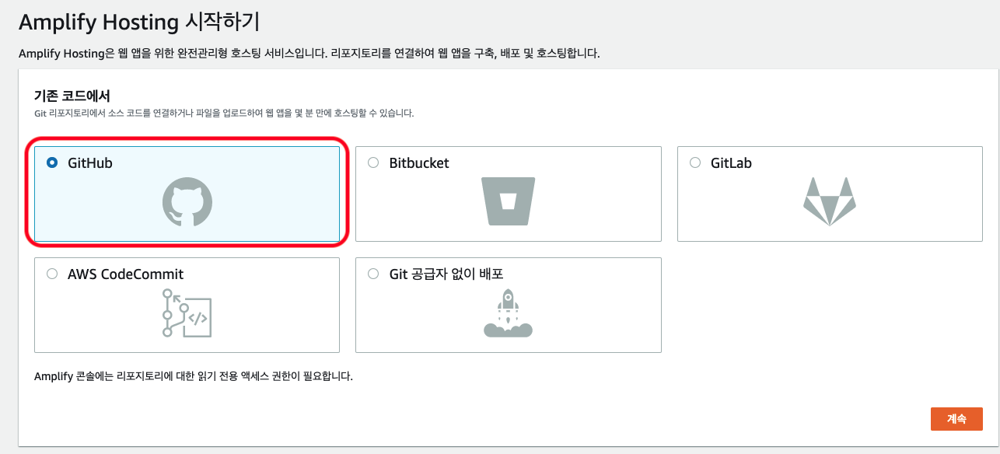
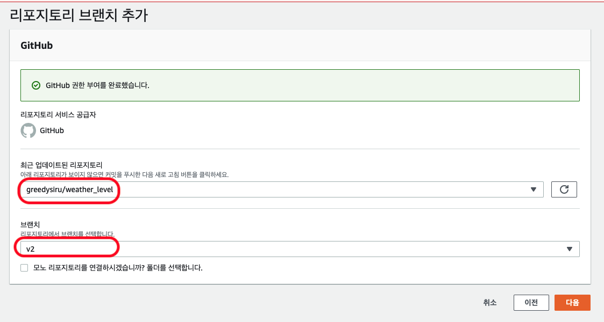
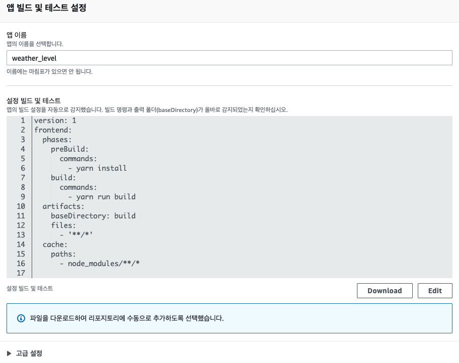
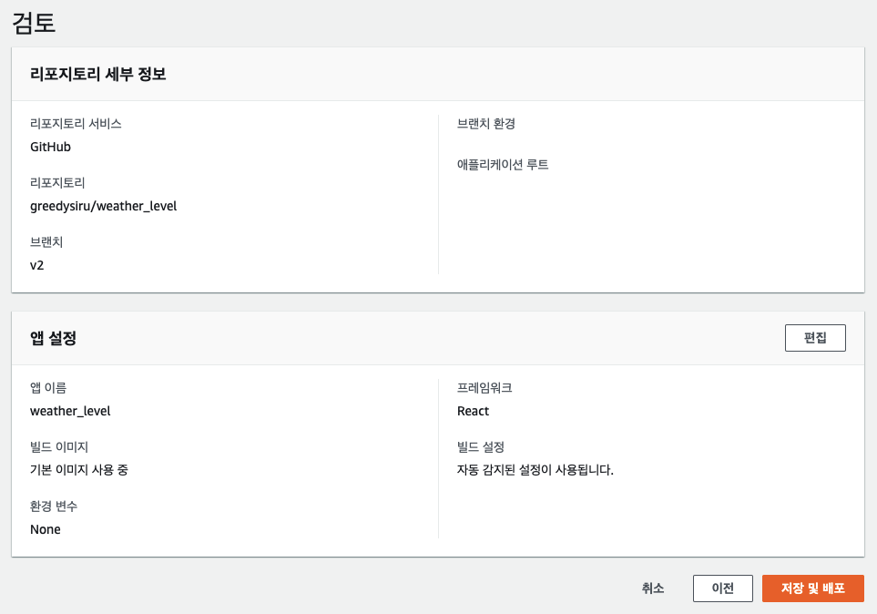
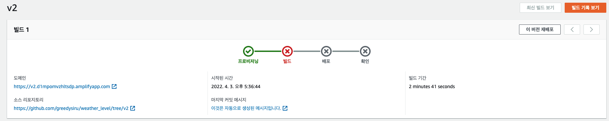
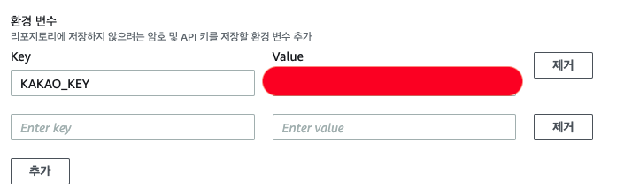
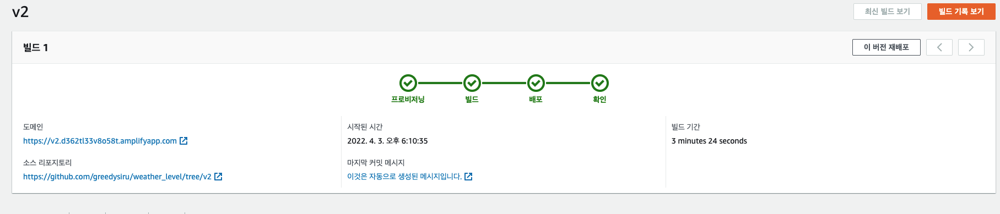

# AWS Amplify


## 1. AWS Apmplify란?

- AWS에서 제공하는 CI/CD 및 호스팅 서비스

## CI/CD란?

- 개발 → 배포까지의 과정 자동화
- CI : Continuous Integration
  - 지속적 통합
  - 새로 추가한 코드가 성공적으로 배포 브랜치의 프로젝트 코드에 통합되도록 자동화하는 것
- CD : Continuous Delivery & Continuous Deployment
  - 통합된 코드가 유저에게 바로 제공되도록 배포 과정을 자동화


## 2. 도입하는 이유

- 기존 배포 방식의 비효율성
  - 코드 변경 → 빌드 → 빌드한 파일을 S3에 직접 배포
- git과 브랜치와의 연동성
- 메인 브랜치에 병합 하기 전 PR에서의 새 환경을 생성하여 평가 가능


## 3. Amplify 셋팅

>  💡  **기존 소스코드가 Gihub에서 관리되고 있으므로, Github 기준 서술합니다.**


1. [AWS Amplify Console](https://ap-northeast-2.console.aws.amazon.com/amplify/home?region=ap-northeast-2#/) 접속

2. Amplify Hosting에서 시작하기 버튼 클릭

   

3. Amplify Hosting에서 GitHub 선택

   

4. Github에서 Amplify 권한 부여하기

   1. 계정 로그인
   2. 허용

5. Repositroy와 브랜치 선택

   

6. 앱 빌드 및 테스트 설정

   

7. 검토 후 저장 및 배포

   


## 4.  Amplify 환경 변수 설정하기

## 빌드 실패 이슈

- 우리앱은 카카오의 링크 서비스를 사용하고 있음

- src/shared/kakao.ts 에서 카카오 링크 서비스를 초기화하기 위해서 Key 값을 사용

- Key가 설정되어 있는 파일은 .gitingnore에 지정되어 있어 AWS Amplify에서 접근 불가

  - 이런 이유로 아래와 같이 빌드 실패하게 됨

    

    ```jsx
    # Starting phase: preBuild
    ...
    2022-04-03T08:39:12.435Z [INFO]: Failed to compile.
    2022-04-03T08:39:12.440Z [INFO]: ./src/shared/kakao.ts
                                     Cannot find file './config' in './src/shared'.
    2022-04-03T08:39:12.469Z [WARNING]: error Command failed with exit code 1.
    2022-04-03T08:39:12.470Z [INFO]: info Visit <https://yarnpkg.com/en/docs/cli/run> for documentation about this command.
    2022-04-03T08:39:12.477Z [ERROR]: !!! Build failed
    2022-04-03T08:39:12.477Z [ERROR]: !!! Non-Zero Exit Code detected
    2022-04-03T08:39:12.477Z [INFO]: # Starting environment caching...
    2022-04-03T08:39:12.477Z [INFO]: # Environment caching completed
    Terminating logging...
    ```

## Amplify 환경 변수 설정하기



## 결과

- 배포 완료!

  