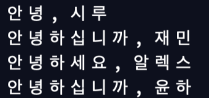

# [Teccboi Wonie]코딩 1시간만에 배우기 -Python(1) (2020.12.13)


**상세 내용 [블로그](https://greedysiru.tistory.com/23) 참고**


## 변수

```python
x = 1
y = 2
z = "안녕"
```

이항 연산자 `=`  를 사용해서 변수에 데이터 대입.


## 데이터 타입

1. 숫자
2. 문자열
3. 불리언


## 조건문

불리언의 값이 참일 때와 거짓일 때를 구분해서 실행

```python
x = 3
if x > 5:
  print("hello")
elif x == 3:
  print("bye")
else:
  print("hi")
```

elif는 else if의 줄임말. 추가적인 조건을 뜻함.


## 함수

```python
def chat(name1, name2, age):
  print("%s: 안녕? 넌 몇살이니?" % name1)
  print("%s: 나? 나는 %d" % (name2, age))
  
chat("알렉스","윤하",20)
chat("재민","시루",4)
```


## 리턴

함수에서 연산 처리 후 그 값을 다시 돌려줌.

```python
def dsum(a, b):
  result = a + b
  return restult

d = dsum(1,2)
print(d)
```

3이 출력. retrun이 없으면 값이 없으므로 none이 출력.


## 조건문과 함수 응용

인사말 출력하기

	1. 이름과 나이를 입력 받는다.
	2. 10살 미만이면 "안녕"
	3. 10살에서 20살 사이면 "안녕하세요"
	4. 그 외 "안녕하십니까"

```python
def sayHello(name, age):
  if age < 10:
    print("안녕," + name)
  elif age <= 20 and age >= 10:
    print("안녕하세요," + name)
  else
  	print("안녕하십니까," + name)
    
sayHello("시루", 3)
sayHello("재민", 28)
sayHello("알렉스", 10)
sayHello("윤하", 40)
```




## 반복문

* For

```python
for i in range(3):
	print(i)
  print("가")
  print("나")
```


* while

```python
i = 0
while i < 3:
	print(i)
  print("가")
  print("나")
  i = i+1
```


## Break

무한루프 반복문을 중단할 수 있다.

```python
i = 0
while True:
  print(i)
  print("가")
  print("나")
  i = i + 1
  
  if i > 2:
    break
```


## Continue

반복문의 처음으로 다시 넘기는 명령어.

```python
for i in range(3):
  print(i)
  print("가")
  print("나")
  
  if i == 1:
    continue
    
  print("다") 
```

`i==1` 이면, "다"를 출력하지 않고 반복문 상단으로 다시 간다.


## 명령어 정리

`print()` : 출력

`str()` : 문자화

`int()` :  정수화

`and` : 두 조건이 참이어야 참

`or` : 두 조건중 하나만 참이어도 참

`not`: 해당 Boolean을 반대로

`==` : 좌항과 우항이 같은지 Boolean 출력

`%s` : 문자 인자

`%d` : 숫자 인자

`return` : 리턴

`break` : 루프 중단

`continue` : 루프 처음으로


# Reference

https://www.youtube.com/watch?v=M6kQTpIqpLs&list=PLa7Lj786Q-Gts3-LsBl5I56YQrQb4sHxI&index=1

