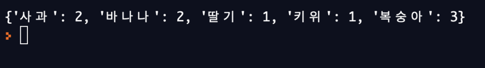
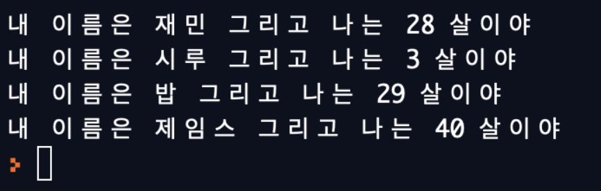

# [Teccboi Wonie]코딩 1시간만에 배우기 -Python(2) (2020.12.14)


**상세 내용 [블로그](https://greedysiru.tistory.com/24) 참고**


## 자료 구조

	1. List
	2. Tuple
	3. Dictionary


## List

```python
x = list()
y = []
```

리스트는 위 처럼 정의한다.

```python
x = [1,2,3,4]
y = ["siru","jaemin"]
z = ["hello",1,2,3,]
```

리스트는 숫자, 문자열, 둘 다 섞여서 들어갈 수 있다. 자리의 카운트는 첫 번째를 0으로 시작한다.

```python
x[1] = 10
```

해당 자리의 elements를 Assignment할 수 있다.

```python
num_elements=len(x)
print(num_elements)
```

 함수 len은 해당 리스트의 길이를 불러온다.

 ```python
x = [4,2,3,1]

y = sorted(x)
print(y)
 ```

무작위 순서인 리스트를 오름차순으로 정렬할 수 있다.

```python
z = sum(x)
print(z)
```

리스트의 합을 구할 수 있다.

```python
for n in x:
  print(n)
```

for문으로 리스트의 모든 데이터를 뽑아올 수 있다.

```python
x = [4,2,3,1]
y = ["hello","there"]

print(x.index(3))
print(y.index("hello"))
```

특정 값이 해당하는  리스트에 몇 번째 자리에 있는지 알 수 있다.

```python
if "hello" in y:
  print("hello가 있어요")
```

특정 값이 리스트에 있는지 여부를 Boolean으로 알 수 있다.


## Tuple

```python
x = tuple()
y = ()
```

위 처럼 정의한다. Tuple은 immutable의 특징을 가져서 Assignment를 할 수 없다.


## Dictionary

```python
x = dict()
y = {}
```

위 처럼 정의한다. key와 value가 짝지어진 자료 구조이다.


## 과일세기

```python
fruit = ["사과","사과","바나나","바나나","딸기","키위","복숭아","복숭아","복숭아"] 																	# 리스트 fruit에 과일 데이터가 있다.
d={}              # 빈 딕셔너리 d를 생성. 
	for f in fruit:    # 변수 f는 리스트 fruit의 elements를 하나씩 뽑아온다. 이하 for												문의 번호는 회차 수.
  	if f in d:       # 1. 딕셔너리 d에 "사과"가 있는가? 거짓 2. 딕셔너리 d에 "사과"가 																													있는가? 참 
    	d[f]=d[f] + 1  # 2. 참이므로 딕셔너리의 value에 1을 더한다.
  	else:            # 1. 거짓이므로 딕셔너리에 key "사과"를 넣고 value 1을 넣는다.
    	d[f] = 1

print(d)
```




## Class & Object

 Class는 함수와 변수들의 합. Object는 클래스를 이용해서 만들어낸 물체.

```python
class Person: 									#person class 생성
  def __init__(self,name,age):  #Object 생성할 시 자신(self)의 인자로 name, age를 받는다.
    self.name = name						#받은 name, age 인자를 각각 넣는다.
    self.age = age
  def introduce(self):					#소개문을 생성하는 함수
    print("내 이름은 " + self.name + " 그리고 나는 " + str(self.age) + " 살이야") 
    														#Object 생성시 받은 인자들을 대입한다.

jamin = Person("재민", 28)
siru = Person("시루", 3)
bob = Person("밥", 29)
james = Person("제임스", 40)

jamin.introduce()
siru.introduce()
bob.introduce()
james.introduce()
```




## Inheritance(상속)

새로운 Class를 생성시, 기존의 Class를 물려받아 그 Class의 하위 함수들과 변수들을 사용할 수 있다.

```python
class Person:
  def __init__(self, name, age):
    self.name = name
    self.age = age

  def say_hello(self, to_name):
    print("안녕! " + to_name + " 나는 " + self.name)
  
  def introduce(self):
    print("내 이름은 " + self.name + " 그리고 나는 " + str(self.age) + " 살이야")

class Police(Person):
  def arrest(self, to_arrest):
    print("넌 체포됐다, " + to_arrest)

class Programmer(Person):
  def program(self, to_program):
    print("다음엔 뭘 만들지? 아 이걸 만들어야겠다: " + to_program)

jaemin = Programmer("재민",28)
bob = Person("밥", 29)
James = Police("제임스", 40)

jaemin.program("인스타그램")
James.arrest("시루")
```


## Package & Module

패키지는 어떤 기능을 구현하는 모듈의 합이다. 라이브러리. 코드를 공유, 정리할 수 있다. 다른 사람의 코드를 가져와서 사용할 수도 있다.


## 명령어 정리

`print(x.keys())` : key 출력

`print(x.values())` : value 출력

`from a import b` : a로부터 b가져오기


# Reference

https://www.youtube.com/watch?v=M6kQTpIqpLs&list=PLa7Lj786Q-Gts3-LsBl5I56YQrQb4sHxI&index=1

