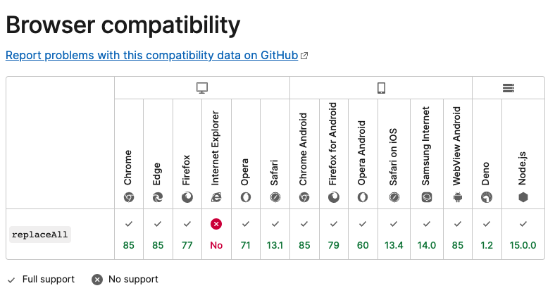

# replaceAll is not a function


## 1. 화이트 아웃 이슈가 발생하다.

회사에서 운영중인 서비스의 결제 페이지에서 화이트아웃 이슈가 발생한 적이 있었다.

해당 사항은 CS팀에서 개발팀으로 빠르게 전달되었고 중요한 페이지에서의 오류인 만큼 핫이슈로 처리되어야했었다.


## 2. 상황 재현

원인을 파악하기 위해서 상황을 재현해내어야 했다. (프론트엔드 에러 로그 시스템이 전무하다...)

결제 페이지를 webpack dev server에서, 다른 브라우저에서, real 서버에서 접근을 하여도 상황이 재현되지 않았다.

이를 보아, 기기에서 재현되는 오류일거라고 생각한 나는 테스트 기기를 사용하여 해당 페이지에 접근하였는데 특정 AOS 기기에서만 상황이 재현되었다. 곧바로 해당 기기를 연결하여 웹뷰 디버그 모드로 에러 메시지를 확인했는데, **replaceAll is not a function** 오류가 발생하였다는 것을 알아냈다.


## 3. 오류 원인 파악

 **replaceAll is not a function**의 원인으로 예상되는 사항은 아래 세 가지와 같았다.

1. replaceAll을 호출할 때, 참조할 데이터가 없음
2. replaceAll이String이 아닌 type에서 호출
3. repalceAll이 표준이 아닌 경우


### 3.1 replaceAll을 호출할 때, 참조할 데이터가 없음

아니었다. 해당 페이지에서의 데이터는 API 호출 응답이긴 하나, 로딩처리가 되어 있어 데이터의 존재가 보장되었다. 또 옵셔널 체이닝으로 메서드 호출이 되어있어 안전한 접근또한 보장이 되어있었다.


### 3.2 replaceAll이 String이 아닌 type에서 호출

아니었다. 해당 페이지는 TypeScript로 정의되어 있어 해당 데이터의 type이 String으로 인터페이스가 정의되어 있었다. 또, 참조하는 API의 응답도 백엔드에 문의하였는데 무조건 String으로 응답하는 것으로 되어있었다.


### 3.3 replaceAll이 표준이 아닌 경우

가장 유력한 원인인줄 알았지만 이또한 아니었다. MDN에서 replaceAll 메서드에 대한 Browser compatibility를 보았는데, 아래와 같이 IE를 제외한 모든 브라우저에서 지원하는 것으로 되어있었다. 재현이 되었던 기기는 AOS 웹뷰(WebviewAndroid)이므로 아래처럼 당연히 지원해야만 했었다.




## 3.4 실제 원인

replaceAll is not a function 키워드를 가지고 구글링을 하니 원인을 알 수 있었다. 

[How to Fix "replaceAll is not a function" JavaScript Error?](https://www.designcise.com/web/tutorial/how-to-fix-replaceall-is-not-a-function-javascript-error)라는 문서에서 replaceAll 메서드는 ES2021/ES12에 도입되었다는 사실을 알게 되었다. 즉, 브라우저 버전이 예전이라면, 해당 메서드가 없기 때문에 replaceAll is not a function이 발생할 수도 있다는 것이다. 실제로, 해당 현상이 재현된 AOS 기기의 OS 버전은 구버전이었다.


## 4. 해결방법

급한 이슈였으므로 replaceAll을 replace로 대체하는 방식을 사용하였다.(회사코드를 쓸 수 없으므로 아래는 예시 코드)

replace는 ES2021/ES12 이전에도 구현되어있던 빌트인 메서드로 모든 브라우저와 호환이 된다.(IE 포함)

```JavaScript
// 수정 전
example.replaceAll('-', '.');

// 수정 후
example.replace(/-/g, '.');
```


위와 같이 해당 페이지에서 사용되는 replaceAll 메서드를 replace로 바꾸니, 화이트아웃 이슈가 해결이 되었다.


## 5. 더 좋은 해결 방안

사실, 위의 해결방안은 좋은 것은 아니다. replaceAll이 다른 페이지에서도 사용된다면, replaceAll을 지원하지 않는 브라우저 버전으로 접근할 시 not a function 오류가 일어나 화이트아웃이 일어날 것이기 때문이다. 위 방법과 같이 replaceAll을 replace로 교체하면 되나, 매번 교체하는 것은 비효율적이다.

그러므로 아래와 같은 폴리필을 사용하여 미지원 브라우저 대응을 하는 것이 좋다. 프로토타입에 replaceAll에 대한 폴리필을 정의하면 알아서 대체 로직을 실행할 것이기 때문이다.

우리 메인 앱의 경우 React.js에서 webpack, babel을 사용하므로 corejs3를 설치하고 관련 설정을 하여 폴리필을 추가할 예정이다.

```JavaScript
// replaceAll이 undefined인 경우(미지원 브라우저) replace로 대체 로직을 실행하는 폴리필
if (typeof String.prototype.replaceAll == "undefined") {  
  String.prototype.replaceAll = function(match, replace) {  
    return this.replace(new RegExp(match, 'g'), () => replace);  
  }  
}
```


## 6. 느낀점

회사의 서비스는 하이브리드 앱이다. 그러므로 여러 브라우저, 여러 OS에서 일어나는 이슈들을 대응해야하는데, 이 이슈도 그런 것중의 하나였다. 느낀점은 크게 아래와 같다.

1. ECMASCript 규격 메서드라도 브라우저 버전에 따라 지원하지 않을 수 있다. -> 폴리필로 대응한다.
2. 단순한 메서드 오류라도 메인 앱 전체가 셧다운 되는 것을 방지하기 위해 에러 핸들링을 해야한다. -> try, catch 또는 에러바운더리를 활용한다.
3. 에러 추적에 용이한 솔루션이 필요하다 - sentry 같은 에러 로그 시스템을 도입한다.


## Reference

* [How to Fix "replaceAll is not a function" JavaScript Error?](https://www.designcise.com/web/tutorial/how-to-fix-replaceall-is-not-a-function-javascript-error)
* [replaceAll Polyfill](https://thewebdev.info/2021/08/13/how-to-fix-the-javascript-replaceall-is-not-a-function-error/)

