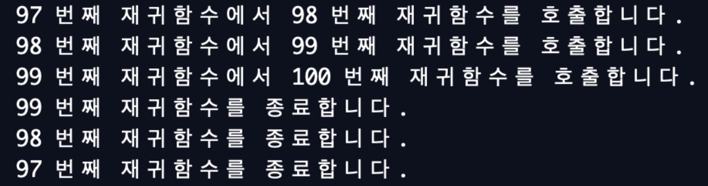

# [동빈나]이코테 2021 강의 몰아보기(5)(2021.1.3)


**본 내용은 해당 [강의](https://www.youtube.com/watch?v=7C9RgOcvkvo&list=PLRx0vPvlEmdAghTr5mXQxGpHjWqSz0dgC&index=3) 토대로 작성**


# 그래프 탐색 알고리즘: DFS/ BFS

* 탐색(Search)이란 **원하는 데이터를 찾는 과정**
* DFS, BFS
  * 자주 출제되는 유형


## 1. 자료구조

### 스택

Stack

* **후입선출**의 자료 구조
* **입구와 출구가 동일**한 형태
  * 박스를 쌓듯이 나중에 들어온 것을 가장 먼저 뺄 수 있다.


#### 스택 구현 예제

```python
stack = [] # 리스트 자료형

# 삽입(5) - 삽입(2) - 삽입(3) - 삽입(7) - 삭제() - 삽입(1) - 삽입(4) - 삭제()
stack.append(5) # 가장 오른쪽에 추가
stack.append(2) 
stack.append(3)
stack.append(7)
stack.pop()     # 가장 오른쪽 제거
stack.append(1)
stack.append(4)
stack.pop()

print(stack[::-1]) # 최상단 원소부터 출력                   [1, 3, 2, 5]
print(stack) # 최하단 원소부터 출력                         [5, 2, 3, 1]
```

* **appen함수**와 **pop함수**의 시간 복잡도는 상수 시간이므로 스택에 적합
* **append** : 가장 오른쪽에 원소를 추가하는 함수
* **pop** : 가장 오른쪽에 원소를 제거하는 함수


### 큐

Queue

* **선입선출**의 자료구조
* **입구와 출구가 모두 뚫려 있는** 형태
  * 터널
  * 대기열


#### 큐 구현 예제

```python
from collections import deque

# 큐(Queue) 구현을 위해 deque 라이브러리 사용
queue = deque()

# 삽입(5) - 삽입(2) - 삽입(3) - 삽입(7) - 삭제() - 삽입(1) - 삽입(4) - 삭제()
queue.append(5) # 가장 오른쪽에 추가
queue.append(2)
queue.append(3)
queue.append(7)
queue.popleft() # 가장 왼쪽 제거
queue.append(1)
queue.append(4)
queue.popleft()

print(queue) # 먼저 들어온 순서대로 출력                  deque[3, 7, 1, 4]
queue.reverse() # 역순으로 바꾸기
print(queue) # 나중에 들어온 원소부터 출력                deque[4, 1, 7, 3]
```

* 리스트로 큐를 기능적으로 구현할 수 있지만, 시간복잡도가 높아진다.
* **deque 라이브러리**를 사용한다.
* **append** : 가장 오른쪽에 원소 추가
* **pop left** : 가장 왼쪽의 원소 제거
* 두 함수의 시간 복잡도는 상수시간이다.
* 구현의 입력은 실제와 다른것에 주의한다.
  * 출력은 **역순**으로 해야한다.
  * **reverse**


## 2. 재귀 함수

Recursive Function

* **자기 자신을 다시 호출**하는 함수
* 재귀 함수 예제

```python
def recursive_function():
    print('재귀 함수를 호출합니다.')
    recursive_function()
    
recursive_function()
```

* 어느 정도 출력하다가 최대 재귀 깊이 초과 메시지 출력
* 재귀 깊이 초과란
  * 함수는 스택과 같은 자료구조에 쌓이면서 처리된다.
  * 함수가 재귀적으로 호출이 되면, 시스템 스택 프레임에 함수가 반복적으로 쌓인다.
  * 메모리가 가득 차게 되면, 문제가 발생한다.
  * 재귀 제한을 두어, 문제를 방지한다.


### 재귀 함수의 종료 조건

* 재귀 함수를 사용한다면, 종료 조건을 반드 명시
* 종료 조건이 없으면, 함수가 무한히 호출 된다.
* **종료 조건**을 포함한 재귀 함수 예제

```python
def recursive_function(i):
    # 100번째 호출을 했을 때, 종료되도록 종료 조건 명시
    if i == 100:
        return                # 100이 되면, 종료
    print(i, '번째 재귀함수에서', i + 1, '번째 재귀함수를 호출합니다.')
    recursive_function(i + 1)
    print(i, '번째 재귀함수를 종료합니다.')
    
recursive_function(1)
```

* 100번쨰 재귀함수가 호출되면, 함수를 종료한다.



* 스택처럼 가장 마지막에 호출된 함수부터 종료된다.


### 팩토리얼 구현 예제

* n! = 1 x 2 x 3 x ... x (n-1) x n

```python
# 반복적으로 구현한 n!
def factorial_iterative(n):
    result = 1
    # 1부터 n까지의 수를 차례대로 곱하기
    for i in range(1, n + 1):
        result *= i
    return result
 
# 재귀적으로 구현한 n!
def factorial_recursive(n):
    if n <= 1: # n이 1 이하인 경우 1을 반환
        return 1
    # n! = n * (n - 1)을 그대로 코드로 작성
    return n * factorial_recursive(n - 1)
  
# 각각의 방식으로 구현한 n! 출력(n = 5)
print('반복적으로 구현:', factorial_iterative(5))
print('재귀적으로 구현:', factorial_recursive(5))           # 둘 다 120 출력
```

* **return n * factorial_recursive(n - 1)**
  * 자기자신에게 입력된 정수 n과 (n-1)! 을 return


### 최대공약수 계산 (유클리드 호제법) 예제

* 두 개의 자연수에 대한 최대 공약수(GCD)를 구하는 알고리즘
* **유클리드 호제법**
  * 두 자연수 A,B에 대하여 (A > B) A를 B로 나눈 나머지를 R이라고 한다.
  * 이때, A와 B의 최대공약수는 B와 R의 최대공약수와 같다.
* 유클리드 호제법의 아이디어를 그대로 재귀 함수로 작성

| 단계 |  A   |  B   |
| :--: | :--: | :--: |
|  1   | 192  | 162  |
|  2   | 162  |  30  |
|  3   |  30  |  12  |
|  4   |  12  |  6   |

* 최대 공약수는 6

* 구현하기

```python
def gcd(a, b):
    if a % b == 0:
        return b
    else:
        return gcd(b, a % b)
      
print(gcd(192, 162)) # 실행 결과 6
```

* 동작 과정상, a와 b의 순서는 영향이 없다.


### 재귀 함수 사용의 유의 사항

* 알고리즘을 간결하게 작성 가능
* 반복문을 이용하여 동일한 기능 구현 가능
* 반복문보다 불리하거나 유리한 경우가 각각 있다.
* 재귀 함수를 연속적으로 호출한다면, 컴퓨터 메모리 내부의 스택 프레임에 쌓임
  * 스택을 사용해야할 때, 구현 상 **스택 라이브러리 대신 재귀 함수**를 이용 가능