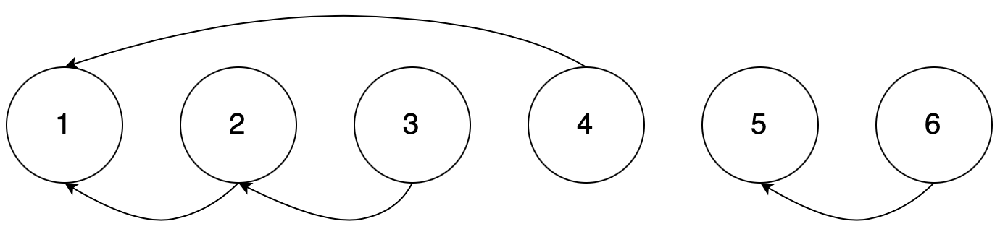
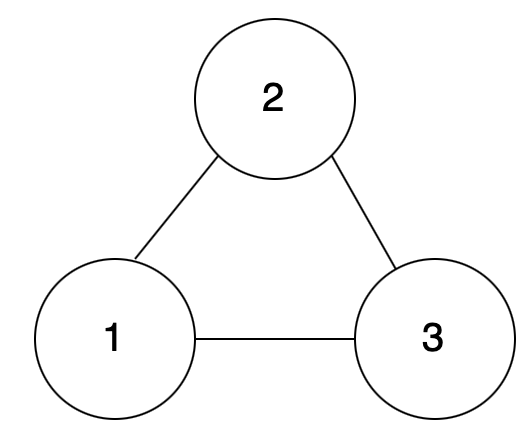

# [동빈나]이코테 2021 강의 몰아보기 (11)(2021.1.14)


**본 내용은 해당 [강의](https://www.youtube.com/watch?v=aOhhNFTIeFI&list=PLRx0vPvlEmdAghTr5mXQxGpHjWqSz0dgC&index=8) 토대로 작성**


# 기타 그래프 이론

## 1. 서로소 집합

* 서로소 집합(Disjoint Sets) :  **공통 원소가 없는 두 집합**


### 서로소 집합 자료 구조

* 서로소 부분 집합들로 나누어진 원소들의 데이터를 처리하기 위한 자료 구조
* 두 종류의 연산 지원
  * **합집합(Union)** : 두 개의 원소가 포함된 집합을 하나의 집합으로 합치는 연산
  * **찾기(Find)** : 특정한 원소가 속한 집합이 어떤 집합인지를 알려주는 연산
* **합치기 찾기(Union Find) 자료 구조**라고도 불림


### 서로소 집합 자료 구조 동작 과정

1. 합집합(Union) 연산을 확인하여, 서로 연결된 두 노드 A, B를 확인
   1.  A와 B의 루트 노드 A', B'를 각각 찾는다.
   2. A'를 B'의 부모 노드로 설정
2. 모든 합집합(Union) 연산을 처리할 때까지 1번의 과정을 반복


### 동작 과정 살펴보기

1. 노드의 개수 크기의 부모 테이블을 초기화

> Union(1, 4), Union(2, 3), Union(2, 4), Union(5, 6)

| 노드 번호 | 1    | 2    | 3    | 4    | 5    | 6    |
| --------- | ---- | ---- | ---- | ---- | ---- | ---- |
| 부모      | 1    | 2    | 3    | 4    | 5    | 6    |


2. 노드 1과 노드 4의 루트 노드를 각각 찾는다. 더 큰 번호에 해당하는 루트 노드 4의 부모를 1로 설정한다.

   > **Union(1, 4)**, Union(2, 3), Union(2, 4), Union(5, 6)

| 노드 번호 | 1    | 2    | 3    | 4     | 5    | 6    |
| --------- | ---- | ---- | ---- | ----- | ---- | ---- |
| **부모**  | 1    | 2    | 3    | **1** | 5    | 6    |


3. 노드 2와 노드 3의 루트노드를 찾는다. 위와 같이 큰 루트 노드 3의 부모를 2로 설정한다.

   >**Union(1, 4)**, **Union(2, 3)**, Union(2, 4), Union(5, 6)

| 노드 번호 | 1    | 2    | 3     | 4     | 5    | 6    |
| --------- | ---- | ---- | ----- | ----- | ---- | ---- |
| **부모**  | 1    | 2    | **2** | **1** | 5    | 6    |


4. 노드 2와 노드 4의 루트 노드를 각각 찾는다. 더 큰 번호에 해당하는 루트 노드 2의 부모를 1로 설정한다.

> **Union(1, 4)**, **Union(2, 3)**, **Union(2, 4)**, Union(5, 6)

| 노드 번호 | 1    | 2     | 3     | 4     | 5    | 6    |
| --------- | ---- | ----- | ----- | ----- | ---- | ---- |
| **부모**  | 1    | **1** | **2** | **1** | 5    | 6    |


5. 노드 5와 노드 6의 루트 노드를 각각 찾는다. 더 큰 번호에 해당하는 루트 노드 6의 부모를 5로 설정한다.

> **Union(1, 4)**, **Union(2, 3)**, **Union(2, 4)**, **Union(5, 6)**

| 노드 번호 | 1    | 2     | 3     | 4     | 5    | 6     |
| --------- | ---- | ----- | ----- | ----- | ---- | ----- |
| **부모**  | 1    | **1** | **2** | **1** | 5    | **5** |


6. **연결성**을 통해 집합의 형태를 확인한다.

| 루트를 1로 가지는 원소들 | 루트를 5로 가지는 원소들 |
| :----------------------: | :----------------------: |
|        1, 2, 3, 4        |           5, 6           |

* 왼쪽과 오른쪽은 서로소 관계이다.



### 서로소 집합 자료 구조 : 연결성

* 기본적인 형태의 서로소 집합 자료 구조에서는 루트 노드에 즉시 접근할 수 없다.

  * 위 방법처럼 부모 테이블을 확인하며 거슬러 올라가야한다.
  * 재귀 함수로 거슬러 올라간다.

  

### 서로소 집합 자료 구조 : 기본적인 구현 방법

```python
# 특정 원소가 속한 집합을 찾기
def find_parent(parent, x):
    # 루트 노드가 아니라면, 루트 노드를 찾을 때까지 재귀적으로 호출
    if parent[x] != x:
        return find_parent(parent, parent[x])
    return x

# 두 원소가 속한 집합을 합치기
def union_parent(parent, a, b):
    a = find_parent(parent, a)
    b = find_parent(parent, b)
    if a < b:
        parent[b] = a
    else:
        parent[a] = b

# 노드의 개수와 간선(Union 연산)의 개수 입력 받기
v, e = map(int, input().split())
parent = [0] * (v + 1) # 부모 테이블 초기화하기

# 부모 테이블상에서, 부모를 자기 자신으로 초기화
for i in range(1, v + 1):
    parent[i] = i

# Union 연산을 각각 수행
for i in range(e):
    a, b = map(int, input().split())
    union_parent(parent, a, b)

# 각 원소가 속한 집합 출력하기
print('각 원소가 속한 집합: ', end='')
for i in range(1, v + 1):
    print(find_parent(parent, i), end=' ')

print()

# 부모 테이블 내용 출력하기
print('부모 테이블: ', end='')
for i in range(1, v + 1):
    print(parent[i], end=' ')
```


### 서로소 집합 자료 구조 : 기본적인 구현 방법의 문제점

* 합집합(Union) 연산이 편향되게 이루어지는 경우 찾기(Find) 함수가 비효율적으로 동작


### 서로소 집합 자료구조 : 경로 압축

* 경로 압축(Path Compression)
  * **찾기 함수를 재귀적으로 호출한 뒤에 부모 테이블 값을 바로 갱신**
  * 시간 복잡도 개선
  * **find함수**만 아래로 바꿔준다.

```python
# 특정 원소가 속한 집합을 찾기
def find_parent(parent, x):
    # 루트 노드가 아니라면, 루트 노드를 찾을 때까지 재귀적으로 호출
    if parent[x] != x:
        parent[x] = find_parent(parent, parent[x])
    return parent[x]
```


## 2. 서로소 집합을 활용한 사이클 판별

* **무방향 그래프 내에서의 사이클을 판별**할 때 사용 가능
  * 방향 그래프에서의 사이클 여부는 DFS를 이용하여 판별


### 사이클 판별 알고리즘

1. 각 간선을 하나씩 확인하여 두 노드의 루트 노드 확인
   1. 루트 노드가 서로 다르다면 두 노드에 대해서 합집합(Union) 연산을 수행
   2. 루트 노드가 서로 같다면 사이클(Cycle)이 발생한 것
2. 그래프에 포함되어 있는 모든 간선에 대해서 1번 과정을 반복


### 동작 과정 살펴보기

1. 모든 노드에 대하여 자기 자신을 부모로 설정하는 형태로 부모 테이블 초기화

| 인덱스   | 1    | 2    | 3    |
| -------- | ---- | ---- | ---- |
| **부모** | 1    | 2    | 3    |


2. 간선 (1, 2)를 확인한다. 노드 1과 노드 2의 루트 노드는 각각 1과 2이므로 더 큰 번호에 해당하는 노드 2의 부모 노드를 1로 변경

| 인덱스   | 1    | 2    | 3    |
| -------- | ---- | ---- | ---- |
| **부모** | 1    | 1    | 3    |


3. 간선(1, 3)을 확인. 더 큰 번호에 해당하는 노드 3의 부모 노드를 1로 변경

| 인덱스   | 1    | 2    | 3    |
| -------- | ---- | ---- | ---- |
| **부모** | 1    | 1    | 1    |


4. 간선(2, 3)을 확인한다. 노드가 모두 1이므로 **사이클이 발생**한다는 것을 알 수 있다.

| 인덱스   | 1    | 2    | 3    |
| -------- | ---- | ---- | ---- |
| **부모** | 1    | 1    | 1    |





### 서로소 집합을 활용한 사이클 판별

```python
# 특정 원소가 속한 집합을 찾기
def find_parent(parent, x):
    # 루트 노드가 아니라면, 루트 노드를 찾을 때까지 재귀적으로 호출
    if parent[x] != x:
        parent[x] = find_parent(parent, parent[x])
    return parent[x]

# 두 원소가 속한 집합을 합치기
def union_parent(parent, a, b):
    a = find_parent(parent, a)
    b = find_parent(parent, b)
    if a < b:
        parent[b] = a
    else:
        parent[a] = b

# 노드의 개수와 간선(Union 연산)의 개수 입력 받기
v, e = map(int, input().split())
parent = [0] * (v + 1) # 부모 테이블 초기화하기

# 부모 테이블상에서, 부모를 자기 자신으로 초기화
for i in range(1, v + 1):
    parent[i] = i

cycle = False # 사이클 발생 여부

for i in range(e):
    a, b = map(int, input().split())
    # 사이클이 발생한 경우 종료
    if find_parent(parent, a) == find_parent(parent, b):
        cycle = True
        break
    # 사이클이 발생하지 않았다면 합집합(Union) 연산 수행
    else:
        union_parent(parent, a, b)

if cycle:
    print("사이클이 발생했습니다.")
else:
    print("사이클이 발생하지 않았습니다.")
```

