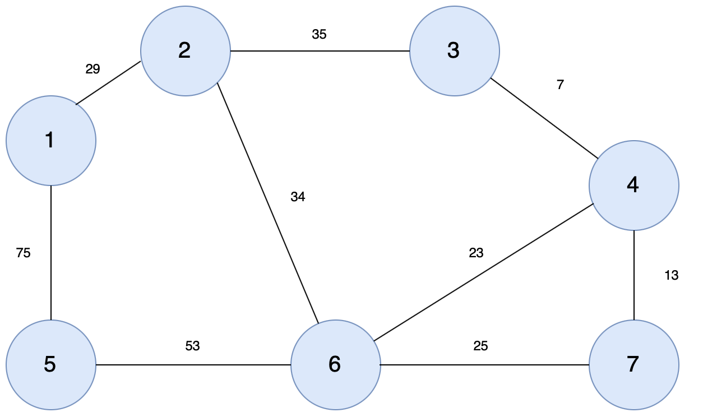
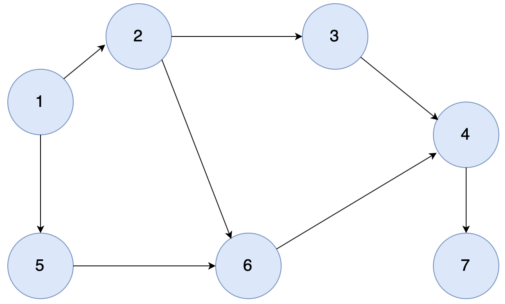

# [동빈나]이코테 2021 강의 몰아보기 (12)(2021.1.15)


**본 내용은 해당 [강의](https://www.youtube.com/watch?v=aOhhNFTIeFI&list=PLRx0vPvlEmdAghTr5mXQxGpHjWqSz0dgC&index=8) 토대로 작성**


# 기타 그래프 이론

## 1. 크루스칼 알고리즘

### 신장 트리

* 그**래프에서 모든 노드를 포함하면서 사이클이 존재하지 않는 부분 그래프를 의미**
  * 모든 노드가 포함되어 서로 연결되면서 사이클이 존재하지 않는다는 조건은 **트리**의 조건이기도 한다.
  * 일부 간선만 활용
* 일부 간선을 사용하지 않아도 모든 노드를 이을 수 있으므로 유용한 경우가 있다.


### 최소 신장 트리

* N개의 도시가 존재하는 상황에서 두 도시 사이에 도로를 놓아 전체 도시가 서로 연결될 수 있게 도로를 설치하는 경우
  * 두 도시 A, B를 선택했을 때 A에서 B로 이동하는 경로가 반드시 존재하도록 도로를 설치
  * 포함되는 간선의 합이 최소가 되도록 한다.
* 최종적으로 만들어지는 최소 신장 트리의 포함된 간선 개수는 전체 노드 개수의 -1이다.


### 크루스칼 알고리즘

* 대표적인 **최소 신장 트리 알고리즘**
* 그리디 알고리즘


#### 크루스칼 알고리즘 동작 과정

1. 간선 데이터를 비용에 따라 **오름차순 정렬**
2. 간선을 하나씩 확인하며 **현재의 간선이 사이클을 발생시키는지 확인**
   1. 사이클이 발생하지 않는 경우 최소 신장 트리에 포함
   2. 사이클이 발생하는 경우 최소 신장 트리에 미포함
3. 모든 간선에 대해 2번의 과정을 반복


#### 크루스칼 알고리즘 : 동작 과정 살펴보기





1. 그래프의 모든 간선 정보에 대해서 **오름차순 정렬**을 수행한다.

|   간선   | (1, 2) | (1, 5) | (2, 3) | (2, 6) | (3, 4) | (4, 6) | (4, 7) | (5, 6) | (6, 7) |
| :------: | :----: | :----: | :----: | :----: | :----: | :----: | :----: | :----: | :----: |
| **비용** |   29   |   75   |   35   |   34   |   7    |   23   |   13   |   53   |   25   |


2. 가장 짧은 간선인 (3, 4)를 선택하여 처리

|   간선   | (1, 2) | (1, 5) | (2, 3) | (2, 6) | (3, 4) | (4, 6) | (4, 7) | (5, 6) | (6, 7) |
| :------: | :----: | :----: | :----: | :----: | :----: | :----: | :----: | :----: | :----: |
| **비용** |   29   |   75   |   35   |   34   |   7    |   23   |   13   |   53   |   25   |
| **순서** |        |        |        |        | **1**  |        |        |        |        |


3. 같은 집합에 포함되지 않은 짧은 간선 순으로 위 동작을 반복한다.

|   간선   | (1, 2) | (1, 5) | (2, 3) | (2, 6) | (3, 4) | (4, 6) | (4, 7) | (5, 6) | (6, 7) |
| :------: | :----: | :----: | :----: | :----: | :----: | :----: | :----: | :----: | :----: |
| **비용** |   29   |   75   |   35   |   34   |   7    |   23   |   13   |   53   |   25   |
| **순서** |        |        |        |        | **1**  | **3**  | **2**  |        |        |


4. 같은 집합에 포함되어 있은 경우, 최소 신장 트리에 포함하지 않는다.

|   간선   | (1, 2) | (1, 5) | (2, 3) | (2, 6) | (3, 4) | (4, 6) | (4, 7) | (5, 6) | (6, 7) |
| :------: | :----: | :----: | :----: | :----: | :----: | :----: | :----: | :----: | :----: |
| **비용** |   29   |   75   |   35   |   34   |   7    |   23   |   13   |   53   |   25   |
| **순서** |        |        |        |        | **1**  | **3**  | **2**  |        |   4    |


5. 결과는 아래와 같다.(볼드 처리 : 최소 신장 트리)

|   간선   | (1, 2) | (1, 5) | (2, 3) | (2, 6) | (3, 4) | (4, 6) | (4, 7) | (5, 6) | (6, 7) |
| :------: | :----: | :----: | :----: | :----: | :----: | :----: | :----: | :----: | :----: |
| **비용** |   29   |   75   |   35   |   34   |   7    |   23   |   13   |   53   |   25   |
| **순서** | **5**  |   9    |   7    | **6**  | **1**  | **3**  | **2**  | **8**  |   4    |


6. 최소 신장 트리에 포함된 간선의 비용만 모두 더하면 그 값이 최종 비용이다.


#### 크루스칼 알고리즘 구현

```python
# 특정 원소가 속한 집합을 찾기
def find_parent(parent, x):
    # 루트 노드가 아니라면, 루트 노드를 찾을 때까지 재귀적으로 호출
    if parent[x] != x:
        parent[x] = find_parent(parent, parent[x])
    return parent[x]

# 두 원소가 속한 집합을 합치기
def union_parent(parent, a, b):
    a = find_parent(parent, a)
    b = find_parent(parent, b)
    if a < b:
        parent[b] = a
    else:
        parent[a] = b

# 노드의 개수와 간선(Union 연산)의 개수 입력 받기
v, e = map(int, input().split())
parent = [0] * (v + 1) # 부모 테이블 초기화하기

# 모든 간선을 담을 리스트와, 최종 비용을 담을 변수
edges = []
result = 0

# 부모 테이블상에서, 부모를 자기 자신으로 초기화
for i in range(1, v + 1):
    parent[i] = i

# 모든 간선에 대한 정보를 입력 받기
for _ in range(e):
    a, b, cost = map(int, input().split())
    # 비용순으로 정렬하기 위해서 튜플의 첫 번째 원소를 비용으로 설정
    edges.append((cost, a, b))

# 간선을 비용순으로 정렬
edges.sort()

# 간선을 하나씩 확인하며
for edge in edges:
    cost, a, b = edge
    # 사이클이 발생하지 않는 경우에만 집합에 포함
    if find_parent(parent, a) != find_parent(parent, b):
        union_parent(parent, a, b)
        result += cost

print(result)
```

* **O(ElogE)** 시간 복잡도


## 2. 위상 정렬

* **사이클이 없는 방향 그래프**의 모든 노드를 **방향성에 거스르지 않도록 순서대로 나열**


### 진입차수와 진출차수

* 진입차수(Indegree) : 특정한 노드로 들어오는 간선의 개수
* 진출차수(outdegree) : 특정한 노드에서 나가는 간선의 개수


### 위상 정렬 알고리즘 동작 과정

1. 진입차수가 0인 모든 노드를 큐에 넣는다.
2. 큐가 빌 때까지 다음의 과정 반복
   1. 큐에서 원소를 꺼내 해당 노드에서 나가는 간선을 그래프에서 제거
   2. 새롭게 진입차수가 0이된 노드를 삽입


결과적으로 **각 노드가 큐에 들어온 순서가 위상 정렬을 수행한 결과**와 같다.


### 위상 정렬 동작 예시

* **사이클이 없는 방향 그래프(DAG)**




1. **진입차수가 0인 모든 노드**를 큐에 넣는다.

| 노드         | 1    | 2    | 3    | 4    | 5    | 6    | 7    |
| ------------ | ---- | ---- | ---- | ---- | ---- | ---- | ---- |
| **진입차수** | 0    | 1    | 1    | 2    | 1    | 2    | 1    |

> **큐** 노드 1


2. 노드 1을 꺼낸 뒤에 **노드 1에서 나가는 간선 제거** 후 새롭게 **진입차수가 0이 된 노드들을 큐에 삽입**(작은 번호의 노드가 큐에 우선 삽입)

| 노드         | 1    | 2    | 3    | 4    | 5    | 6    | 7    |
| ------------ | ---- | ---- | ---- | ---- | ---- | ---- | ---- |
| **진입차수** | 0    | 0    | 1    | 2    | 0    | 2    | 1    |

> **큐** 노드 2, 노드 5


3. 노드 2를 꺼낸 뒤, 위 동작을 반복

| 노드         | 1    | 2    | 3    | 4    | 5    | 6    | 7    |
| ------------ | ---- | ---- | ---- | ---- | ---- | ---- | ---- |
| **진입차수** | 0    | 0    | 0    | 2    | 0    | 1    | 1    |

> **큐** 노드 5, 노드 3


4. 진입차수가 0이 없는 경우 큐의 다음 노드를 수행하고 위 동작을 반복하면, 결과는 아래와 같다.

> **큐** 삽입된 순서 : 1, 2, 5, 3, 6, 4, 7


### 위상 정렬 특징

* **DAG(Direct Acyclic Graph)에 대해서만 수행 가능**
* **여러가지 답 존재**할 수 있다.
  * 한 단계에서 큐에 새롭게 들어가는 원소가 2개 이상인 경우
* 모**든 원소를 방문하기 전에 큐가 빈다면 사이클이 존재**한다고 판단할 수 있다.
  * 사이클에 포함된 원소 중에서 어떠한 원소도 큐에 들어가지 못한다.
* 스택을 활용한 DFS를 이용해 위상 정렬을 수행할 수 있다.


### 위상 정렬 알고리즘 구현

```python
from collections import deque

# 노드의 개수와 간선의 개수를 입력 받기
v, e = map(int, input().split())
# 모든 노드에 대한 진입차수는 0으로 초기화
indegree = [0] * (v + 1)
# 각 노드에 연결된 간선 정보를 담기 위한 연결 리스트 초기화
graph = [[] for i in range(v + 1)]

# 방향 그래프의 모든 간선 정보를 입력 받기
for _ in range(e):
    a, b = map(int, input().split())
    graph[a].append(b) # 정점 A에서 B로 이동 가능
    # 진입 차수를 1 증가
    indegree[b] += 1

# 위상 정렬 함수
def topology_sort():
    result = [] # 알고리즘 수행 결과를 담을 리스트
    q = deque() # 큐 기능을 위한 deque 라이브러리 사용

    # 처음 시작할 때는 진입차수가 0인 노드를 큐에 삽입
    for i in range(1, v + 1):
        if indegree[i] == 0:
            q.append(i)

    # 큐가 빌 때까지 반복
    while q:
        # 큐에서 원소 꺼내기
        now = q.popleft()
        result.append(now)
        # 해당 원소와 연결된 노드들의 진입차수에서 1 빼기
        for i in graph[now]:
            indegree[i] -= 1
            # 새롭게 진입차수가 0이 되는 노드를 큐에 삽입
            if indegree[i] == 0:
                q.append(i)

    # 위상 정렬을 수행한 결과 출력
    for i in result:
        print(i, end=' ')

topology_sort()
```

* **O(V + E)** 시간 복잡도