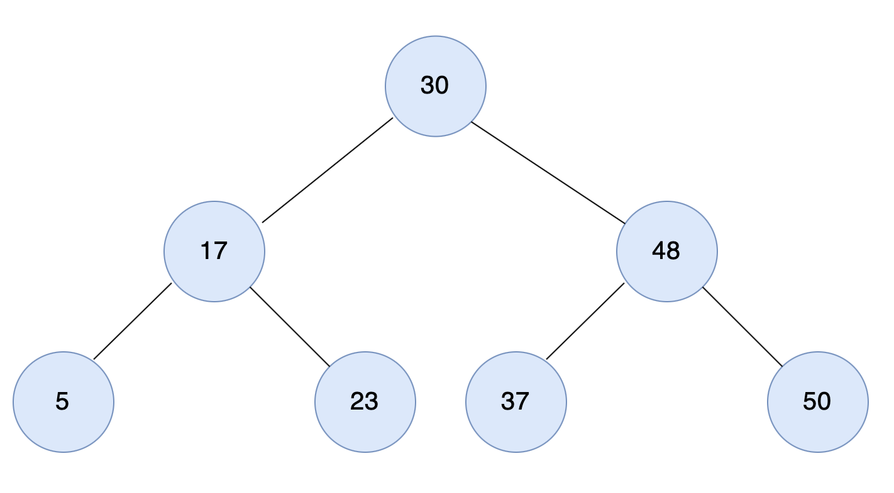
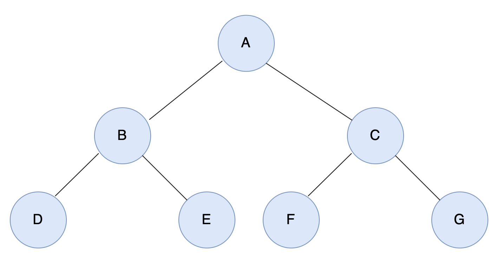

# [동빈나]이코테 2021 강의 몰아보기 (16)(2021.1.20)


**본 내용은 해당 [강의](https://www.youtube.com/watch?v=i5yHkP1jQmo&list=PLRx0vPvlEmdAghTr5mXQxGpHjWqSz0dgC&index=12) 토대로 작성**


# 자료구조 : 트리(Tree)

* **가계도**와 같은 **계층적인 구조**를 표현할 때 사용하는 자료 구조
* 기본적으로 **트리의 크기가 N**일 때, **전체 간선의 개수는 N-1개** 이다.


## 트리 관련 용어

* 루트 노드(root node): 부모가 없는 최상위 노드
* 단말 노드(leaf node): 자식이 없는 노드
* 크기(size): 트리에 포함된 모든 노드의 개수
* 깊이(depth): 루트 노드부터의 거리
* 높이(height): 깊이 중 최댓값
* 차수(degree): 각 노드의 (자식 방향) 간선 개수


## 이진 탐색 트리 (Binary Search Tree)

* 이진 탐색이 동작할 수 있도록 고안된 효율적인 탐색이 가능한 자료구조의 일종
* 왼쪽 자식 노드 < 부모 노드 < 오른쪽 자식 노드
  * 부모 노드를 기준으로, 왼쪽 자식 노드가 작고 오른족 자식 노드가 크다.


### 이진 탐색 트리 (Binary Search Tree) 조회 과정



**찾고자 하는 원소 : 37**

1. 루트 노드부터 방문하여 탐색을 진행
   1. 현재 노드와 찾는 원소 37을 비교
   2. 찾는 원소가 더 크므로 오른쪽 방문


**현재 위치 : 48**

2. 현재 노드와 값을 비교
   1. 현재 노드와 찾는 원소 37을 비교
   2. 찾는 원소가 더 작으므로 왼쪽 방문
   3. 원소를 찾았으므로 탐색 종료


### 트리의 순회 (Tree Traversal)

* 노드를 특정한 방법으로 한 번씩 방문하는 방법을 의미
  * 트리의 정보를 시각적으로 확인할 수 있다.
* **대표적인 트리 순회 방법**
  * **전위 순회(pre-order traverse)**: 루트를 먼저 방문
  * **중위 순회(in-order traverse)**: 왼쪽 자식을 방문한 뒤에 루트를 방문
  * **후위 순회(post-order traverse)**: 오른쪽 자식을 방문한 뒤에 루트를 방문


#### 예시



 

```
7
A B C
B D E
C F G
D None None
E None None
F None None
G None None
```

* 전위 순회(pre-order traverse): A -> B -> D -> E -> C -> F -> G
* 중위 순회(in-order traverse): D -> B -> E -> A -> F -> C -> G
* 후위 순회(post-order traverse): D -> E -> B -> F -> G -> C -> A


#### Python 소스 코드

```python
class Node:
    def __init__(self, data, left_node, right_node):
        self.data = data
        self.left_node = left_node
        self.right_node = right_node

# 전위 순회(Preorder Traversal)
def pre_order(node):
    print(node.data, end=' ')
    if node.left_node != None:
        pre_order(tree[node.left_node])
    if node.right_node != None:
        pre_order(tree[node.right_node])

# 중위 순회(Inorder Traversal)
def in_order(node):
    if node.left_node != None:
        in_order(tree[node.left_node])
    print(node.data, end=' ')
    if node.right_node != None:
        in_order(tree[node.right_node])

# 후위 순회(Postorder Traversal)
def post_order(node):
    if node.left_node != None:
        post_order(tree[node.left_node])
    if node.right_node != None:
        post_order(tree[node.right_node])
    print(node.data, end=' ')

n = int(input())
tree = {}

for i in range(n):
    data, left_node, right_node = input().split()
    if left_node == "None":
        left_node = None
    if right_node == "None":
        right_node = None
    tree[data] = Node(data, left_node, right_node)

pre_order(tree['A'])
print()
in_order(tree['A'])
print()
post_order(tree['A'])

'''
[예시 입력]
7
A B C
B D E
C F G
D None None
E None None
F None None
G None None
[예시 출력]
A B D E C F G 
D B E A F C G 
D E B F G C A 
'''
```


# Reference

https://ko.wikipedia.org/wiki/트리_구조


