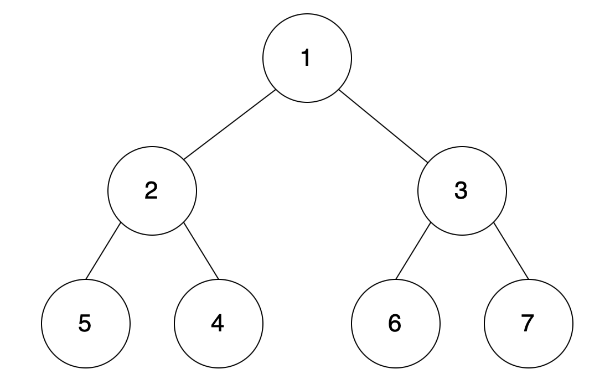

# [인프런 - 김태원] 파이썬 알고리즘 문제풀이 (코딩테스트 대비) (16)(2021.2.8)


**본 내용은 해당 [강의](https://www.inflearn.com/course/파이썬-알고리즘-문제풀이-코딩테스트/dashboard) 토대로 작성**

# 1. 최소힙

## 힙

### 트리



* 노드 : 숫자가 쓰인 원
* 간선 : 노드를 잇는 선, 엣지라고도 함
* 루트 노드 : 가장 상위의 노드
* 자식 노드 : 상위 노드의 아래에 있는 노드
* 이진트리의 기본 구성 단위: 부모 노드와 자식 노드
* 왼쪽 서브 트리 : 2 , 5,  4
* 오른쪽 서브 트리 : 3, 6, 7
* 0 레벨 : 1
* 1 레벨 : 2, 3
* 2 레벨 : 5, 4, 6, 7


### 최소힙

* 부모노드가 자식노드보다 작아야 한다.
* 0레벨부터 왼쪽을 채운다.
* 부모가 자식보다 큰 경우, 바꿔준다.(**업힙**)
* **heap.pop** 하면, 루트 노드 값이 나온다.
* 빈 루트 노드 자리에 아래 레벨, 가장 오른쪽(큰 값)이 가게 된다.
* 더 작은 값이 부모노드가 되도록 자리를 바꾼다.(**다운힙**)
* **heap.push**가 되면, **업힙**


## 문제 답안

```python
import heapq as hq # heap
a = []; # 빈 리스트 생성
while True:
    n = int(input());
    if n == -1:
        break;
    if n == 0:
        if len(a) == 0:
            print(-1);
        else:
            print(hq.heappop(a)); # 루트노드
    else:
        hq.heappush(a, n); # 트리형태로 넣기
```

* 힙의 개념은 면접에서 물어보니 잘 기억하자

# 2. 최대힙

* 파이썬의 heapq는 최소힙이 기본세팅이다.
* **힙을 입력시 부호를 바꾼다.**
* **출력시 다시 원래 부호로 바꾼다.**


## 문제 답안

```python
import heapq as hq # heap
a = []; # 빈 리스트 생성
while True:
    n = int(input());
    if n == -1:
        break;
    if n == 0:
        if len(a) == 0:
            print(-1);
        else:
            print(-hq.heappop(a)); # 원래 부호로 바꾸기
    else:
        hq.heappush(a, -n); # 최대힙
```

