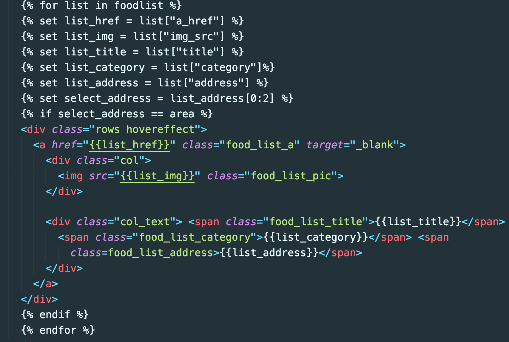

# [Chapter1] 웹개발 미니 프로젝트 F.A (Final Assignment)

### 제출자: 전재민 길근용

## 1. 웹사이트 링크

[주.먹.밥!](http://jumeokbap.site/)

## 2. 제목

주.먹.밥! (주는대로 먹는 밥!)

## 3. 설명

* 오늘도, 메뉴 선정이라는 중대한 선택의 갈림길에서 갈등하시는 분
* 최신 인기메뉴 top10 + 원하는 지역의 맛집의 정보를 받아보세요!
* 웹 스크래핑으로 가져온 최신 인기 맛집 정보를 제공합니다!
* bulma 기반의 깔끔한 웹 사이트 디자인도 만끽하세요!

## 4. 데모영상 유튜브 링크

[유튜브](https://www.youtube.com/watch?v=4ZrYW0CPipQ&feature=youtu.be)

## 5. github 주소(public)

https://github.com/greedysiru/hanghae99-jumeokbap

## 6. 서버사이드 렌더링의 장점

서버사이드 렌더링은 한 페이지에서 사용자의 요청에 따라 여러가지 모습을 출력시킬 수 있습니다. 이 프로젝트에서는 flask 프레임워크에서 사용하는 템플릿 언어인 jija2 를 사용하였습니다. 웹  스크래핑으로 정보들을 가져와 mongoDB에 저장 후 jinja2 문법을 사용하여 원하는 페이지를 구현할 수 있었습니다. 특히, if문과 for문을 사용할 수 있어서 매우 유용했습니다. 직관적이고 간편한 문법도 사용하기 용이했습니다. 본래, 원하는 페이지를 만들기 위해서 긴 HTML 코드가 필요했는데 jija2를 사용함으로 html파일들의 가독성을 향상시킬 수 있었습니다.

이 외에도, 로그인한 사용자의 정보를 페이지에 jija2로 불러와 표시할 수도 있었습니다.

## 7. 쿠키/세션 대비 JWT 장점

JWT는 저장소 관리가 필요하지 않고 토큰을 발급합니다. 쿠키/세션처럼 별도의 저장소 관리가 필요하지 않아서 간편합니다. 그렇기때문에 자연히, 서버의 부담도 줄어들게 됩니다. 