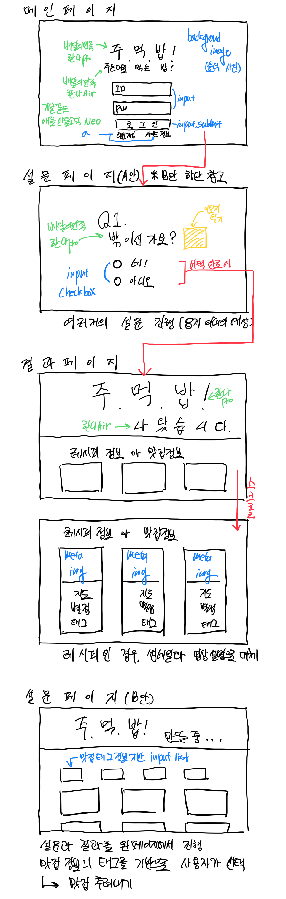

# [Chapter1] 웹개발 미니 프로젝트 S.A (Starting Assignment)

##  팀소개

### 17 조

* [전재민](https://www.notion.so/1be4db7eaca348f5afc4dbc88e38ea6d)
* [길근용](https://www.notion.so/9655b61c464948358fe7d6ec1fe5bc09)
* [김영빈](https://www.notion.so/e6d6857cd3a14348a29acf49e7b3e1bc)

## 01. 프로젝트 제목/간단설명

### 프로젝트 제목

> **주먹밥!**
>
> 주.는대로 먹.는 밥!

### 간단설명

오늘도, 메뉴 선정이라는 중대한 선택의 갈림길에서 갈등하시는 분 😱

기왕 먹을 밥, 알차게 맛있게 드시고 싶으신 분 🤔

상황, 날씨, 취향 등을 토대로 위치 기반 맛집과 레시피를 추천 해드립니다 😋

저희가 **주.는대로 먹.는 밥!** 마음껏 만끽하세요 😘

## 02. 와이어프레임

## 03. 개발해야 하는 기능들

### 맛집 정보 API 설계하기

| 기능              | Method |
| ----------------- | ------ |
| 지도 API          | get    |
| 날씨 API          | get    |
| 사용자 위치 API   | get    |
| 맛집 조회 API     | get    |
| 레시피 조회 API   | get    |
| 리뷰 작성 API     | post   |
| 리뷰 불러오기 API | get    |

## 04. Public github  repo 주소

[hanghae99-jumeokbap](https://github.com/greedysiru/hanghae99-jumeokbap)

