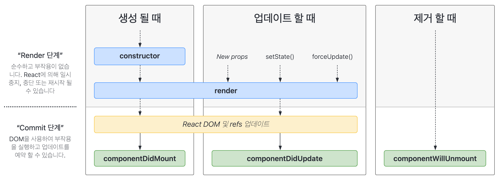

# [항해99 1기] [Chapter3-1] 주특기 기본 - 프론트의 꽃 리액트 (4) (2021.3.22)

# 1. SCSS

* [공식문서](https://sass-lang.com/documentation)
* [SCSS와 CSS를 비교할 수 있는 사이트](https://www.sassmeister.com/)
* SASS의 3번째 버전
* SASS와 CSS에 호환이 잘 된다.
* 기본적인 문법은 CSS와 동일
* 사용하기 위해 패키지들을 설치

```shell
yarn add node-sass@4.14.1 open-color sass-loader classnames
```


## 1.1 Nesting

* 부모 태그와 자식 태그에 스타일을 줄 때 다른 블럭을 만들지 않아도 된다.
* 프로퍼티를 축약형으로 묶을 수 있다
  * font-size와 font-family를 font 아래에 묶을 수 있다.

```scss
/* div태그 안에 p태그와 img태그가 있을 때 */
div{
  p{
    color: white;
    /* font-size와 font-family를 아래처럼 묶을 수 있다. */
    font: {
      family: snas-serif;
      size: 14px;
    }
  }
  img {
    width: 400px;
  }
}
```


## 1.2 상위 요소 이어쓰기

* &로 클래스명, 글자를 이어쓸 수 있다.

```scss
div {
  background-color: green;
  &:hover {background-color: blue}
}

.div {
  background-color: green;
  &_blue {background-color: blue}
}
```


## 1.3 변수 사용하기

```scss
$defaultSize: 20px;
$className: blue;

p{
	font-size: #{$defaultSize};
	&.#{$className} {color: #{$className}}
}
```


# 2. styled-components

* 컴포넌트 스타일링 기법 중 하나
* class 이름 짓기를 할 필요가 없다.
* 컴포넌트에 스타일을 적으므로 간단하고 직관적

## 2.1 패키지 설치

```shell
yarn add styled-components
```


## 2.2 적용 예시

```react
import React from 'react';
// styled-components 불러오기
import styeld from 'styled-components';

function App() {
  return (
  	<div className="App">
      <MyStyled>Hello React!</MyStyled>
    </div> 
  );
}

const MyStyled = styled.div`
	width: 50vw;
	min-height: 150px;
	padding: 10px;
	border-radius: 15px;
	color: #fff;
	&:hover{
		background-color: #ddd;
	}
`

export default App;
```


# 3. 라이프 사이클

## 3.1 가상돔

* DOM: html 단위 하나하나를 객체로 생각하는 모델
  * 태그들을 트리구조로 나타낸다.
* DOM트리 중 하나가 수정될 때 모든 DOM을 뒤지고, 수정할 것을 찾고 수정한다면 필요없는 연산이 많이 발생
  * 그래서 등장한 것이 **가상돔**
* 가상돔은 메모리 상에서 돌아가는 가짜 DOM
* 가상돔의 동작 방식
  * 기존 DOM과 어떤 행동 후 새로 그린 DOM(가상 돔에 올라갔다고 표현)을 비교해서 바뀐 부분만 갈아끼운다.
  * 돔 업데이트 처리가 간결
* DOM을 새로 그리는 경우
  * 처음 페이지 진입시
  * 데이터가 변했을 시


## 3.2 라이프 사이클

* **컴포넌트가 렌더링을 준비하는 순간부터, 페이지에서 사라질 때까지**



* **생성 -> 수정(업데이트) -> 제거**
* 생성: 컴포넌트를 불러오는 단계
* 수정(업데이트): 사용자의 행동(클릭, 데이터 입력 등)으로 데이터가 바뀌거나, 부모 컴포넌트가 렌더링할 때 업데이트
  * props가 바뀔 때
  * state가 바뀔 때
  * 부모 컴포넌트의 업데이트(=리렌더링)
  * 강제로 업데이트 했을 경우 (forceUpdate())
* 제거: 페이지를 이동하거나 사용자의 행동(삭제 버튼 클릭 등)으로 인해 컴포넌트가 화면에서 사라지는 단계


## 3.3 라이프 사이클 함수

* **클래스형 컴포넌트에서만 사용 가능**
* 함수형 컴포넌트에서도 React Hooks을 이용해 라이프 사이클 함수 대체


```react
import React from "react";

// 클래스형 컴포넌트
class LifecycleEx extends React.Component {

// 생성자 함수
  constructor(props) {
    super(props);
    
    this.state = {
      cat_name: '시루',
    };

    console.log('in constructor!');
  }

  changeCatName = () => {
    // state 업데이트

      this.setState({cat_name: 'siru'});

      console.log('고양이 이름을 영문으로');
  }

  componentDidMount(){
    console.log('in componentDidMount!');
  }

  componentDidUpdate(prevProps, prevState){
      console.log(prevProps, prevState);
      console.log('in componentDidUpdate!');
  }

  componentWillUnmount(){
      console.log('in componentWillUnmount!');
  }

  // 랜더 함수 안에 리액트 엘리먼트 넣기
  render() {

    console.log('in render!');

    return (
      <div>
          {/* render 안에서 컴포넌트의 데이터 state를 참조 가능 */}
        <h1>제 고양이 이름은 {this.state.cat_name}입니다.</h1>
        <button onClick={this.changeCatName}>영문 변환</button>
      </div>
    );
  }
}

export default LifecycleEx;
```

* **constructor()**: 생성자 함수. 컴포넌트 생성 시 가장 처음 호출되는 구조
* **render()**: 컴포넌트의 모양을 정하는 함수
  * state, props에 접근해서 데이터를 보여줄 수 있다.
  * 컴포넌트에 모양에만 관여하는 것이 좋다.
  * state, props를 수정하지 말 것
* **componentDidMount()**
  * **Mount**: 컴포넌트가 화면에 나타나는 것
  * **첫번째 렌더링을 마친 후 딱 한 번 실행되는 함수**
  * 리렌더링에는 실행되지 않는다.
  * 이 함수 안에서 ajax 요청, 이벤트 등록, 함수 호출 등 작업을 처리
  * 이 시점에서는 가상돔이 실제돔으로 올라간 상태이므로 DOM관련 처리를 할 수 있다.
* **componentDidUpdate(prevProps, prevState, snapshot)**
  * **리렌더링을 완료한 후에 실행되는 함수**
  * prevProps: 업데이트 되기 전의 props
  * prevState: 업데이트 되기 전의 state
  * 이 시점에서는 가상돔이 실제돔으로 올라간 상태이므로 DOM관련 처리를 할 수 있다.
* **componentWillUnmound()**
  * 컴포넌트가 돔에서 제거 될 때 실행하는 함수
  * 이벤트 리스너를 여기에서 해제할 것


## 3.4 StirctMode

* index.js에서 애플리케이션이 문제가 없는 지 검사하는 모드
* 로컬환경에서만 활성화
* 기본 설정으로는 React.StrictMode가 App을 감싸고 있는 형태
* render, constuctor가 두번씩 찍히는 이유
* 삭제해도 된다.


# 4.  리액트에서 돔요소 가져오기

* JavaScript에서 쿼리셀렉터로 돔요소를 가져오는 것처럼 리액트에서도 가능
* **리액트 요소에서 가져올 것**


## 4.1 React.createRef()

```react
class MyComponent extends React.Component {
  constructor(props) {
    super(props);
    this.myRef = React.createRef();
  }
  render() {
    return <div ref={this.myRef} />;
  }
}
```

* Ref는 React.createRef()를 통해 생성된다.
* 생성된 Ref는 리액트 엘리먼트에 ref 속성을 통해서 부착된다.


## 4.2 Ref에 접근

```react
const node = this.myRef.currnet;
```

* render에서 Ref가 엘리먼트에 전달되면, 그 노드를 향한 참조는 ref의 currnet 속성에 담긴다.


# Reference

[스파르타코딩클럽 - 프론트엔드의 꽃 리액트](https://spartacodingclub.kr/online/react)

[라이프 사이클](https://projects.wojtekmaj.pl/react-lifecycle-methods-diagram/)

[리액트 공식문서](https://ko.reactjs.org/)