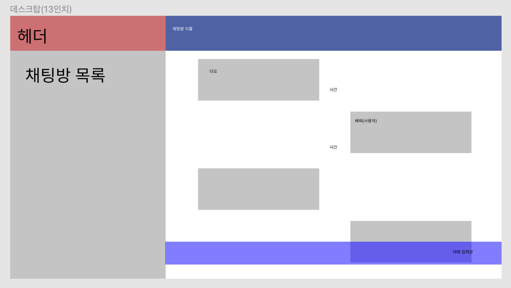
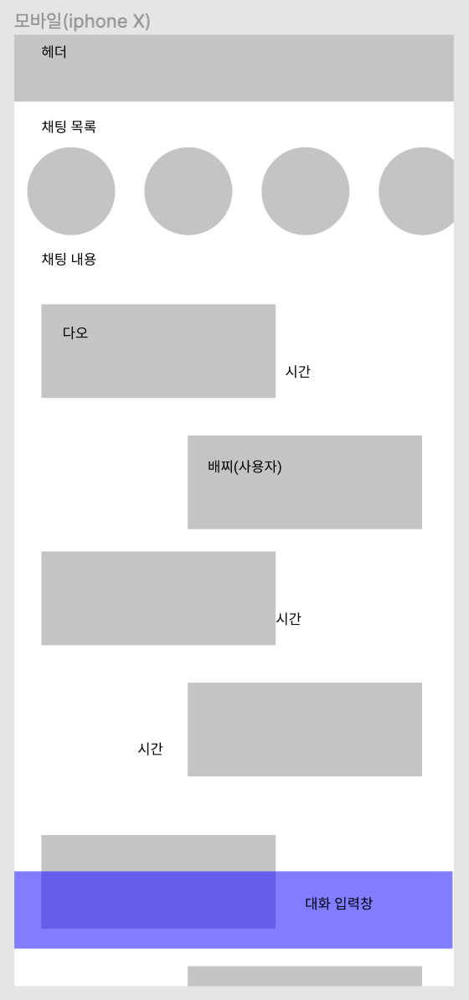
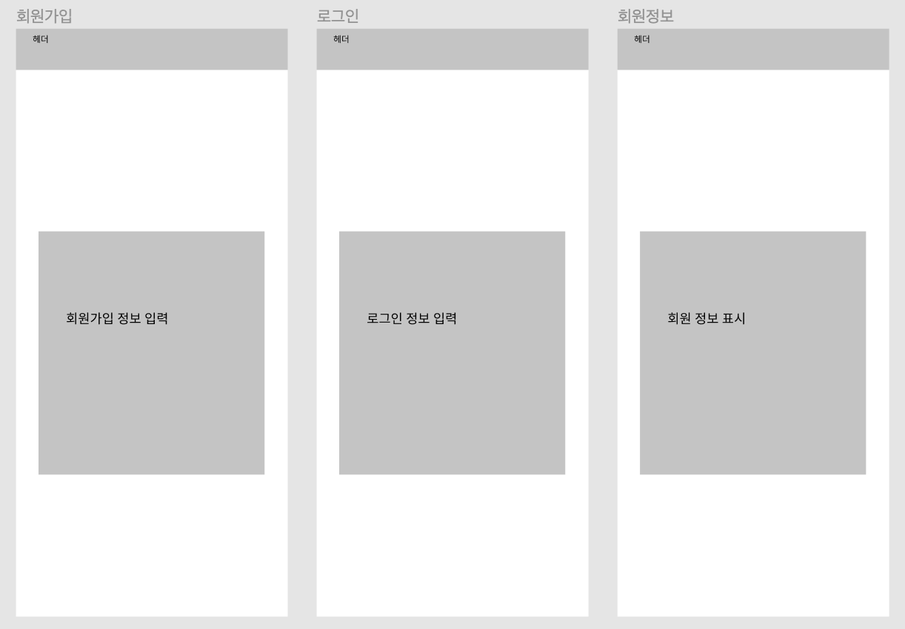

# [항해99 1기] [Chapter5] 미니프로젝트 (1) (2021.4.9)

**미니 프로젝트에 대한 일지**

# 1. 주제 선정

**아이스브레이킹 후 프로젝트 주제에 대한 회의 진행**

**참고할 만한 기존의 서비스나 필요한 기능들을 말해보기**

* 채팅을 메인 컨텐츠로하는 웹 애플리케이션으로 정하기
* **스파르타코딩의 상담 채팅앱**
  * 아임웹
  * 관리자와만 채팅을 할 수 있어서 제한적
* 사용자 간의 채팅을 할 수 있는 것이 좋다.
* 알림 기능까지
* **자소설 닷컴**
* 사용자가 로그인을 하면 채팅방을 개설
* 들어가서 대화를 할 수 있도록 함
* **클럽하우스**
  * 누구나 자유롭게 음성 채팅을 할 수 있는 것을 참조하자
* 카테고리 별로 채팅방을 만들어 놓기
* 무한스크롤
* 회원가입, 프로필, 로그인
  * 소셜 로그인(카카오, 네이버)
* JWT 토큰
* 닉네임이 보이도록 하자
* 웹소켓
  * 소켓통신 + http
  * 실시간으로 통신 할 수 있다.
  * Redis DB 사용
  * 빠르나 안정성은 낮다.
  * 중요한 정보만 mySQL
  * **리액트와 연동하는 방법 모색할 것**
  * [JavaScript와 웹소켓에 대해서 참고할만한 문서](https://ko.javascript.info/websocket)

## 선정한 주제

* 대상을 좁혀 잡기
  * 현재 우리가 개발자 지망생인 점을 착안, 우리들에게 필요할 만한 서비스
* 언어별, 이슈별로 채팅을 할 수 있는 사이트
* 개발자 지망생을 위한 talk -> **개망톡**

# 2. 와이어프레임

**프론트 엔드 팀이 figma 툴을 이용하여 프로젝트의 전체적인 프레임 구성해보기**

## 데스크탑에서의 채팅 목록과 대화창

## 모바일에서의 채팅 목록과 대화창

## 로그인, 회원가입, 회원정보

* 모바일 환경 뷰를 기반으로 데스크탑 뷰를 만들 것

# 3. API 설계

**백 엔드 팀이 프로젝트에 필요한 기능을 위한 API 설계 하기**

* [API 설계 노션 링크](https://www.notion.so/fbbcf13d1bc842579e6b14247fa71054?v=136e65986c3f4bd4a7241ccc260a042e)

# 4. 중간 점검 목표

* 2021.04.16(금)까지 채팅, 로그인, 회원가입 기능 구현 완료하기!

# 5. 필요한 것, 준비할 것

**프론트 팀 회의를 통해서 프로젝트 진행에 필요할 만한 필요한 것과 공부할 것들 정리**

* Validation
* 모바일과 데스크탑 각각의 경우에서 데이터를 받아올 때 분기처리
* 모달
* 채팅 기능에서 서버와의 소통을 위한 웹소켓 공부하기
* 리액트 공부하기
  * 렌더링, useEffect, state 다루기
  * css 설정 어떻게 할 지
* 좋은 웹사이트 계속 찾아보기
* **로고**
* favicon
* 메타태그

