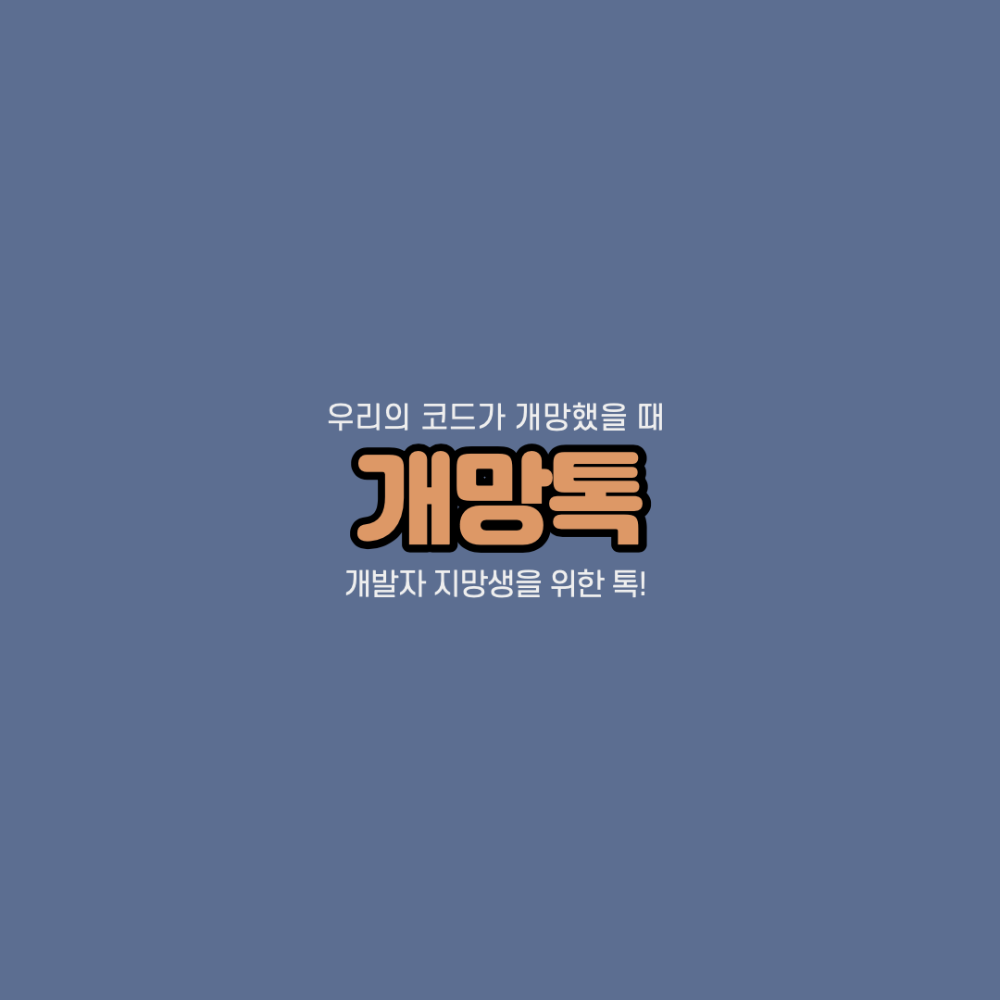
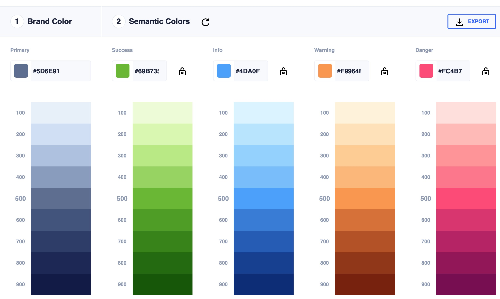

# [항해99 1기] [Chapter5] 미니프로젝트 (2) (2021.4.10)

**미니 프로젝트에 대한 일지**

# 1. 우선순위 목표 세우기(프론트엔드)

## 뷰 만들기

* 회원가입
* 로그인
* 헤더
* 채팅방
* 프레임과 색상을 입히는 단계까지 진행하고 기능 확인이 가능할 선까지

## 패키지 기본 세팅

**웹 페이지 제작에 필요한 기본적인 패키지들 정하기**

history같이 최신 버전에서 오류가 있는 패키지들 주의할 것!

* router
* redux
* react-redux
* redux-thunk
* logger
* redux devtools
* history
* router url 정하기
* Notfound 만들기

# 2. 오늘 진행한 것

**컨셉 색상 정하기 및 로고 제작 완료**

## 로고와 중심 테마 색상

## 기본 로고

## 테마 색상

## 색상표

# 3. 프로젝트 간이 회의

* 회원가입, 로그인 시스템
  * 일반 회원가입, 소셜 회원가입(카카오)
  * 일반 회원가입은 username이 이메일로
  * 소셜 회원가입인 경우는 이메일을 제공안함에 체크하여 서버에 이메일 정보가 오지 않는 이슈가 있다.
    * 이 경우는 null로 비울 것임(DB)
  * 프론트단에서 이메일, 패스워드 유효성 검사 넣기
    * **Validation**

# 4. 필요한 것, 준비할 것

* Validation
* 모바일과 데스크탑 각각의 경우에서 데이터를 받아올 때 분기처리
* 모달
* 채팅 기능에서 서버와의 소통을 위한 웹소켓 공부하기
* 리액트 공부하기
  * 렌더링, useEffect, state 다루기
* **프로젝트의 css 설정 어떻게 할 지 - 월요일에 본격적인 진행전에 토의**
* 좋은 웹사이트 계속 찾아보기
* favicon
  * 로고를 변환시 분간이 안될 정도로 깨지는 이슈가 있다.
* 메타태그