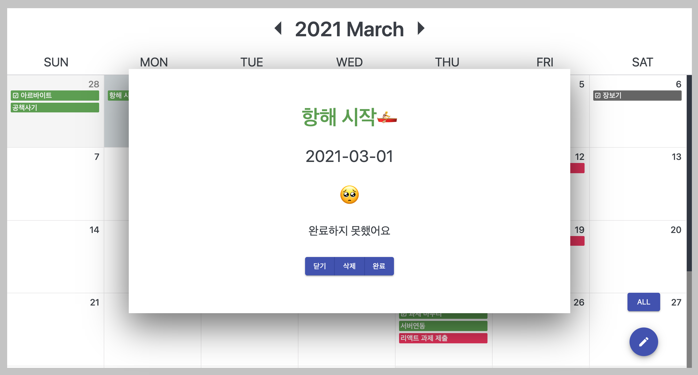

# my_kind_calendar

* [mykindcalendar](http://mykindcalendar.site/)

## 프로젝트 설명

* React를 이용한 캘린더, 스케쥴러 웹사이트
  * 원페이지 웹사이트
* BaaS(Backend as a Service)를 활용
  * [Firebase](https://firebase.google.com/?hl=ko)
* 리덕스와 Firebase를 활용한 React 데이터 제어
* moment를 활용한 달력 생성 알고리즘
* react-router를 활용하여 컴포넌트마다 url 부여
  * history로 뒤로가기 구현
* react-reveal 라이브러리의 애니메이션 효과
* CSS 기반 화면 구성

## 사용 방법

* 캘린더 상단의 버튼으로 월 단위로 이동
* 현재 선택한 날짜는 별도의 색상으로 표시
  * 다른 달의 날짜를 클릭시, 해당 월로 이동
* 현재 월에 속하지 않는 날은 다른 색상으로 표시
* 해당하는 날짜의 스케쥴 표시
  * 완료된 스케쥴, 전체 스케쥴 토글 버튼으로 전환
  * 스케쥴 클릭시, 팝업창으로 해당 스케쥴 정보 표시
  * 완료하기 버튼으로 완료처리 가능
* 스크롤로 더 많은 날짜 확인 가능
* 원하는 일자, 시간에 스케쥴 추가 가능
  * 일정을 구분할 색상 설정 가능
* 캘린더 내 일정은 시간 순으로 정렬

## Components

### 첫 화면

### 달력

### 일정 생성

### 팝업

## License

### MIT

## Reference

https://www.flaticon.com/