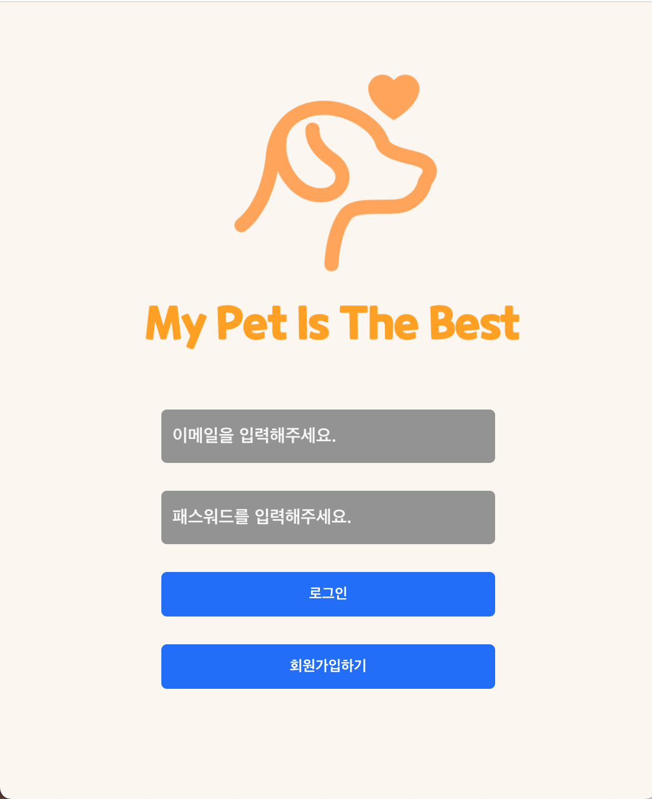
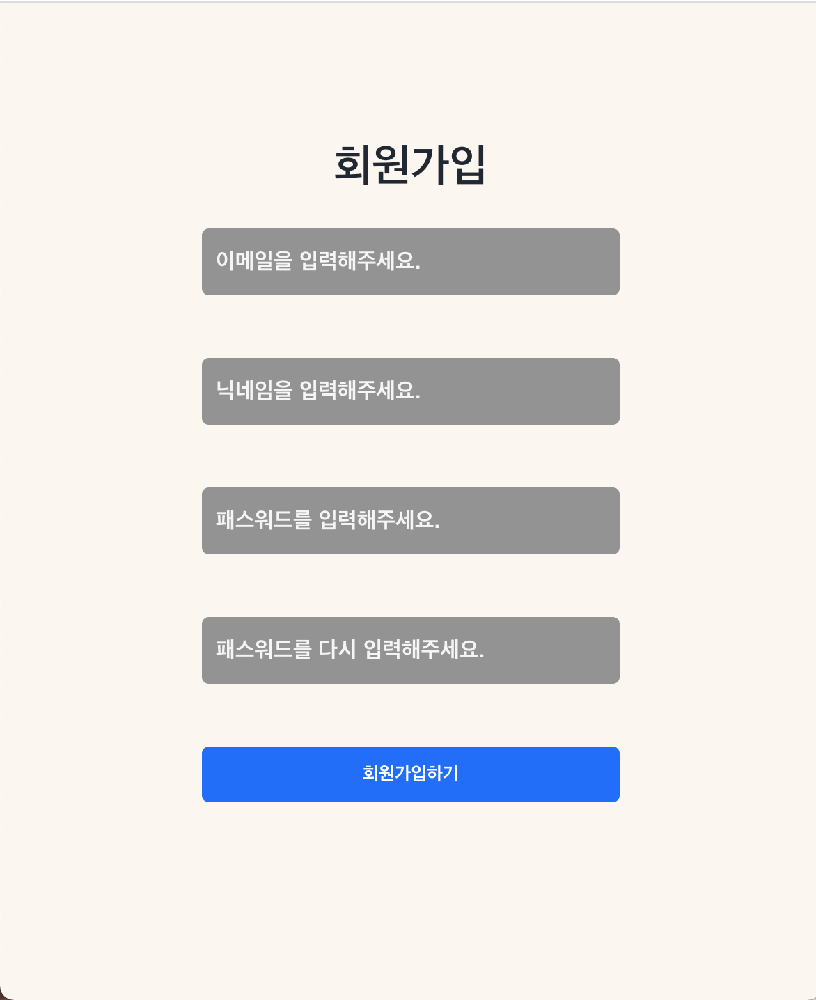
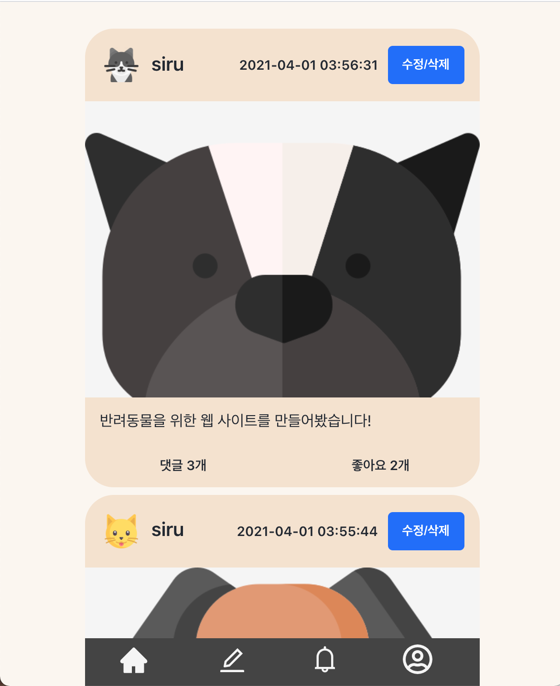
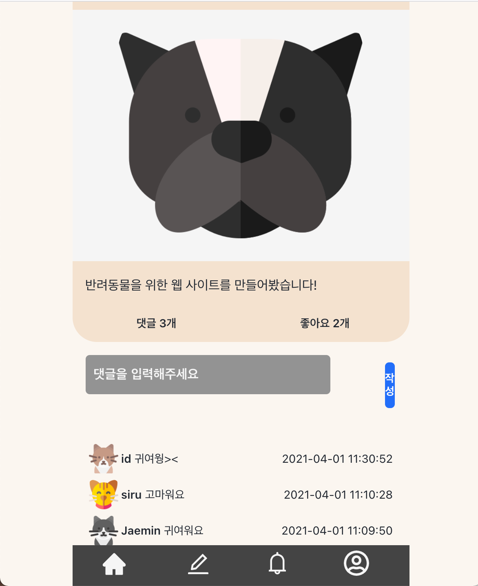
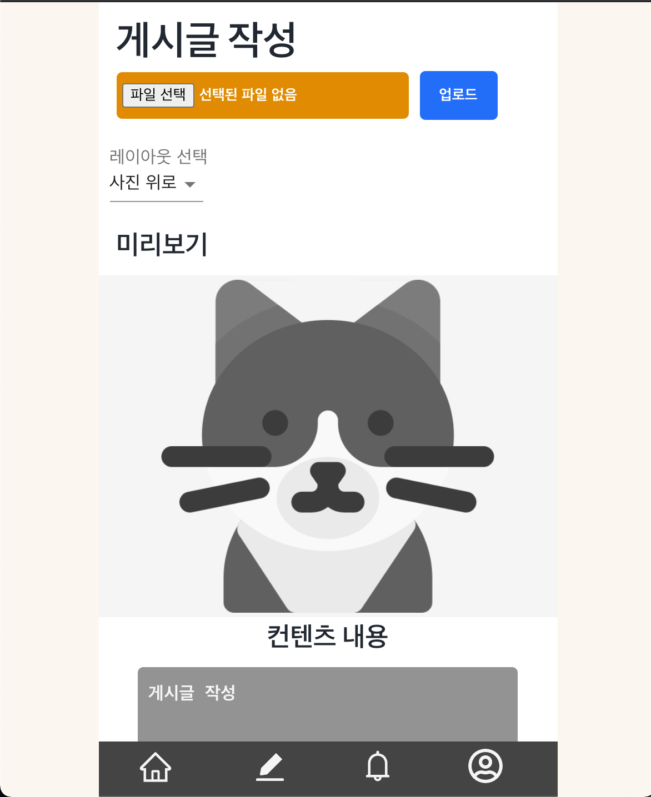
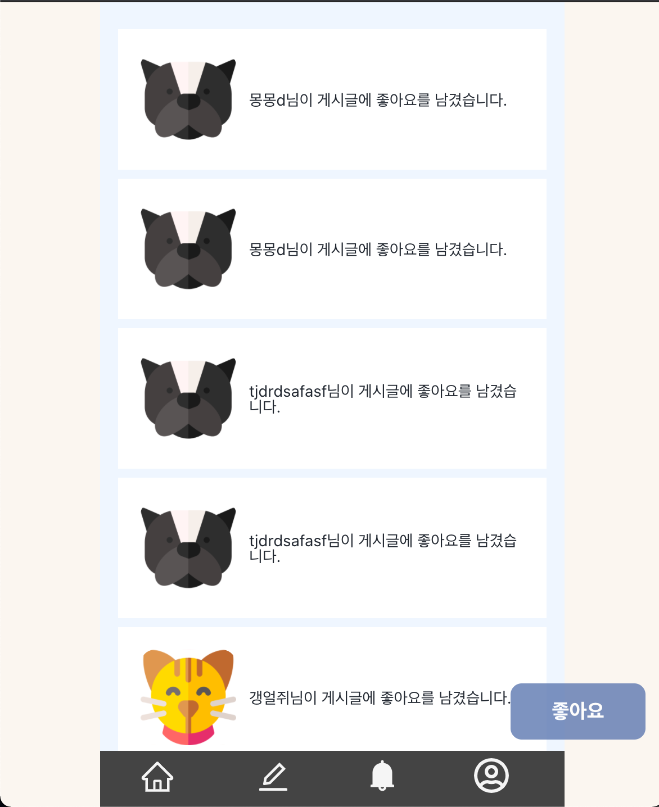

# my_pet_is_the_best

* [mypetisthebest](http://mypetisthebest.site/)

## 프로젝트 설명

* React를 이용한 매거진 사이트
  * 원페이지 웹사이트
* BaaS(Backend as a Service)를 활용
  * Firebase
* 리덕스와 Firebase의 Storage, Realtime, Store를 활용
  * 좋아요 기능
  * 댓글 기능
  * 좋아요 알림 기능
  * 댓글 알림 기능

* Styled-components 기반 화면 구성
  * 일부 SCSS 사용

## 사용 방법

* 회원가입
  * 이메일, 비밀번호 입력
* 컨텐츠를 올리거나 읽을 수 있다.
* 원하는 레이아웃을 선택하여 포스트를 게시 가능
* 포스트 작성, 수정, 삭제 가능
* 댓글 입력 가능

## Contents

## License

### MIT

## Reference

https://www.flaticon.com/