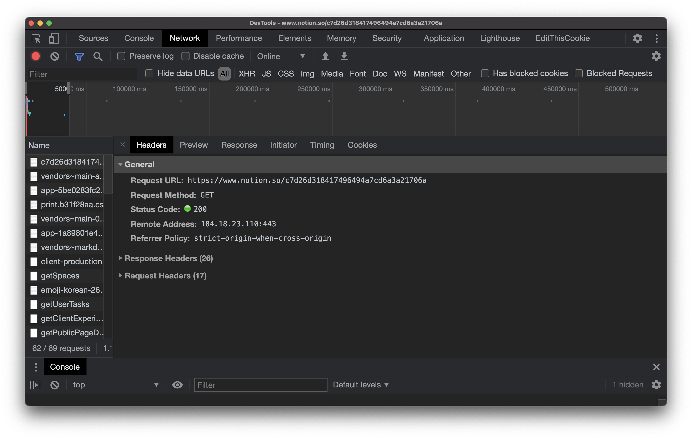

# HTTP (2021.3.7)

## 등장배경

* 1990년대 웹은 크게 4가지의 중요한 요소로 이루어졌다.
  * HTML: 웹 페이지를 만드는 컴퓨터 언어
  * URL, URI
  * 웹 브라우저, 웹 서버
  * HTTP

## HTTP소개

> **클라이언트가 무엇(컨텐츠)을 요청한다. (Request)**
>
> **서버가 응답한다. (Response)**
>
> **이 두개를 나타내는 것이 HTTP**

* Hyper Text Transfer Protocol
* **인터넷에서 가장 중요한 통신 규칙**
  * **HTML, CSS, JavaScript와 같은 컨텐츠를 주고받기 위해서 서버와 클라이언트가 서로 이해할 수 있는 공통의 약속(메시지)**
* 매우 단순한 통신규칙이었다.
  * 이후, 보다 풍부한 기능을 가진 프로토콜로 발전
  * HTML을 포함한 이미지, 오디오, 동영상 등의 멀티미디어 파일 전송

## 개발자 도구 살펴보기

* 개발자 도구의 Network 탭에서 어떤 통신을 하고 있는지 모니터링 할 수 있다.
* HTTP 메시지를 볼 수 있다.
  * **Request Headers**: 웹 브라우저가 웹 서버에게 요청한 데이터
  * **Response Headers** : 웹 서버가 웹 브라우저에게 응답한 데이터
  * 웹 브라우저는 사용자가 물어볼 정보를 웹 서버에게 대신 물어봐준다.
    * 웹 서버에게 응답 받은 정보를 화면에 그려준다.
  * 웹 서버는 자기가 가진 정보를 보내준다.

## Request message

아래와 같이루어져 있다.

* Request Message Header
  * Request Line: method, 요청하는 정보, 통신방식(HTTP의 버전)
  * Request Headers: Host(요청하는 웹 서버의 주소), User-Agent(브라우저, 운영체제 ), Accept-Encoding(압축 방식), If-Modified-Since(갖고 있는 파일의 일자)
* A blank line: header와 body를 구분
* Request Message Body: pay load라고도 함. 서버로 전송할 정보

## Response message

* Response Message Header
  * Status Line: 서버가 응답했을 때 알려주는 정보, HTTP의 버전, **status code**
  * **status code**: HTTP 요청이 성공적으로 되었는지를 알려준다. 404 Not Found (찾을 수 없음), 403 Forbidden(들어가면 안 되는 곳)
  * Response Headers: content-Type, Content-Length(바이트 단위), Content-Encoding(압축 방식), Last-Modified
* A blank line
* Response Message Body

## HTTPS(==SSL) ?

* Secure 안전한
* HTTP는 누군가 전송하고 있는 정보를 볼 수 있다.
* HTTPS는 정보를 암호화한다.
* HTTPS가 아닌 사이트에서 로그인을 요구하면 사용하지 말 것

# 그 외에...

## Cache

* 한 번 웹 사이트에 접속하여 내용을 다운로드 받으면 그 이후에 다운로드 받지 않아도 되게하는 기법
* 성능 향상
* 내용이 갱신되었을 때도 그 사실을 알아차리지 못하는 문제
  * 강제로 Cache를 갱신해야 한다.
  * cache-control, pragma

## cookie

* 사용자의 상태를 유지, 식별할 수 있다.
* web storage: cookie보다 향상된 기술

# Reference

[생활코딩 - WEB2 - HTTP](https://opentutorials.org/course/3385)

