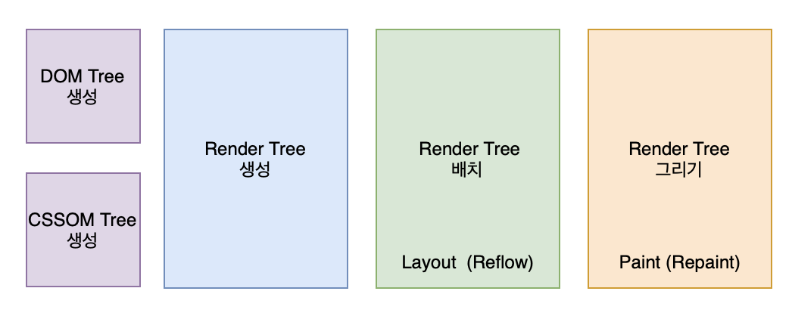

# 브라우저 렌더링

**본 내용은 10분 테코톡 체프님의 강의를 토대로 작성하였습니다.**

## 1. 웹 브라우저의 구조

### User Interface

* 주소 표시줄, 이전 / 다음 / 새로고침 버튼 등
* **웹페이지를 제외**하고 사용자와 상호작용 하는 **사용자 인터페이스**

### Rendering Engine

* HTML과 CSS를 파싱하여 요청한 웹 페이지를 **표시**하는 **렌더링 엔진**

### Browser Engine

* 유저 인터페이스와 렌더링 엔진을 **연결**하는 **브라우저 엔진**

### Networking

* 각종 네트워크 요청을 수행하는 **네트워킹** 파트

### UI Backend

*  체크박스나 버튼과 같은 기본적인 위젯을 그려주는 UI 백엔드 파트

### Data Persistence

* localSotrage나 Cookie와 같이 **보조 기억장치**에 **데이터를 저장하는 파트**

### JavaScript Interpreter

* **자바스크립트** 코드를 실행하는 **인터프리터**
* 크롬: v8엔진

## 2. Rendering Engine

* 웹 브라우저마다 렌저링 엔진이 다름
* Safari - Webkit, Firefox - Gecko, Chrome - Blink

### 렌더링 엔진의 목표

* HTML, CSS , JS, 이미지 등 웹 페이지에 포함된 모든 요소들을 **화면에 보여준다.**
* 업데이트가 필요할 때 **효율적**으로 렌더링을 할 수 있도록 **자료 구조를 생성**한다.

### Critical Rendering Path

#### 1-1. DOM Tree생성

* 브라우저에서 사용자가 요청한 HTML 파일을 불러오고 파싱한다.
* 어휘 분석을 통해서 HTML5 표준에 지정된 **고유한 토큰으로 변환**
* 브라우저의 렉싱 과정을 통해서 **토큰**이 **해당 속성과 규칙을 정의하는 노드 객체로 변환**
* **각 노드가** 서로 **연관성**을 가질 수 있도록 **트리 생성** -> **DOM Tree**
* 파싱하는 과정에서, JavaScript나 CSS같이 추가로 필요한 파일들을 불러오도록 요청

#### 1-2. CSSOM Tree 생성

* **DOM이 어떻게 화면에 표시될 지** 알려주는 역할
* 트리구조

#### 2. Render Tree 생성

* **DOM 트리**와 **CSSOM 트리**를 합쳐서 **Render Tree 생성**
* 화면에 표시되어야 할 **모든 노드의 컨텐츠, 스타일 정보를 포함**하고 있는 트리
* document 객체부터 **각 노드를 순회하면서 각각에 맞는 CSSOM을 찾아 규칙을 적용**
* 렌더와 관련된 요소들을 렌더 트리에 포함
  * meta 태그, display: none 속성을 가진 요소들은 포함되지 않음
* 브라우저마다 조금씩 다르게 생성

#### 3. Render Tree 배치

* Layout(Reflow)과정을 거침
  * viewport 내에서 요소들의 정확한 위치와 크기를 계산
* 박스모델에 따라 요소가 화면에서 차지하는 영역, 여백, 스타일 속성이 계산
* CSS에서 %, em같은 상대적 단위를 사용했을 때는 기기의 viewport에 맞추어 픽셀단위로 변환

#### 4. Render Tree 그리기

* 화면에 실제 픽셀로 나타냄

### UI가 업데이트되는 3가지 상황

> **JavaScript -> Style -> Layout -> paint -> Composite**

* 브라우저마다 업데이트 방식이 다름
* 개발자 도구를 사용해서 애니메이션의 성능 최적화를 할 수 있음

### 레이어

* 페인팅할 영역을 나눈 것
* 크롬의 경우 레이아웃 과정 이후에 정해진 기준이나 필요에 의해서 브라우저가 레이어를 생성
* 렌더 트리의 노드 객체들은 생성된 레이어에 포함
* 레이어는 트리형태로 구성
* 렌더링 엔진이 각 레이어를 프린팅 과정에서 각각 그려준 후 하나의 비트맵으로 **합성**해서 페이지 완성

#### 1. 다시 Layout이 발생하는 경우

* 요소의 크기나 위치가 바뀔 때
* 브라우저 창의 크기가 바뀌었을 때

#### 2. Paint부터 다시 발생되는 경우

* 배경 이미지, 텍스트 색상, 그림자 등 **레이아웃의 수치를 변화시키지 않는** 스타일이 변경이 일어났을 때 발생
* Layout이 발생하지 않기 때문에 성능상으로 이점을 가짐

#### 3. 레이어의 합성만 다시 발생하는 경우

* 레이어의 합성만 발생하기 때문에 성능상으로 가장 큰 이점을 가짐

  

# Reference

[[10분 테코톡] 체프의 브라우저 렌더링](https://www.youtube.com/watch?v=sJ14cWjrNis&list=PLgXGHBqgT2TvpJ_p9L_yZKPifgdBOzdVH&index=10)